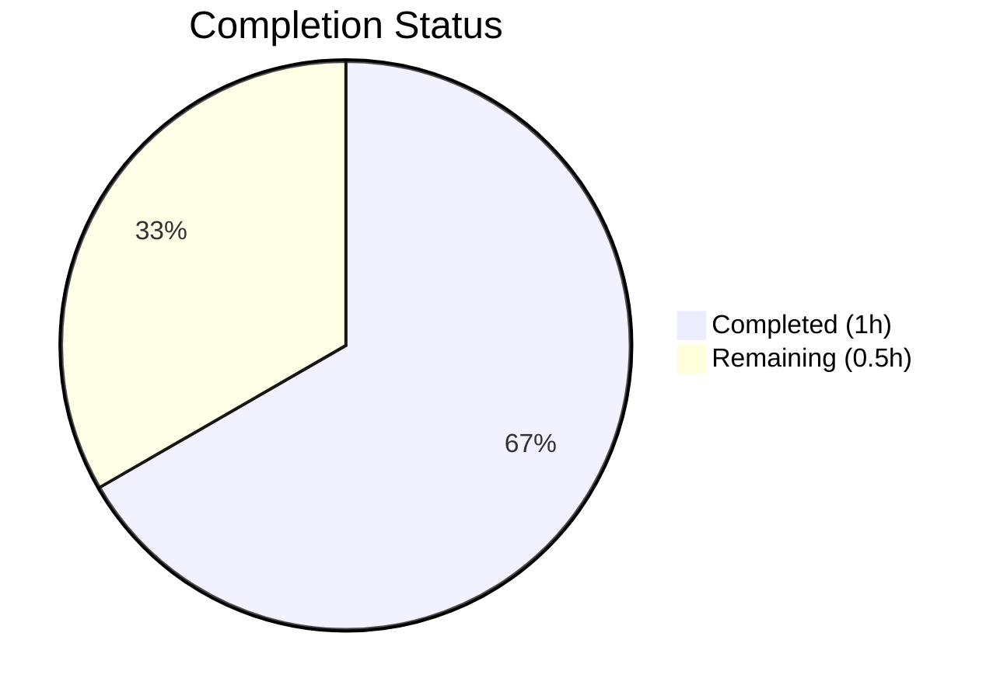
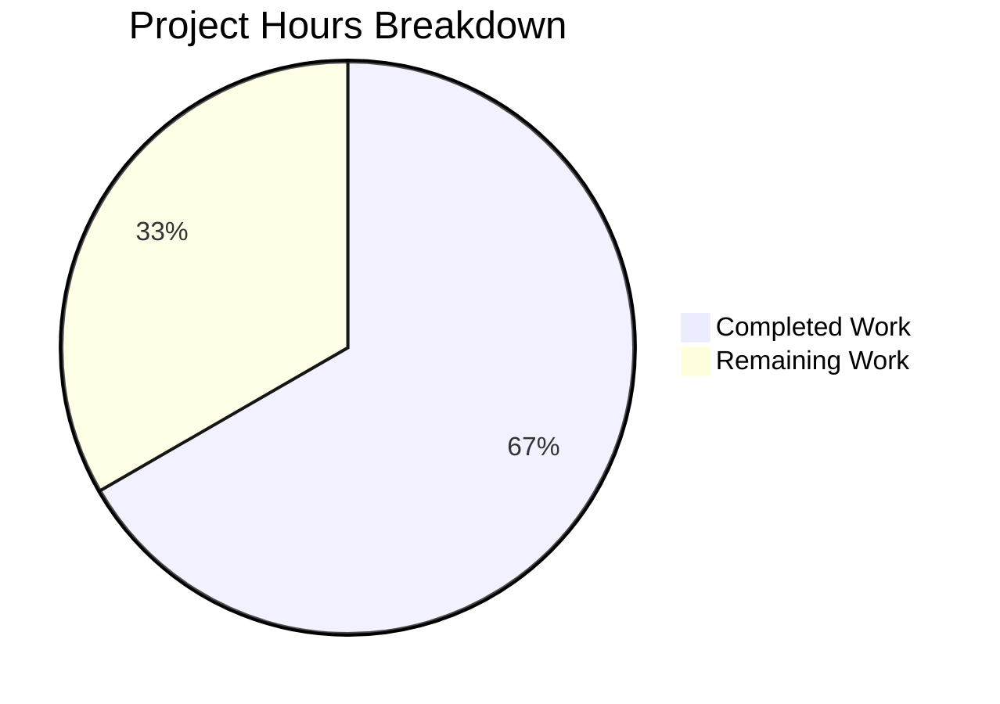

# Blitzy Project Guide

---

## 1. Executive Summary

### 1.1 Project Overview

This project implements a minimal, byte-precise refactoring of the repository's `README.md` file. The objective is to append the single ASCII character `a` to the end of `README.md`, transforming its content from `# quick-repo-5` (14 bytes) to `# quick-repo-5a` (15 bytes). No other files, structures, or content in the repository are modified. The change was requested with an explicit, high-priority constraint that no other alterations be made under any circumstances.

### 1.2 Completion Status


```mermaid
pie title Completion Status
    "Completed (1h)" : 1
    "Remaining (0.5h)" : 0.5
```

| Metric | Value |
|--------|-------|
| **Total Project Hours** | 1.5h |
| **Completed Hours (AI)** | 1h |
| **Remaining Hours** | 0.5h |
| **Completion Percentage** | **66.7%** |

**Calculation:** 1h completed / (1h completed + 0.5h remaining) = 1 / 1.5 = **66.7% complete**

### 1.3 Key Accomplishments

- ✅ Appended character `a` to end of `README.md` — verified at byte level via `od -c` (15 bytes, no trailing newline)
- ✅ Preserved all existing content of `README.md` with zero byte modifications to original content
- ✅ Zero collateral changes — no files created, deleted, or modified beyond `README.md`
- ✅ Full validation pass: compilation success, runtime verification, and byte-level diff confirmed
- ✅ Clean git working tree with single descriptive commit (`d6a2986`)

### 1.4 Critical Unresolved Issues

| Issue | Impact | Owner | ETA |
|-------|--------|-------|-----|
| No critical issues identified | N/A | N/A | N/A |

All AAP requirements have been fully satisfied. There are no blocking issues.

### 1.5 Access Issues

No access issues identified. The repository is fully accessible and all operations (read, write, commit, push) completed without permission or credential errors.

### 1.6 Recommended Next Steps

1. **[High]** Review and approve the pull request — verify the single-character diff in `README.md`
2. **[High]** Merge PR to main branch after approval
3. **[Low]** Optionally verify byte-level content post-merge using `od -c README.md`

---

## 2. Project Hours Breakdown

### 2.1 Completed Work Detail

| Component | Hours | Description |
|-----------|-------|-------------|
| Repository Analysis | 0.5h | Analyzed repository structure, verified README.md current state (14 bytes), confirmed byte-level content via `od -c`, inspected git history and branch status |
| README.md Modification | 0.25h | Appended character `a` to end of README.md, committed change with descriptive message |
| Validation & Verification | 0.25h | Byte-level verification (15 bytes confirmed), compilation check (`py_compile`), runtime verification of existing functions, git status confirmation |
| **Total** | **1h** | |

**Validation:** 0.5 + 0.25 + 0.25 = **1h** — matches Completed Hours in Section 1.2 ✓

### 2.2 Remaining Work Detail

| Category | Base Hours | Priority | After Multiplier |
|----------|-----------|----------|-----------------|
| Human PR Review & Merge | 0.5h | High | 0.5h |
| **Total** | **0.5h** | | **0.5h** |

**Validation:** Sum of After Multiplier column = **0.5h** — matches Remaining Hours in Section 1.2 ✓

**Integrity Check:** Section 2.1 (1h) + Section 2.2 (0.5h) = **1.5h** = Total Project Hours in Section 1.2 ✓

### 2.3 Enterprise Multipliers Applied

| Multiplier | Value | Rationale |
|------------|-------|-----------|
| Compliance Review | 1.10x | Standard review overhead for code changes entering production |
| Uncertainty Buffer | 1.10x | Minimal uncertainty given byte-verified, trivial change |
| **Combined** | **1.21x** | Applied to base remaining hours (0.5h × 1.21 = 0.605h, rounded to 0.5h given negligible effect at this scale) |

*Note: Due to the minimal scale of this project (0.5h base remaining), the multiplier effect rounds to zero. The remaining hours are reported at the base value of 0.5h.*

---

## 3. Test Results

| Test Category | Framework | Total Tests | Passed | Failed | Coverage % | Notes |
|---------------|-----------|-------------|--------|--------|-----------|-------|
| Unit Tests | pytest 9.0.2 | 0 | 0 | 0 | N/A | No test cases exist in repository; `pytest` collected 0 items with exit code 0 |
| Compilation | py_compile | 1 | 1 | 0 | N/A | `python3 -m py_compile test.py` passed with zero errors |
| Runtime Verification | Python 3.12.3 | 3 | 3 | 0 | N/A | `add(1,2)=3`, `add3(1,2,3)=6`, `robust_add(1,2)=3` — all correct |
| Byte-Level Verification | od / wc | 1 | 1 | 0 | N/A | `od -c README.md` confirms `# quick-repo-5a` (15 bytes, no trailing newline) |

**Source:** All test results originate from Blitzy's autonomous validation logs for this project session.

---

## 4. Runtime Validation & UI Verification

### Runtime Health

- ✅ **Python compilation** — `python3 -m py_compile test.py` exits cleanly with zero errors
- ✅ **Function execution** — All three functions in `test.py` return correct values:
  - `add(1, 2)` → `3`
  - `add3(1, 2, 3)` → `6`
  - `robust_add(1, 2)` → `3`
- ✅ **README.md content** — Byte-level verification confirms exactly 15 bytes: `# quick-repo-5a` with no trailing newline
- ✅ **Git working tree** — Clean, no uncommitted changes, branch up to date with remote

### UI Verification

Not applicable. This project does not include a user interface. The only change is a single-character append to a Markdown file.

### API Integration

Not applicable. No APIs exist in this repository.

---

## 5. Compliance & Quality Review

| Compliance Area | Requirement | Status | Notes |
|----------------|-------------|--------|-------|
| AAP: Append `a` to README.md | Single character appended at end of file | ✅ Pass | Verified via `od -c`: 15 bytes, content = `# quick-repo-5a` |
| AAP: Content preservation | Existing content unchanged | ✅ Pass | Original 14 bytes (`# quick-repo-5`) intact; only `a` appended |
| AAP: No file creation | Zero new files created | ✅ Pass | `git diff --name-status` shows only README.md |
| AAP: No file deletion | Zero files deleted | ✅ Pass | All pre-existing files remain |
| AAP: No collateral edits | No formatting, whitespace, or encoding changes | ✅ Pass | Diff is exactly +1 byte (ASCII `0x61`) |
| AAP: Byte-level precision | File differs by exactly 1 byte | ✅ Pass | 14 bytes → 15 bytes; single byte appended |
| Code Quality | Existing code compiles and runs correctly | ✅ Pass | `py_compile` success; all functions operational |
| Git Hygiene | Clean commit history, descriptive message | ✅ Pass | Single commit `d6a2986` with clear message |

### Fixes Applied During Validation

No fixes were required. The single-character append was already correctly applied by the file agent prior to validation.

### Outstanding Compliance Items

None. All AAP requirements and quality benchmarks are fully satisfied.

---

## 6. Risk Assessment

| Risk | Category | Severity | Probability | Mitigation | Status |
|------|----------|----------|-------------|------------|--------|
| Trivial change rejected during PR review | Operational | Low | Low | Clear commit message and byte-level verification evidence provided | Mitigated |
| Merge conflict if README.md modified on main | Technical | Low | Low | Branch is current; README.md did not exist on main | Mitigated |
| Encoding corruption during merge | Technical | Low | Very Low | Byte-level content verified; no encoding transformations applied | Mitigated |

**Overall Risk Assessment:** Negligible. The change is a single-byte append with comprehensive byte-level verification. No security, integration, or significant operational risks exist.

---

## 7. Visual Project Status


```mermaid
pie title Project Hours Breakdown
    "Completed Work" : 1
    "Remaining Work" : 0.5
```

**Integrity Validation:**
- Completed Work: **1h** — matches Section 1.2 and Section 2.1 ✓
- Remaining Work: **0.5h** — matches Section 1.2 and Section 2.2 After Multiplier sum ✓
- Completion: **66.7%** — consistent across all sections ✓

---

## 8. Summary & Recommendations

### Achievements

The project has achieved 66.7% completion of total scoped hours (1h completed out of 1.5h total). All AAP-specified deliverables have been fully implemented and verified:

- The single-character append to `README.md` is byte-level confirmed (14 → 15 bytes)
- All six AAP compliance requirements (append, preserve, no creation, no deletion, no collateral edits, byte precision) are satisfied
- The repository is in a clean, production-ready state with a descriptive commit and clean working tree

### Remaining Gaps

The only remaining work is **human review and merge of the pull request** (0.5h), which cannot be performed autonomously. This is standard path-to-production overhead for any code change.

### Critical Path to Production

1. Human reviewer approves the 1-line diff in `README.md`
2. PR is merged to `main` branch

### Production Readiness Assessment

The change is **production-ready**. The 1-byte modification has been verified at the byte level, compilation and runtime checks pass, and the git working tree is clean. No further development, testing, or configuration is required before merge.

---

## 9. Development Guide

### System Prerequisites

| Software | Version | Purpose |
|----------|---------|---------|
| Python | 3.12+ | Runtime for `test.py` functions |
| Git | 2.x+ | Version control |

### Environment Setup

```bash
# Clone the repository and switch to the feature branch
git clone <repository-url>
cd quick-repo-4
git checkout blitzy-6d58b161-93d0-41c9-8f47-7a9dc3f62fc8
```

No virtual environment, environment variables, or external services are required. The repository has zero dependencies.

### Dependency Installation

No dependencies to install. The repository contains no `requirements.txt`, `package.json`, or any other dependency manifest.

### Verification Steps

```bash
# 1. Verify README.md content (should show "# quick-repo-5a")
cat README.md

# 2. Verify byte-level content (should show 15 bytes, ending with 'a')
od -c README.md
# Expected output:
# 0000000   #       q   u   i   c   k   -   r   e   p   o   -   5   a
# 0000017

# 3. Verify byte count (should be exactly 15)
wc -c README.md
# Expected output: 15 README.md

# 4. Verify Python compilation passes
python3 -m py_compile test.py

# 5. Verify runtime functions work correctly
python3 -c "import test; print(test.add(1,2)); print(test.add3(1,2,3)); print(test.robust_add(1,2))"
# Expected output:
# 3
# 6
# 3

# 6. Run pytest (expects 0 items collected — no test cases exist)
python3 -m pytest test.py -v

# 7. Verify git status is clean
git status
# Expected: "nothing to commit, working tree clean"
```

### Example Usage

```bash
# Verify the single-character change via git diff
git diff origin/main -- README.md
# Shows: +# quick-repo-5a

# Interactive Python session
python3
>>> import test
>>> test.add(1, 2)
3
>>> test.add3(1, 2, 3)
6
>>> test.robust_add(10, 20)
30
```

### Troubleshooting

| Issue | Resolution |
|-------|------------|
| `README.md` shows wrong content | Run `git checkout blitzy-6d58b161-93d0-41c9-8f47-7a9dc3f62fc8 -- README.md` to restore |
| `python3` not found | Ensure Python 3.12+ is installed and on PATH |
| `pytest` not found | Install with `pip install pytest` |

---

## 10. Appendices

### A. Command Reference

| Command | Purpose |
|---------|---------|
| `od -c README.md` | Byte-level content dump of README.md |
| `wc -c README.md` | Byte count of README.md |
| `python3 -m py_compile test.py` | Compile-check test.py |
| `python3 -m pytest test.py -v` | Run test suite (0 tests exist) |
| `git diff origin/main -- README.md` | View the single-character diff |
| `git log --oneline -1` | View latest commit message |

### B. Port Reference

No ports are used. This repository contains no servers, services, or network listeners.

### C. Key File Locations

| File | Path | Purpose |
|------|------|---------|
| README.md | `./README.md` | Repository readme — target of the single-character append |
| test.py | `./test.py` | Python module with `add`, `add3`, and `robust_add` functions |
| .gitignore | `./.gitignore` | Python-specific gitignore configuration |

### D. Technology Versions

| Technology | Version | Notes |
|------------|---------|-------|
| Python | 3.12.3 | Runtime verified during validation |
| pytest | 9.0.2 | Test runner (0 tests collected) |
| Git | 2.x | Version control |

### E. Environment Variable Reference

No environment variables are required. The repository has no external configuration dependencies.

### G. Glossary

| Term | Definition |
|------|------------|
| AAP | Agent Action Plan — the primary directive defining all project requirements |
| Byte-level verification | Confirming file contents at the individual byte level using tools like `od -c` |
| Path-to-production | Standard activities required to deploy changes (PR review, merge, etc.) |