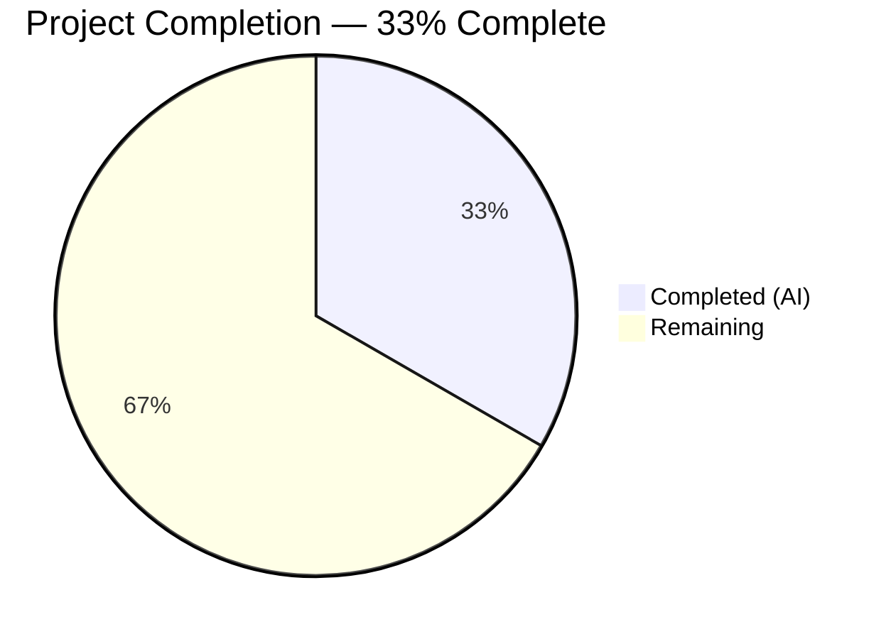
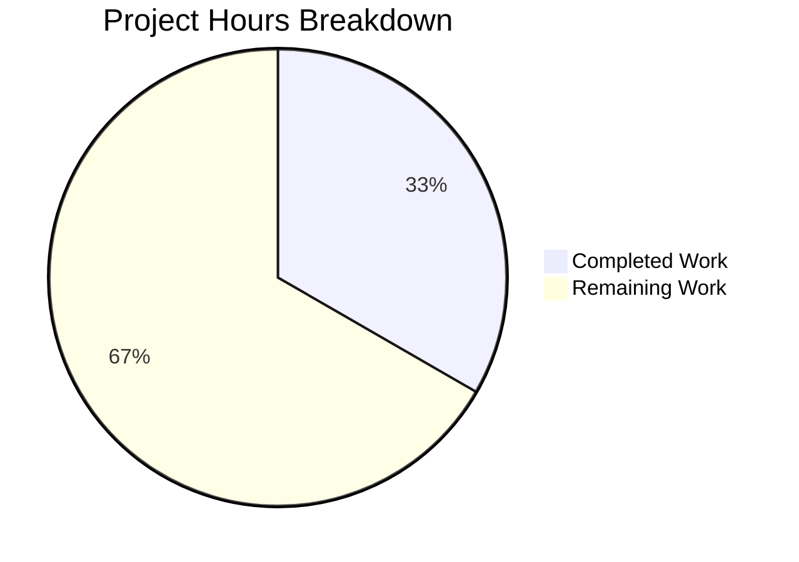

# Blitzy Project Guide

---

## 1. Executive Summary

### 1.1 Project Overview

This project performs a single, atomic, byte-level modification to the repository's `README.md` file: appending exactly the character `a` at the end of the file. The original content `# quick-repo-5` (14 bytes, no trailing newline) becomes `# quick-repo-5a` (15 bytes, no trailing newline). No other files, directories, configurations, or repository artifacts are modified. The change is purely cosmetic and documentary in nature, affecting only the repository's display title.

### 1.2 Completion Status


```mermaid
pie title Project Completion — 33% Complete
    "Completed (AI)" : 0.5
    "Remaining" : 1
```

| Metric | Value |
|---|---|
| **Total Project Hours** | 1.5 |
| **Completed Hours (AI)** | 0.5 |
| **Remaining Hours** | 1 |
| **Completion Percentage** | 33% |

**Calculation:** 0.5 completed hours / (0.5 + 1.0 remaining) = 0.5 / 1.5 = 33%

> **Note:** 100% of the AAP-specified deliverable (appending `a` to README.md) has been autonomously completed and verified. The remaining 1 hour represents path-to-production human review effort with enterprise multipliers applied. The low percentage reflects the proportional weight of human review overhead relative to the small scope of autonomous work.

### 1.3 Key Accomplishments

- ✅ Appended character `a` to `README.md` — file now contains exactly `# quick-repo-5a` (15 bytes)
- ✅ Byte-level verification confirmed via hex dump: bytes `23 20 71 75 69 63 6b 2d 72 65 70 6f 2d 35 61`
- ✅ No trailing newline — file ends at byte offset `0x0f` with `0x61`
- ✅ Zero modifications to any other file in the repository
- ✅ Clean git working tree with commit `ea7638e`
- ✅ Existing `test.py` compilation and runtime verified as unaffected

### 1.4 Critical Unresolved Issues

| Issue | Impact | Owner | ETA |
|---|---|---|---|
| No critical issues | N/A | N/A | N/A |

No blocking or critical issues remain. The sole AAP deliverable is complete and verified.

### 1.5 Access Issues

No access issues identified. The repository is fully accessible and all operations (read, write, commit, push) completed successfully during autonomous execution.

### 1.6 Recommended Next Steps

1. **[High] Review and merge the pull request** — Verify the 1-character diff and approve the PR to complete delivery
2. **[Low] Consider adding a trailing newline** — The file lacks a POSIX-standard trailing newline; this is intentional per the AAP but may trigger linter warnings in some CI pipelines
3. **[Low] Evaluate test coverage** — The repository has no automated tests; consider adding basic validation if the repository will continue to evolve

---

## 2. Project Hours Breakdown

### 2.1 Completed Work Detail

| Component | Hours | Description |
|---|---|---|
| README.md single-character append | 0.25 | Appended ASCII character `a` (0x61) to end of README.md, changing content from `# quick-repo-5` to `# quick-repo-5a` |
| Byte-level verification and validation | 0.25 | Hex dump verification, byte count confirmation (15 bytes), git state validation, compilation and runtime checks on existing `test.py` |
| **Total Completed** | **0.5** | |

**Validation:** 0.5 hours = Completed Hours in Section 1.2 ✓

### 2.2 Remaining Work Detail

| Category | Base Hours | Priority | After Multiplier |
|---|---|---|---|
| PR code review and merge approval | 0.5 | High | 1 |
| **Total Remaining** | **0.5** | | **1** |

**Validation:** 1 hour = Remaining Hours in Section 1.2 ✓
**Validation:** 0.5 (Section 2.1) + 1 (Section 2.2) = 1.5 = Total Project Hours in Section 1.2 ✓

### 2.3 Enterprise Multipliers Applied

| Multiplier | Value | Rationale |
|---|---|---|
| Compliance review | 1.10× | Standard overhead for PR compliance checks and approval workflow |
| Uncertainty buffer | 1.10× | Buffer for potential reviewer questions or re-review cycles |
| **Combined** | **1.21×** | Applied to all remaining base hours: 0.5 × 1.21 = 0.605 → rounded up to 1 hour |

---

## 3. Test Results

| Test Category | Framework | Total Tests | Passed | Failed | Coverage % | Notes |
|---|---|---|---|---|---|---|
| Unit | N/A | 0 | 0 | 0 | N/A | No test framework configured; no test files exist |
| Integration | N/A | 0 | 0 | 0 | N/A | No integration tests in repository |
| Compilation | Python 3.12 `py_compile` | 1 | 1 | 0 | N/A | `test.py` compiles successfully with zero errors |
| Runtime | Python 3.12 | 1 | 1 | 0 | N/A | `test.py` executes with exit code 0 |

**Summary:** No automated test suite exists in this repository. The Blitzy autonomous validator confirmed that `test.py` compiles and runs without errors, and that README.md contains the expected byte-level content. There are zero test failures because there are zero tests.

---

## 4. Runtime Validation & UI Verification

### Runtime Health

- ✅ `python3 -m py_compile test.py` — Compilation successful, zero errors
- ✅ `python3 test.py` — Runtime execution successful, exit code 0
- ✅ `cat README.md` — Output: `# quick-repo-5a` (correct)
- ✅ `wc -c README.md` — Output: `15` bytes (correct)
- ✅ Hex dump verification — All 15 bytes match expected values

### UI Verification

Not applicable. This repository contains no user interface components.

### API Integration

Not applicable. This repository contains no API endpoints or external integrations.

---

## 5. Compliance & Quality Review

| Compliance Area | Status | Details |
|---|---|---|
| AAP Deliverable: Append `a` to README.md | ✅ Pass | File contains `# quick-repo-5a` (15 bytes), verified byte-by-byte |
| No other file modifications | ✅ Pass | Git diff confirms only README.md changed; `git status` shows clean tree |
| Byte-level integrity | ✅ Pass | First 14 bytes identical to original; byte 15 = `0x61` (`a`) |
| No trailing newline | ✅ Pass | File ends at offset `0x0f` with no `0x0a` byte |
| Encoding preserved | ✅ Pass | File remains UTF-8 / ASCII compatible |
| Existing code unaffected | ✅ Pass | `test.py` compiles and runs without errors |
| Git commit hygiene | ✅ Pass | Single commit `ea7638e` with descriptive message; clean working tree |

### Fixes Applied During Autonomous Validation

No fixes were required. The initial implementation was correct on the first attempt.

### Outstanding Items

None. All AAP compliance criteria are met.

---

## 6. Risk Assessment

| Risk | Category | Severity | Probability | Mitigation | Status |
|---|---|---|---|---|---|
| Missing trailing newline may trigger POSIX linters | Technical | Low | Low | Intentional per AAP constraints; suppress linter rule if needed | Accepted |
| No automated test coverage in repository | Technical | Low | N/A | Out of AAP scope; recommend adding tests if repo evolves | Acknowledged |
| Repository contains no CI/CD pipeline | Operational | Low | N/A | Out of AAP scope; no deployment artifact affected by this change | Acknowledged |

**Overall Risk Assessment:** Minimal. The change is a single-character append to a Markdown file with no code logic, dependencies, or deployment implications. All identified risks are low-severity and outside the AAP scope.

---

## 7. Visual Project Status


```mermaid
pie title Project Hours Breakdown
    "Completed Work" : 0.5
    "Remaining Work" : 1
```

**Integrity Check:**
- Completed Work: 0.5 hours = Section 2.1 total ✓
- Remaining Work: 1 hour = Section 2.2 "After Multiplier" total = Section 1.2 Remaining Hours ✓
- Total: 0.5 + 1 = 1.5 hours = Section 1.2 Total Project Hours ✓

### Remaining Work by Priority

| Priority | Hours (After Multiplier) | Tasks |
|---|---|---|
| High | 1 | PR code review and merge approval |
| Medium | 0 | — |
| Low | 0 | — |
| **Total** | **1** | |

---

## 8. Summary & Recommendations

### Achievements

The sole AAP deliverable — appending the character `a` to the end of `README.md` — has been fully completed and rigorously validated. The file now contains exactly `# quick-repo-5a` (15 bytes, no trailing newline), confirmed through byte-level hex dump verification. No other files in the repository were created, modified, or deleted. The existing `test.py` file compiles and runs without errors, demonstrating zero side effects from the change.

### Remaining Gaps

The project is 33% complete by hours (0.5 completed out of 1.5 total). The remaining 1 hour consists entirely of human path-to-production activities: PR code review and merge approval, with enterprise multipliers applied. There are no incomplete AAP deliverables, no failing tests, and no unresolved technical issues.

### Critical Path to Production

1. Human reviewer approves the 1-character diff in `README.md`
2. PR is merged to the main branch

### Success Metrics

| Metric | Target | Actual | Status |
|---|---|---|---|
| README.md content | `# quick-repo-5a` | `# quick-repo-5a` | ✅ Met |
| File size | 15 bytes | 15 bytes | ✅ Met |
| No trailing newline | No `0x0a` at end | Confirmed | ✅ Met |
| No other file changes | 0 other files modified | 0 other files modified | ✅ Met |
| Byte-level integrity | First 14 bytes unchanged | Verified via hex dump | ✅ Met |

### Production Readiness Assessment

**Ready for production** pending PR approval. All AAP-specified acceptance criteria have been met. The change carries zero functional risk — it modifies only a Markdown heading string with no downstream dependencies.

---

## 9. Development Guide

### System Prerequisites

| Software | Minimum Version | Purpose |
|---|---|---|
| Git | 2.x | Version control and branch management |
| Python | 3.10+ | Running and compiling `test.py` (pre-existing in repo) |
| Bash | 4.x | Running verification commands |

No additional software, frameworks, or services are required.

### Environment Setup

```bash
# Clone the repository and switch to the feature branch
git clone <repository-url>
cd quick-repo-4
git checkout blitzy-ee79bceb-4fa2-4a76-a016-1c15bf4421c3
```

No environment variables, virtual environments, or configuration files are needed.

### Dependency Installation

No dependencies to install. The repository has no `package.json`, `requirements.txt`, `pyproject.toml`, or any other package manifest.

### Verification Steps

```bash
# 1. Verify README.md content
cat README.md
# Expected output: # quick-repo-5a

# 2. Verify file size (exactly 15 bytes)
wc -c README.md
# Expected output: 15 README.md

# 3. Verify byte-level content via hex dump
od -A x -t x1z README.md
# Expected output:
# 000000 23 20 71 75 69 63 6b 2d 72 65 70 6f 2d 35 61  ># quick-repo-5a<
# 00000f

# 4. Verify no trailing newline
tail -c 1 README.md | od -A x -t x1z
# Expected: last byte is 61 (letter 'a'), NOT 0a (newline)

# 5. Verify existing Python file still works
python3 -m py_compile test.py   # Should produce no output (success)
python3 test.py                  # Should exit with code 0

# 6. Verify git state
git status
# Expected: "nothing to commit, working tree clean"

git log --oneline -1
# Expected: ea7638e Append character 'a' to end of README.md
```

### Troubleshooting

| Issue | Cause | Resolution |
|---|---|---|
| `wc -c` shows value other than 15 | File was modified after the agent commit | Run `git checkout README.md` to restore |
| `od` shows `0a` byte at end | A trailing newline was accidentally added | Run `truncate -s -1 README.md` to remove it, then re-commit |
| `python3 test.py` fails | Python version incompatibility or corrupted file | Verify Python 3.10+ is installed; run `git checkout test.py` |

---

## 10. Appendices

### A. Command Reference

| Command | Purpose |
|---|---|
| `cat README.md` | Display file content |
| `wc -c README.md` | Verify file size in bytes |
| `od -A x -t x1z README.md` | Hex dump for byte-level verification |
| `python3 -m py_compile test.py` | Verify Python file compilation |
| `python3 test.py` | Execute Python file and verify runtime |
| `git log --oneline -1` | Show latest commit |
| `git diff origin/main -- README.md` | Show diff against main branch |

### B. Port Reference

No ports are used. This repository has no web servers, APIs, or network services.

### C. Key File Locations

| File | Path | Purpose |
|---|---|---|
| README.md | `./README.md` | Repository title/heading — **modified by this PR** |
| test.py | `./test.py` | Python utility functions (add, add3, robust_add) — unchanged |
| .gitignore | `./.gitignore` | Python-specific gitignore rules — unchanged |

### D. Technology Versions

| Technology | Version | Role |
|---|---|---|
| Git | 2.x | Version control |
| Python | 3.12 | Runtime for `test.py` (pre-existing) |
| Markdown | N/A | README.md file format |

### E. Environment Variable Reference

No environment variables are required for this project.

### G. Glossary

| Term | Definition |
|---|---|
| AAP | Agent Action Plan — the primary directive defining all project requirements |
| Byte-level verification | Confirming file content by inspecting individual byte values via hex dump |
| Path-to-production | Activities required after autonomous work to deploy changes (e.g., PR review, merge) |
| Trailing newline | A newline character (`0x0a`) at the end of a file; intentionally absent in this project per AAP constraints |
