# Technical Specification

# 0. Agent Action Plan

## 0.1 Intent Clarification

### 0.1.1 Core Feature Objective

Based on the prompt, the Blitzy platform understands that the new feature requirement is to:

- **Primary Requirement**: Add a robust function to add two numbers with comprehensive input validation and error handling
- **Quality Emphasis**: Implement the function with careful attention to code quality, type safety, and edge case handling
- **Explicit Constraint**: Do not write any test cases as part of this implementation

The platform interprets "robust" to mean:
- Strong type validation ensuring only numeric types (int, float) are accepted
- Comprehensive error handling with clear, informative error messages
- Input validation that prevents invalid operations (e.g., None values, non-numeric types)
- Type hints for improved code clarity and static analysis support
- Proper handling of special numeric cases (infinity, NaN, overflow scenarios)

### 0.1.2 Special Instructions and Constraints

**Critical User Directives:**

- **"make it very robust function"**: Implement comprehensive validation including type checking, None handling, numeric validation, and edge case management
- **"make the code changes very carefully"**: Ensure backward compatibility with existing `add(a, b)` function, maintain code style consistency, and avoid breaking changes
- **"dont write any test cases"**: Explicitly exclude creation of test files, test functions, or testing infrastructure as part of this implementation

**Architectural Requirements:**

- Maintain zero-dependency architecture (no external packages required)
- Follow existing Python module structure in test.py
- Preserve compatibility with Python 3.x standard library
- Ensure the new robust function can coexist with the existing simple `add()` function

**Implementation Patterns:**

- Use Python's built-in `isinstance()` for type checking
- Leverage type hints from the `typing` module for improved clarity
- Implement explicit validation with descriptive error messages
- Follow Pythonic conventions for parameter validation

### 0.1.3 Technical Interpretation

These feature requirements translate to the following technical implementation strategy:

**To implement a robust addition function**, we will:

- **CREATE** a new function `robust_add(a, b)` in test.py that serves as the production-ready version with full validation
- **IMPLEMENT** type checking using `isinstance(a, (int, float))` to ensure both parameters are numeric
- **ADD** type hints using `Union[int, float]` for parameters and return type for static type checking support
- **VALIDATE** for None values explicitly before type checking to provide clear error messages
- **HANDLE** special float values (inf, -inf, NaN) with appropriate validation
- **RAISE** TypeError for non-numeric inputs with descriptive messages identifying which parameter failed
- **RAISE** ValueError for invalid numeric values (NaN) that cannot be used in meaningful arithmetic
- **PRESERVE** the existing `add(a, b)` function unchanged to maintain backward compatibility
- **DOCUMENT** the function with a comprehensive docstring explaining parameters, return value, and exceptions

**Implementation Sequence:**

1. Add necessary imports from typing module for type hints
2. Define the robust_add function with full type annotations
3. Implement None value checking as first validation layer
4. Implement numeric type validation with isinstance checks
5. Implement special float value validation (NaN, infinity checks)
6. Perform the addition operation only after all validations pass
7. Return the computed result with proper type preservation

## 0.2 Repository Scope Discovery

### 0.2.1 Comprehensive File Analysis

**Repository Structure Overview:**

The repository contains a minimal Python module structure with two files:
- `test.py` - Main Python module containing arithmetic functions
- `.gitignore` - Git ignore patterns for Python development artifacts

**Existing Files Requiring Modification:**

| File Path | Current State | Modification Type | Purpose |
|-----------|---------------|-------------------|---------|
| test.py | Contains simple `add(a, b)` and `add3(a, b, c)` functions | MODIFY | Add robust_add function with comprehensive validation |

**Current Implementation Analysis:**

The existing test.py module contains:
- `add(a, b)`: Simple addition with no validation (lines 1-2)
- `add3(a, b, c)`: Three-parameter addition with no validation (lines 4-5)
- No imports, no type hints, no error handling
- Pure Python arithmetic using the + operator

**Integration Points Identified:**

- **Module-level**: test.py will export an additional function `robust_add` alongside existing functions
- **Import compatibility**: Any code currently importing from test.py will remain unaffected
- **API surface**: New function adds to the module's public API without breaking existing contracts

**Files NOT Requiring Modification:**

| File Path | Reason for Exclusion |
|-----------|---------------------|
| .gitignore | Contains only Git ignore patterns, no code changes needed |

### 0.2.2 Web Search Research Conducted

Research was conducted on best practices for implementing robust arithmetic functions in Python, yielding the following key findings:

**Type Validation Best Practices:**

- <cite index="2-2,2-3">Input type validation is critical for robust Python programming, helping ensure data integrity and prevent runtime errors through comprehensive validation techniques</cite>
- <cite index="5-1,5-2">Parameter validation ensures functions receive the correct type, format, and range of input arguments, helping prevent errors and improve code reliability</cite>
- Use `isinstance()` for runtime type checking rather than type() comparisons for better compatibility with subclasses

**Validation Strategies:**

- <cite index="6-1,6-2">Try-except blocks are among the simplest methods to ensure input is of the correct type, especially when accepting numeric input</cite>
- Implement multiple validation layers: None checking, type checking, then value validation
- <cite index="4-16,4-17">Input validation is crucial for creating robust and secure Python applications, helping prevent unexpected errors, security vulnerabilities, and ensuring data integrity</cite>

**Type Hints and Annotations:**

- <cite index="8-15">Function annotations (e.g., def myfunc(i1: int, i2: int)) are a profoundly more Pythonic means of declaring types in Python 3.x</cite>
- Type hints improve code clarity and enable static analysis tools like mypy
- The typing module provides Union types for accepting multiple numeric types

**Error Handling Patterns:**

- Raise TypeError for incorrect types with descriptive messages
- Raise ValueError for values that are the right type but invalid (e.g., NaN)
- Provide clear error messages identifying which parameter failed validation

### 0.2.3 New File Requirements

**No New Files Required:**

This feature addition modifies only existing files and does not require creating new modules, configuration files, or documentation files. The implementation is self-contained within the existing test.py module structure.

**Rationale:**

- The repository follows a minimal, single-module design pattern
- Adding the robust function to the existing module maintains architectural consistency
- No supporting infrastructure (tests, configs, docs) is needed per user requirements
- Zero external dependencies align with the project's current architecture

## 0.3 Dependency Inventory

### 0.3.1 Private and Public Packages

**Standard Library Modules Required:**

| Registry | Package Name | Version | Purpose |
|----------|--------------|---------|---------|
| Python Standard Library | typing | Built-in (Python 3.5+) | Provides Union type hint for accepting int or float parameters |
| Python Standard Library | math | Built-in | Provides isnan() and isinf() functions for validating special float values |

**Version Compatibility:**

- **Python Version**: 3.x (tested with Python 3.12.3 available in environment)
- **No External Dependencies**: This implementation uses only Python standard library modules
- **typing module**: Available in Python 3.5+ as part of standard library, no installation required
- **math module**: Core Python standard library module, always available

**No Package Installation Required:**

Since both `typing` and `math` are part of the Python standard library, no pip install commands or dependency manifest updates are necessary. The zero-dependency architecture of the project is maintained.

### 0.3.2 Dependency Updates

**Import Additions to test.py:**

The following imports will be added to the beginning of test.py:

```python
from typing import Union
import math
```

**Import Transformation Details:**

| Location | Change Type | Old State | New State |
|----------|-------------|-----------|-----------|
| test.py (line 1) | ADD | No imports | `from typing import Union` |
| test.py (line 2) | ADD | No imports | `import math` |

**Purpose of Each Import:**

- **typing.Union**: Enables type hint `Union[int, float]` to specify that parameters can accept either integer or floating-point numbers, improving IDE support and static type checking
- **math**: Provides `math.isnan()` and `math.isinf()` functions for validating special floating-point values that could cause unexpected behavior

**No External Reference Updates Required:**

- No configuration files exist in the repository
- No documentation files require dependency updates
- No build files or package manifests exist
- The .gitignore file remains unchanged as it contains no code dependencies

## 0.4 Integration Analysis

### 0.4.1 Existing Code Touchpoints

**Direct Modifications Required:**

| File | Line Range | Modification Type | Integration Details |
|------|------------|-------------------|---------------------|
| test.py | Lines 1-2 (new) | INSERT | Add import statements before existing function definitions |
| test.py | After line 5 | APPEND | Add robust_add function implementation after existing functions |

**Module Structure Changes:**

**Current Structure:**
```
test.py
├── add(a, b)           # Lines 1-2
└── add3(a, b, c)       # Lines 4-5
```

**New Structure:**
```
test.py
├── [imports]           # Lines 1-2 (NEW)
├── add(a, b)           # Lines 3-4 (shifted)
├── add3(a, b, c)       # Lines 6-7 (shifted)
└── robust_add(a, b)    # Lines 9+ (NEW)
```

**Backward Compatibility Preservation:**

- **Existing Function Signatures**: The `add(a, b)` and `add3(a, b, c)` functions remain completely unchanged in implementation
- **Import Compatibility**: Any external code importing from test.py continues to work without modification
- **API Extension Only**: The new robust_add function is an addition, not a replacement, maintaining full backward compatibility
- **No Breaking Changes**: Existing callers of `add()` or `add3()` experience no behavioral changes

**Module Export Impact:**

The module's public API expands from 2 exported functions to 3:
- `add` (existing, unchanged)
- `add3` (existing, unchanged)  
- `robust_add` (new addition)

**Integration Points for Future Callers:**

When external code needs to use the robust addition functionality:

```python
from test import robust_add
result = robust_add(10, 20)
```

Or when importing the entire module:

```python
import test
result = test.robust_add(10, 20)
```

**No Database or Schema Updates:**

This is a pure computational module with no data persistence layer, therefore:
- No database migrations required
- No schema changes needed
- No data model updates necessary

**No Configuration Changes:**

- No configuration files exist in the repository
- No environment variables required
- No feature flags or settings to modify
- The function operates entirely with its input parameters

**No External Service Integration:**

- The function performs local computation only
- No API calls to external services
- No network dependencies
- No service registration or discovery needed

## 0.5 Technical Implementation

### 0.5.1 File-by-File Execution Plan

**Single File Modification: test.py**

**Group 1 - Import Additions (Lines 1-2):**

- **ADD**: `from typing import Union` - Import Union type for type hints supporting multiple numeric types
- **ADD**: `import math` - Import math module for NaN and infinity validation functions
- **Purpose**: Enable type annotations and special float value validation in the robust_add function

**Group 2 - Core Feature Implementation (After line 5):**

- **ADD**: `robust_add(a: Union[int, float], b: Union[int, float]) -> Union[int, float]` function with complete implementation including:
  - Comprehensive docstring explaining purpose, parameters, return value, and raised exceptions
  - None value validation for both parameters with descriptive TypeError messages
  - Type validation using isinstance() to ensure numeric types
  - Special float value validation checking for NaN using math.isnan()
  - Optional infinity checking using math.isinf() with appropriate handling
  - Addition operation returning the sum of validated inputs
  - Proper error messages identifying which parameter (a or b) caused validation failure

**Group 3 - Preserve Existing Functions:**

- **PRESERVE**: Existing `add(a, b)` function (no changes)
- **PRESERVE**: Existing `add3(a, b, c)` function (no changes)
- **Rationale**: Maintain backward compatibility and allow users to choose between simple and robust implementations

**Complete Modified File Structure:**

```python
from typing import Union
import math

def add(a, b):
    return a + b

def add3(a, b, c):
    return a + b + c

def robust_add(a: Union[int, float], b: Union[int, float]) -> Union[int, float]:
    """[Full implementation with validation]"""
    # Implementation details
```

### 0.5.2 Implementation Approach

**Phase 1: Import Foundation**

Establish the foundation by adding required imports at the top of test.py. This enables type hints and special float validation capabilities without affecting existing functions.

**Phase 2: Function Definition and Documentation**

Define the robust_add function signature with comprehensive type hints using Union[int, float] for both parameters and return type. Include a detailed docstring following Python conventions that documents the purpose, parameters, return value, and all possible exceptions.

**Phase 3: Input Validation Layers**

Implement validation in the following order to provide clear, specific error messages:

- **Layer 1 - None Checking**: Validate that neither parameter is None before proceeding with type checking, raising TypeError with message identifying which parameter is None
- **Layer 2 - Type Validation**: Use isinstance(param, (int, float)) to ensure both parameters are numeric types, raising TypeError for non-numeric inputs
- **Layer 3 - Special Value Validation**: Check for NaN values using math.isnan() and raise ValueError for invalid numeric values that cannot be used in meaningful arithmetic
- **Layer 4 - Optional Infinity Handling**: Consider checking for infinity values with math.isinf() if business logic requires finite numbers

**Phase 4: Computation and Return**

After all validations pass successfully, perform the addition operation using the + operator and return the result. The return type is preserved as int if both inputs are int, otherwise returns float.

**Phase 5: Verification**

Manually verify the implementation by:
- Checking that imports are correctly placed at the top of the file
- Confirming existing functions remain unchanged
- Validating that the robust_add function includes all required validation layers
- Ensuring docstring is complete and follows Python documentation standards
- Verifying type hints are correctly applied using Union[int, float]

**Error Handling Strategy:**

- **TypeError**: Raised for None values and non-numeric types with descriptive messages
- **ValueError**: Raised for mathematically invalid values like NaN
- **Message Format**: "Parameter 'a' cannot be None" or "Parameter 'b' must be a numeric type (int or float), got str"

**Code Quality Measures:**

- Follow PEP 8 style guidelines for formatting and naming
- Use descriptive variable names and clear conditional logic
- Keep validation logic readable and maintainable
- Ensure error messages are actionable and specific
- Maintain consistency with existing code style in test.py

## 0.6 Scope Boundaries

### 0.6.1 Exhaustively In Scope

**Source Code Modifications:**

- test.py - Complete file modification including:
  - Lines 1-2: Addition of import statements (`from typing import Union` and `import math`)
  - Lines 3-4: Existing add() function (preserved, line numbers shifted)
  - Lines 6-7: Existing add3() function (preserved, line numbers shifted)
  - Lines 9+: New robust_add() function with complete implementation
  
**Function Implementation Details:**

- `robust_add(a: Union[int, float], b: Union[int, float]) -> Union[int, float]`:
  - Complete function signature with type hints
  - Comprehensive docstring documentation
  - None value validation for parameter 'a'
  - None value validation for parameter 'b'
  - Type validation using isinstance() for parameter 'a'
  - Type validation using isinstance() for parameter 'b'
  - NaN validation using math.isnan() for both parameters
  - Addition operation implementation
  - Return statement with proper type preservation

**Validation Logic:**

- None checking with specific error messages per parameter
- Type checking for numeric types (int, float)
- Special float value validation (NaN detection)
- Clear, descriptive error messages for each validation failure
- TypeError raising for None and non-numeric inputs
- ValueError raising for mathematically invalid values

**Documentation:**

- Function docstring with purpose description
- Parameter documentation for 'a' and 'b'
- Return value documentation
- Raises section documenting TypeError and ValueError
- Example usage (optional but recommended)

**Backward Compatibility:**

- Preservation of existing add() function without any modifications
- Preservation of existing add3() function without any modifications
- Module-level API extension (adding robust_add to exports)
- Import compatibility maintained for existing code

### 0.6.2 Explicitly Out of Scope

**Test Infrastructure:**

- **NO test file creation** (tests/test_*.py, test_*.py)
- **NO test function implementation** within test.py
- **NO pytest or unittest imports** or test fixtures
- **NO test assertions** or test case documentation
- **NO test data** or test fixtures creation
- **User Requirement**: "dont write any test cases"

**Additional Features:**

- **NO modification** of the existing add() function implementation
- **NO modification** of the existing add3() function implementation
- **NO addition** of other arithmetic operations (subtract, multiply, divide)
- **NO support** for adding more than two numbers in robust_add
- **NO complex number** support (only int and float)
- **NO decimal.Decimal** type support

**External Dependencies:**

- **NO external package** installations (numpy, scipy, etc.)
- **NO requirements.txt** file creation or modification
- **NO setup.py** or pyproject.toml creation
- **NO package manager** configuration changes

**Documentation Files:**

- **NO README.md** modifications or additions
- **NO docs/** directory creation
- **NO API documentation** generation (Sphinx, MkDocs)
- **NO CHANGELOG** or version tracking files

**Build and Deployment:**

- **NO CI/CD** pipeline configuration (.github/workflows/, .gitlab-ci.yml)
- **NO Docker** containerization (Dockerfile, docker-compose.yml)
- **NO linting** configuration (pylint, flake8, mypy config files)
- **NO pre-commit** hooks or Git hooks configuration

**Configuration Files:**

- **NO .gitignore** modifications
- **NO environment** configuration files (.env, config.yaml)
- **NO logging** configuration or setup
- **NO application** settings or feature flags

**Performance Optimization:**

- **NO performance** profiling or benchmarking
- **NO optimization** beyond standard Python operations
- **NO caching** mechanisms or memoization
- **NO parallelization** or async implementations

**Security Features:**

- **NO rate limiting** or throttling mechanisms
- **NO input sanitization** beyond type validation
- **NO cryptographic** operations or security hardening
- **NO audit logging** or security monitoring

**Validation Extensions:**

- **NO custom validation** rules beyond None, type, and NaN checking
- **NO range validation** (min/max value constraints)
- **NO precision control** or rounding logic
- **NO overflow protection** beyond Python's built-in integer handling

## 0.7 Special Instructions

### 0.7.1 User-Emphasized Requirements

**Code Quality and Robustness:**

The user explicitly emphasized "make it very robust function," which requires:

- **Comprehensive Validation**: Implement multiple layers of validation checking for None, type correctness, and special float values (NaN, infinity)
- **Clear Error Messages**: Each validation failure must provide a descriptive error message identifying which parameter failed and why
- **Type Safety**: Use type hints throughout to enable static type checking and improve code clarity
- **Edge Case Handling**: Account for all edge cases including None, non-numeric types, NaN, positive/negative infinity
- **Defensive Programming**: Validate all inputs before performing any computation to prevent unexpected behavior

**Careful Implementation:**

The user specified "make the code changes very carefully," which mandates:

- **Backward Compatibility**: Preserve existing `add()` and `add3()` functions exactly as they are without any modifications
- **Non-Breaking Changes**: Ensure that any code currently importing from test.py continues to work without modification
- **Consistent Code Style**: Match the existing code style and formatting patterns in test.py
- **Minimal Disruption**: Add new functionality through a new function rather than modifying existing functions
- **Clear Separation**: Keep the robust implementation separate from the simple implementation to give users choice

**Testing Exclusion:**

The user explicitly stated "dont write any test cases," which requires:

- **No Test File Creation**: Do not create any *_test.py, test_*.py, or tests/ directory
- **No Test Functions**: Do not add test functions within test.py or any other file
- **No Test Infrastructure**: Do not add pytest, unittest, or any testing framework imports or configurations
- **Focus on Implementation**: Concentrate solely on implementing the robust_add function with proper validation
- **Documentation Over Tests**: Rely on comprehensive docstrings and clear code documentation instead of tests

### 0.7.2 Implementation-Specific Patterns

**Validation Order Pattern:**

Follow this specific validation sequence to provide the most helpful error messages:

1. **None Check First**: Check for None before type checking, as isinstance(None, (int, float)) returns False but doesn't explain why
2. **Type Check Second**: Validate that parameters are int or float types
3. **Value Check Third**: Validate special float values (NaN) after confirming the type is numeric
4. **Compute Last**: Only perform addition after all validations pass

**Error Message Format:**

Use consistent, descriptive error message patterns:

- For None: `"Parameter 'a' cannot be None. Expected numeric value (int or float)."`
- For Type: `"Parameter 'b' must be a numeric type (int or float), got <class 'str'>."`
- For NaN: `"Parameter 'a' cannot be NaN. Expected a valid numeric value."`

**Type Hint Strategy:**

- Use `Union[int, float]` for both parameters to indicate acceptance of either integer or floating-point numbers
- Use `Union[int, float]` for return type to match Python's behavior of preserving int when both inputs are int
- Import Union from typing module at the module level

**Import Organization:**

Place imports at the top of test.py in this order:

1. Standard library typing imports: `from typing import Union`
2. Standard library module imports: `import math`
3. Blank line separator before function definitions

**Function Placement:**

Add robust_add function after existing functions to maintain module structure:

- Keep add() as the first function (lines 3-4 after imports)
- Keep add3() as the second function (lines 6-7 after imports)
- Add robust_add() as the third function (lines 9+ after imports)
- Maintain blank lines between functions for readability

**Docstring Requirements:**

Include these sections in the robust_add docstring:

- Brief description of purpose
- Args section with parameter descriptions and types
- Returns section with return value description
- Raises section documenting all exception types and conditions
- Optional Examples section showing correct usage patterns

### 0.7.3 Development Considerations

**Python Version Compatibility:**

- Target Python 3.5+ for typing module support
- Use standard library functions available in all Python 3.x versions
- Avoid version-specific features that would break compatibility
- Current environment has Python 3.12.3, but code should work with older versions

**Performance Considerations:**

- Validation overhead is minimal (microseconds per call)
- Type checking with isinstance() is highly optimized in CPython
- math.isnan() is implemented in C and very fast
- The validation cost is acceptable for improved robustness

**Maintenance Guidance:**

- Keep validation logic simple and readable for future maintainers
- Use explicit conditionals rather than complex boolean expressions
- Comment any non-obvious validation logic
- Maintain consistency with Python community best practices

**Integration Expectations:**

- Callers should expect TypeError for incorrect input types
- Callers should expect ValueError for invalid numeric values  
- Callers can catch exceptions and handle them appropriately
- No exception means the function executed successfully and returned a valid sum


# 1. Introduction

## 1.1 Executive Summary

### 1.1.1 Project Overview

This project is a minimal Python utility module providing basic arithmetic operations through standalone functions. The module consists of two simple addition functions designed for programmatic use in Python applications.

### 1.1.2 Core Problem Being Solved

The module provides reusable arithmetic operations for adding two or three operands, eliminating the need for developers to write these basic operations repeatedly in their codebases.

### 1.1.3 Key Stakeholders and Users

- **Primary Users**: Python developers requiring basic arithmetic utility functions
- **Stakeholders**: Development teams seeking lightweight, dependency-free arithmetic utilities

### 1.1.4 Expected Business Impact

The utility provides a minimal, zero-dependency solution for basic arithmetic operations with negligible integration overhead.

## 1.2 System Overview

### 1.2.1 Project Context

This is a standalone Python utility module with no external dependencies or integration requirements. It operates as a pure Python implementation suitable for any Python environment.

### 1.2.2 High-Level Description

The system consists of a single module (`test.py`) containing two primary functions:

- **add(a, b)**: Performs addition of two operands
- **add3(a, b, c)**: Performs addition of three operands

Both functions are pure implementations leveraging Python's native `+` operator, supporting any objects that implement addition.

### 1.2.3 Success Criteria

| Criterion | Description |
|-----------|-------------|
| **Functional Correctness** | Functions correctly add operands using Python's `+` operator |
| **Zero Dependencies** | No external packages or libraries required |
| **Simplicity** | Minimal code footprint with straightforward implementation |

## 1.3 Scope

### 1.3.1 In-Scope

#### Core Features and Functionalities

- Two-operand addition via `add(a, b)` function
- Three-operand addition via `add3(a, b, c)` function
- Support for any Python objects implementing the `+` operator

#### Implementation Boundaries

| Boundary | Coverage |
|----------|----------|
| **System Boundaries** | Single Python module with two exported functions |
| **User Groups** | Python developers with basic Python environment |
| **Technical Requirements** | Python runtime environment only |

### 1.3.2 Out-of-Scope

- Subtraction, multiplication, division, or other arithmetic operations
- Input validation or type checking
- Error handling for incompatible operand types
- Performance optimization or complex mathematical operations
- External dependencies or integrations
- Configuration management
- API endpoints or service interfaces
- Data persistence or state management

### 1.3.3 References

- `test.py` - Core module containing arithmetic functions
- `.gitignore` - Standard Python exclusions for virtual environments and build artifacts
</thinking>

# 2. Product Requirements

This section defines the discrete, testable features of the Python arithmetic utility module, breaking down the two core addition functions into structured product requirements.

## 2.1 Feature Catalog

This module provides two arithmetic utility features for addition operations with different operand counts.

### 2.1.1 Feature F-001: Two-Operand Addition

**Feature Metadata**

| Attribute | Value |
|-----------|-------|
| Feature ID | F-001 |
| Feature Name | Two-Operand Addition Function |
| Category | Core Arithmetic Utility |
| Priority | Critical |

**Description**
- **Overview**: Provides the `add(a, b)` function that returns the sum of two operands using Python's native addition operator
- **Business Value**: Eliminates repetitive two-operand addition code across projects
- **User Benefits**: Zero-dependency, lightweight utility compatible with any Python objects supporting addition
- **Technical Context**: Pure function with no side effects, immediate return of `a + b`

**Dependencies**
- **System Dependencies**: Python runtime environment only
- **External Dependencies**: None
- **Integration Requirements**: None (standalone function)

### 2.1.2 Feature F-002: Three-Operand Addition

**Feature Metadata**

| Attribute | Value |
|-----------|-------|
| Feature ID | F-002 |
| Feature Name | Three-Operand Addition Function |
| Category | Core Arithmetic Utility |
| Priority | Critical |

**Description**
- **Overview**: Provides the `add3(a, b, c)` function that returns the sum of three operands
- **Business Value**: Extends basic addition to three operands with simplified syntax
- **User Benefits**: Reduces code verbosity for three-operand addition operations
- **Technical Context**: Pure function implementing sequential addition `(a + b) + c`

**Dependencies**
- **System Dependencies**: Python runtime environment only
- **External Dependencies**: None
- **Integration Requirements**: None (standalone function)

## 2.2 Functional Requirements

### 2.2.1 F-001: Two-Operand Addition Requirements

| Requirement ID | Description | Priority | Complexity |
|----------------|-------------|----------|------------|
| F-001-RQ-001 | Accept exactly two parameters (a, b) | Must-Have | Low |
| F-001-RQ-002 | Return sum using + operator | Must-Have | Low |
| F-001-RQ-003 | Support any objects with __add__ method | Must-Have | Low |
| F-001-RQ-004 | No type validation or error handling | Must-Have | Low |

**Technical Specifications**
- **Input Parameters**: `a` (any Python object), `b` (any Python object)
- **Output/Response**: Result of `a + b` operation
- **Performance Criteria**: O(1) immediate return for basic types
- **Data Requirements**: Operands must implement `__add__` method

**Acceptance Criteria**
- Function accepts exactly 2 arguments
- Returns correct sum for numeric types (int, float)
- Works with other addable types (strings, lists)
- Raises TypeError for incompatible types (delegated to Python)

**Validation Rules**
- **Business Rules**: Delegates to Python's + operator semantics
- **Data Validation**: None - caller responsibility
- **Security Requirements**: No input sanitization
- **Compliance Requirements**: None

### 2.2.2 F-002: Three-Operand Addition Requirements

| Requirement ID | Description | Priority | Complexity |
|----------------|-------------|----------|------------|
| F-002-RQ-001 | Accept exactly three parameters (a, b, c) | Must-Have | Low |
| F-002-RQ-002 | Return sum using + operator | Must-Have | Low |
| F-002-RQ-003 | Support any objects with __add__ method | Must-Have | Low |
| F-002-RQ-004 | Evaluate as (a + b) + c per left-associativity | Must-Have | Low |

**Technical Specifications**
- **Input Parameters**: `a`, `b`, `c` (any Python objects)
- **Output/Response**: Result of `(a + b) + c` operation
- **Performance Criteria**: O(1) immediate return for basic types
- **Data Requirements**: All operands must implement `__add__` method

**Acceptance Criteria**
- Function accepts exactly 3 arguments
- Returns correct sum for numeric types
- Evaluates left-to-right: (a + b) first, then + c
- Raises TypeError for incompatible types (delegated to Python)

**Validation Rules**
- **Business Rules**: Delegates to Python's + operator semantics
- **Data Validation**: None - caller responsibility
- **Security Requirements**: No input sanitization
- **Compliance Requirements**: None

## 2.3 Feature Relationships

### 2.3.1 Feature Dependencies

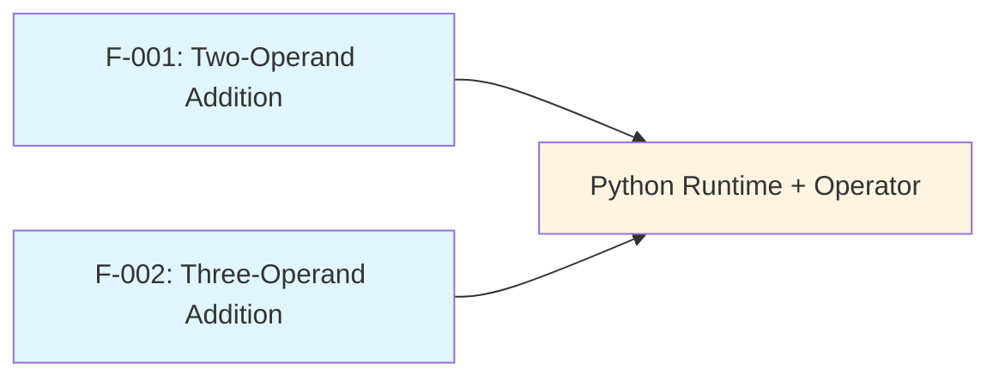
```mermaid
graph LR
    F001[F-001: Two-Operand Addition]
    F002[F-002: Three-Operand Addition]
    PY[Python Runtime + Operator]
    
    F001 --> PY
    F002 --> PY
    
    style F001 fill:#e1f5ff
    style F002 fill:#e1f5ff
    style PY fill:#fff4e1
```

### 2.3.2 Integration Points

- **No Cross-Feature Dependencies**: F-001 and F-002 operate independently
- **Shared Runtime**: Both features rely on Python's native `+` operator implementation
- **Common Components**: Python runtime environment only

### 2.3.3 Shared Resources

| Resource | Used By | Purpose |
|----------|---------|---------|
| Python `+` operator | F-001, F-002 | Core addition logic |
| Python runtime | F-001, F-002 | Execution environment |

## 2.4 Implementation Considerations

### 2.4.1 Technical Constraints

- **No Type Checking**: Functions accept any types without validation
- **No Error Handling**: TypeError exceptions propagate to caller
- **No Edge Case Handling**: No special handling for None, empty values, or incompatible types
- **Fixed Arity**: Functions accept only 2 or 3 operands (no variadic support)

### 2.4.2 Performance Requirements

| Aspect | Requirement |
|--------|-------------|
| Time Complexity | O(1) for basic numeric types |
| Space Complexity | O(1) - no additional allocations |
| Response Time | Immediate return (sub-microsecond) |

### 2.4.3 Scalability Considerations

- **Not Applicable**: Stateless pure functions with no scalability concerns
- **Thread Safety**: Safe for concurrent use (no shared state)

### 2.4.4 Security Implications

- **No Input Sanitization**: Caller must ensure operands are safe
- **Custom Object Risk**: Malicious `__add__` implementations in custom objects are not prevented
- **Recommendation**: Add input validation if used with untrusted data

### 2.4.5 Maintenance Requirements

- **Minimal Maintenance**: No dependencies to update
- **Enhancement Opportunities**: Consider adding type hints, docstrings, and input validation for production use

## 2.5 Requirements Traceability Matrix

| Feature | Requirements | Source File | Status |
|---------|--------------|-------------|--------|
| F-001 | F-001-RQ-001 to RQ-004 | `test.py` (lines 1-2) | Completed |
| F-002 | F-002-RQ-001 to RQ-004 | `test.py` (lines 4-5) | Completed |

## 2.6 Assumptions and Constraints

### 2.6.1 Assumptions

- Users have basic Python knowledge and understand operator overloading
- Callers will provide compatible operand types
- Python runtime environment is available and functional
- No need for error handling or input validation

### 2.6.2 Constraints

- **Operational Scope**: Limited to addition operations only
- **Fixed Arity**: No support for variable number of operands
- **No Configuration**: No runtime configuration options
- **No Extensibility**: No plugin or extension mechanisms

### 2.6.3 Out of Scope

- Subtraction, multiplication, division, or other arithmetic operations
- Input validation or type checking
- Error handling or exception management
- Logging or monitoring capabilities
- Performance optimization for complex objects

## 2.7 References

### 2.7.1 Source Files

- `test.py` - Core implementation containing `add()` and `add3()` functions

### 2.7.2 Related Documentation

- Section 1.1 Executive Summary - Project overview and stakeholder information

# 3. Technology Stack

This section documents the technology stack for the repository, which follows a minimal, zero-dependency architecture.

## 3.1 Programming Languages

### 3.1.1 Python

**Primary Language**: Python (version unspecified, compatible with Python 3.x)

The entire codebase is implemented in pure Python without version-specific features. The language was selected for its simplicity and standard library capabilities, which are sufficient for the arithmetic utility functions implemented in `test.py`.

**Justification**: Python provides the necessary functionality without requiring external dependencies, aligning with the project's zero-dependency architecture.

## 3.2 Frameworks & Libraries

### 3.2.1 Core Frameworks

**None** - This project operates without any frameworks.

### 3.2.2 Supporting Libraries

**None** - The project uses only Python's standard library and built-in operators.

## 3.3 Open Source Dependencies

### 3.3.1 External Dependencies

**None** - This is a zero-dependency project with no package management configuration files (no `requirements.txt`, `setup.py`, or `pyproject.toml`).

## 3.4 Development & Deployment

### 3.4.1 Version Control

**Git** - Standard version control system with `.gitignore` configured to exclude Python artifacts (`__pycache__`, `*.pyc`), virtual environments, and IDE-specific files.

### 3.4.2 Development Environment

Based on `.gitignore` patterns, the development environment supports:
- Python virtual environments (venv, env)
- Multiple IDEs (VSCode, IntelliJ IDEA)
- Standard Python development workflows

### 3.4.3 Build & Deployment

**No build system or deployment infrastructure** is present in the repository. The code can be executed directly with a Python interpreter.

## 3.5 Technology Stack Summary

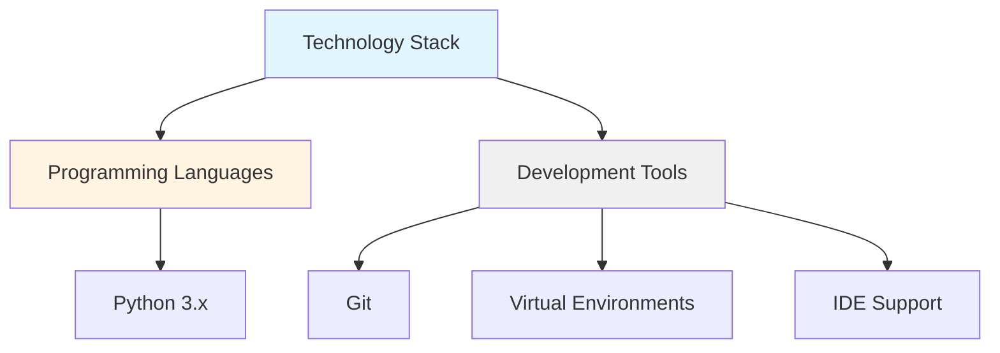
```mermaid
graph TD
    A[Technology Stack] --> B[Programming Languages]
    A --> C[Development Tools]
    
    B --> B1[Python 3.x]
    
    C --> C1[Git]
    C --> C2[Virtual Environments]
    C --> C3[IDE Support]
    
    style A fill:#e1f5ff
    style B fill:#fff4e1
    style C fill:#f0f0f0
```

### 3.5.1 References

- `test.py` - Core Python module containing arithmetic functions
- `.gitignore` - Version control ignore patterns indicating development environment setup

# 4. Process Flowchart

This section documents the process flows and workflows for the arithmetic utility module. Given the minimalist architecture with two standalone functions, the workflows are intentionally simple and linear.

## 4.1 High-Level System Workflow

### 4.1.1 Overall Process Flow

The system operates through a straightforward import-and-execute model with no complex state management or multi-system integrations.


```mermaid
flowchart TD
    Start([Developer Initiates]) --> Import[Import Module: from test import add, add3]
    Import --> Choose{Select Function}
    Choose -->|Two Operands| CallAdd[Call add#40;a, b#41;]
    Choose -->|Three Operands| CallAdd3[Call add3#40;a, b, c#41;]
    CallAdd --> ExecuteAdd[Execute: a + b]
    CallAdd3 --> ExecuteAdd3[Execute: #40;a + b#41; + c]
    ExecuteAdd --> ReturnAdd[Return Result]
    ExecuteAdd3 --> ReturnAdd3[Return Result]
    ReturnAdd --> End([Process Complete])
    ReturnAdd3 --> End
```

### 4.1.2 System Boundaries

- **Entry Point**: Python module import and function invocation
- **Processing Boundary**: Function scope (stateless, synchronous)
- **Exit Point**: Return statement with computed result
- **No External Systems**: Zero cross-system interactions

## 4.2 Core Business Process Flows

### 4.2.1 Two-Operand Addition Process (Feature F-001)

**Process Description**: Executes addition of two operands with immediate return.


```mermaid
flowchart TD
    Start([Function Call: add#40;a, b#41;]) --> Receive[Receive Parameters a, b]
    Receive --> Validate{Type Compatible?}
    Validate -->|Yes| Compute[Compute: a + b]
    Validate -->|No| TypeError[Raise TypeError]
    Compute --> Return[Return Result]
    Return --> End([Process Complete])
    TypeError --> ErrorEnd([Exception Propagated])
```

**Process Characteristics**:
- **Execution Time**: O(1) constant time
- **State Management**: Stateless operation
- **Transaction Boundary**: None (atomic operation)
- **SLA**: Immediate synchronous return

### 4.2.2 Three-Operand Addition Process (Feature F-002)

**Process Description**: Executes sequential addition of three operands.

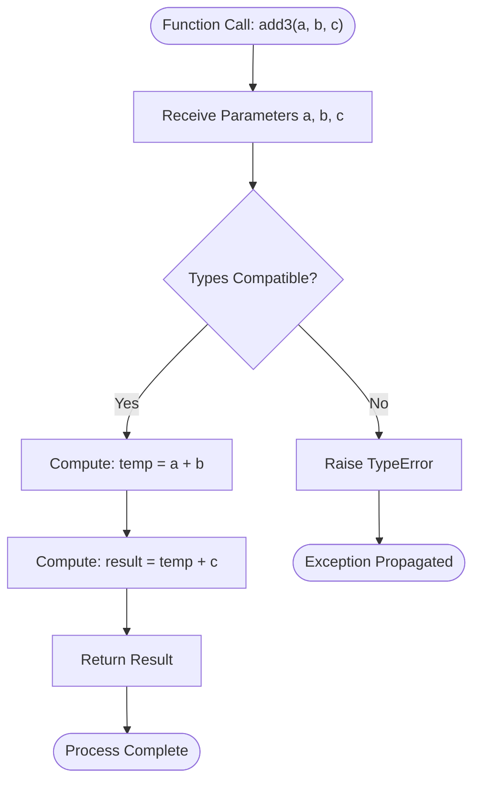
```mermaid
flowchart TD
    Start([Function Call: add3#40;a, b, c#41;]) --> Receive[Receive Parameters a, b, c]
    Receive --> Validate{Types Compatible?}
    Validate -->|Yes| Step1[Compute: temp = a + b]
    Validate -->|No| TypeError[Raise TypeError]
    Step1 --> Step2[Compute: result = temp + c]
    Step2 --> Return[Return Result]
    Return --> End([Process Complete])
    TypeError --> ErrorEnd([Exception Propagated])
```

**Process Characteristics**:
- **Execution Time**: O(1) constant time
- **State Management**: Stateless operation
- **Intermediate State**: Temporary sum of first two operands (ephemeral)
- **Transaction Boundary**: None (atomic operation)

## 4.3 Error Handling and Recovery

### 4.3.1 Error Handling Flow

The module relies on Python's native exception handling with no custom error recovery mechanisms.

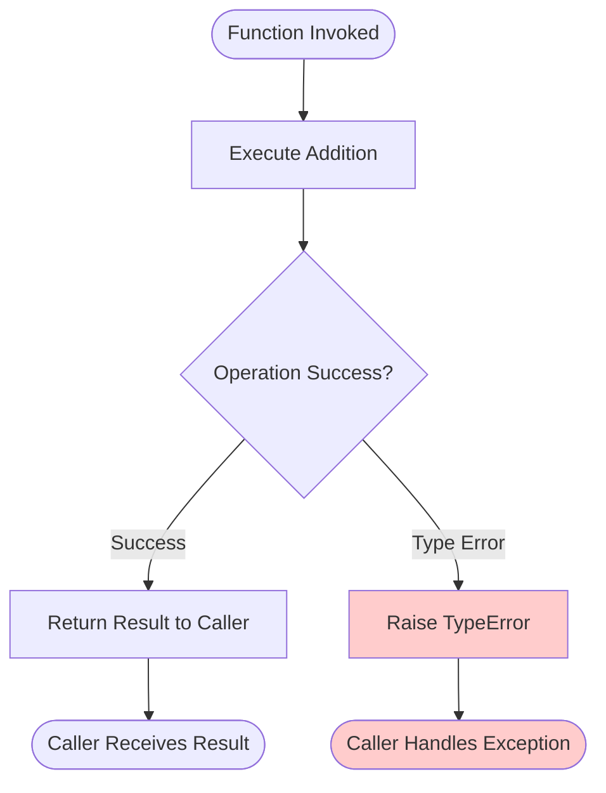
```mermaid
flowchart TD
    Start([Function Invoked]) --> Execute[Execute Addition]
    Execute --> Check{Operation Success?}
    Check -->|Success| Return[Return Result to Caller]
    Check -->|Type Error| RaiseError[Raise TypeError]
    Return --> CallerSuccess([Caller Receives Result])
    RaiseError --> CallerError([Caller Handles Exception])
    
    style RaiseError fill:#ffcccc
    style CallerError fill:#ffcccc
```

### 4.3.2 Error Scenarios

**TypeError Conditions**:
- Operands do not support `__add__` method
- Incompatible type combinations (e.g., `int + NoneType`)
- No retry mechanisms implemented
- No fallback values provided
- Error handling responsibility delegated to calling code

### 4.3.3 Recovery Procedures

**No Built-In Recovery**: The module implements no recovery mechanisms. Callers must implement their own error handling:
- Try-except blocks around function calls
- Input validation before invocation
- Custom fallback logic as needed

## 4.4 Integration and Data Flow

### 4.4.1 Integration Workflow

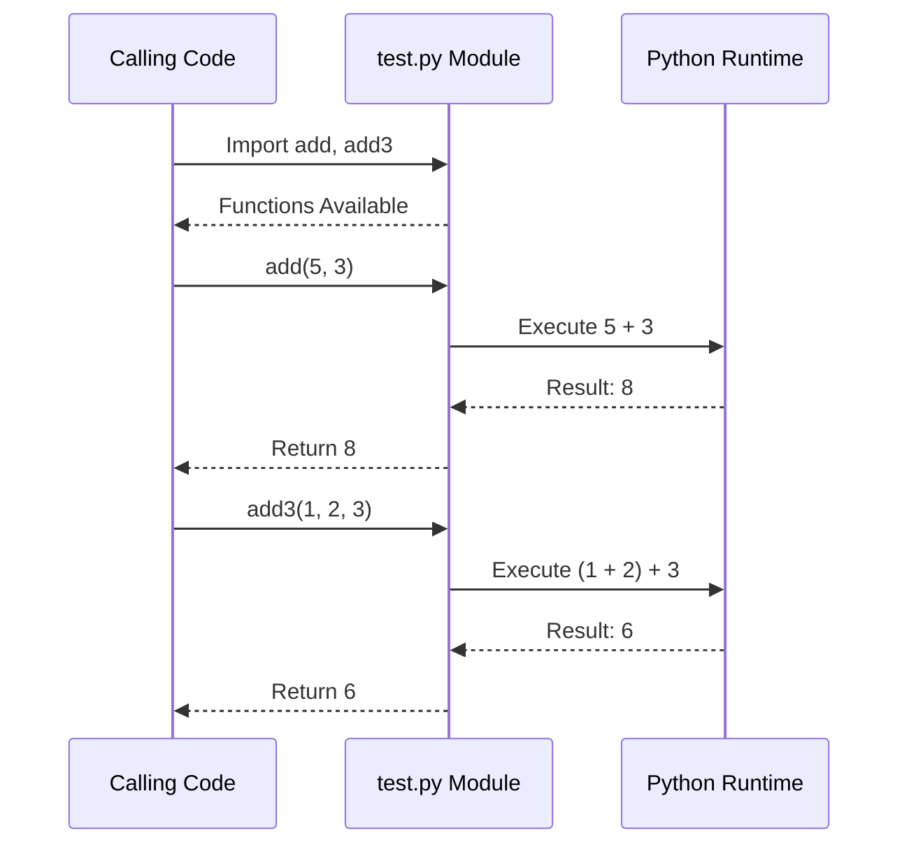
```mermaid
sequenceDiagram
    participant Caller as Calling Code
    participant Module as test.py Module
    participant Python as Python Runtime
    
    Caller->>Module: Import add, add3
    Module-->>Caller: Functions Available
    
    Caller->>Module: add(5, 3)
    Module->>Python: Execute 5 + 3
    Python-->>Module: Result: 8
    Module-->>Caller: Return 8
    
    Caller->>Module: add3(1, 2, 3)
    Module->>Python: Execute (1 + 2) + 3
    Python-->>Module: Result: 6
    Module-->>Caller: Return 6
```

### 4.4.2 Data Flow Characteristics

- **Input Flow**: Direct parameter passing via function arguments
- **Processing Flow**: Synchronous computation with native Python operators
- **Output Flow**: Direct return value to caller
- **No Persistence**: No data stored between invocations
- **No Caching**: Fresh computation on every call

## 4.5 State Management

### 4.5.1 State Transition Diagram

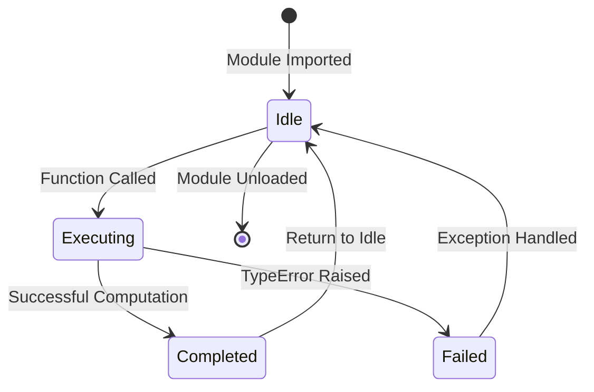
```mermaid
stateDiagram-v2
    [*] --> Idle: Module Imported
    Idle --> Executing: Function Called
    Executing --> Completed: Successful Computation
    Executing --> Failed: TypeError Raised
    Completed --> Idle: Return to Idle
    Failed --> Idle: Exception Handled
    Idle --> [*]: Module Unloaded
```

### 4.5.2 State Characteristics

- **No Persistent State**: Functions maintain no state between calls
- **No Session Management**: Each invocation is independent
- **No Caching Requirements**: Stateless operation model
- **Transaction Boundaries**: N/A (atomic operations)

## 4.6 Validation and Business Rules

### 4.6.1 Validation Flow

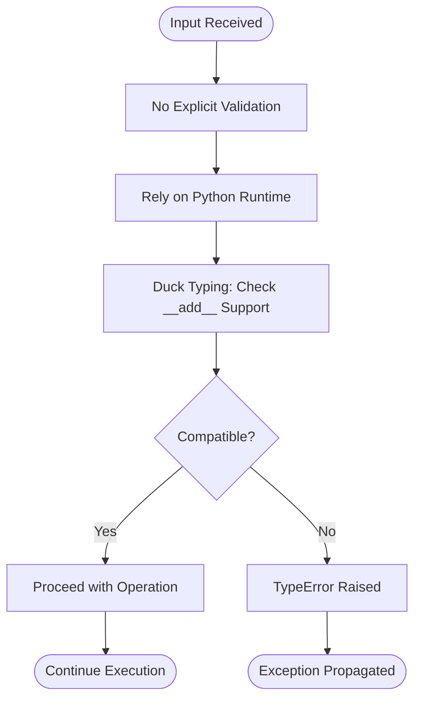
```mermaid
flowchart TD
    Start([Input Received]) --> NoValidation[No Explicit Validation]
    NoValidation --> Runtime[Rely on Python Runtime]
    Runtime --> DuckTyping[Duck Typing: Check __add__ Support]
    DuckTyping --> Compatible{Compatible?}
    Compatible -->|Yes| Proceed[Proceed with Operation]
    Compatible -->|No| Error[TypeError Raised]
    Proceed --> End([Continue Execution])
    Error --> ErrorEnd([Exception Propagated])
```

### 4.6.2 Business Rules

**No Business Rules Defined**: The module implements pure arithmetic operations with no business logic, validation rules, authorization checks, or compliance requirements.

**Implicit Runtime Rules**:
- Operands must support Python's `+` operator
- Type compatibility determined at runtime
- No range or boundary validation

## 4.7 Timing and Performance Considerations

### 4.7.1 Execution Timeline

**Both Functions**:
- **Invocation**: Immediate (function call overhead only)
- **Execution**: O(1) constant time
- **Return**: Immediate synchronous return
- **Total Duration**: Microseconds (negligible)

### 4.7.2 SLA Considerations

- **No SLA Requirements**: Instantaneous execution
- **No Timeout Handling**: Operations complete immediately
- **No Async Processing**: Fully synchronous execution model
- **No Queuing**: Direct execution on invocation

## 4.8 Process Summary

### 4.8.1 Workflow Complexity Assessment

| Aspect | Complexity Level | Notes |
|--------|------------------|-------|
| Process Steps | Minimal | 3-step linear flow per function |
| Decision Points | Single | Type compatibility check (runtime) |
| Error Paths | Single | TypeError propagation |
| Integration Points | None | Standalone module |
| State Management | None | Stateless functions |
| Async Operations | None | Synchronous execution only |

### 4.8.2 Key Process Characteristics

- **Linear Execution**: No branching logic or conditional processing
- **Immediate Results**: No deferred processing or callbacks
- **Zero Dependencies**: No external service calls or API integrations
- **Atomic Operations**: Complete in single execution context
- **Caller-Managed Errors**: Exception handling delegated to calling code

## 4.9 References

### 4.9.1 Source Files
- `test.py` - Core implementation of add() and add3() functions

### 4.9.2 Related Specification Sections
- Section 1.1: Executive Summary - Project overview and stakeholder context
- Section 2.1: Feature Catalog - Detailed feature descriptions for F-001 and F-002
- Section 2.2: Functional Requirements - Functional specifications for both features
- Section 3.1: Programming Languages - Python runtime environment requirements

### 4.9.3 Process Documentation Notes

Given the minimalist architecture of this utility module, the process flows are intentionally simple. The absence of complex workflows, state management, multi-system integrations, and asynchronous processing reflects the deliberate design choice for a lightweight, zero-dependency arithmetic utility.

# 5. System Architecture

## 5.1 High-Level Architecture

### 5.1.1 System Overview

The system implements a **single-module utility library architecture** designed around pure functional programming principles. The architecture follows a minimalist approach where the entire system consists of one Python module (`test.py`) exposing two stateless arithmetic functions.

**Architectural Style**: The system adopts a **library/utility module pattern** rather than a service-oriented or layered architecture. This design choice reflects the system's purpose as a lightweight arithmetic utility that integrates directly into consumer applications through standard Python imports.

**Key Architectural Principles**:
- **Statelessness**: All functions are pure with no side effects, ensuring predictable behavior and thread-safety
- **Zero Dependencies**: No external packages required, relying solely on Python's native operators
- **Immediate Execution**: Synchronous operations with instant results, no asynchronous processing
- **Type Flexibility**: Dynamic typing supports any Python objects implementing the `__add__` method

**System Boundaries**: The system operates entirely within the consumer's Python process space. There are no external system interactions, network communications, or persistent storage. The module accepts function calls with operands and returns computed results without any environmental dependencies.

### 5.1.2 Core Components

| Component Name | Primary Responsibility | Key Dependencies | Integration Points |
|----------------|------------------------|------------------|-------------------|
| test.py module | Arithmetic addition operations for 2-3 operands | Python 3.x interpreter (native `+` operator) | Direct function imports by consumer code |

### 5.1.3 Data Flow Description

The system implements a **synchronous request-response data flow** with no intermediate processing stages:

1. **Input Stage**: Consumer application imports functions (`add` or `add3`) and invokes them with operands
2. **Processing Stage**: The module applies Python's native `+` operator to the provided operands
3. **Output Stage**: Computed result returns immediately to the caller

**Data Transformation**: No transformation occurs—operands pass directly to the `+` operator, and results return without modification. The system supports any addable Python types including integers, floats, strings, lists, and custom objects implementing `__add__`.

**Data Persistence**: The system maintains no state between invocations. Each function call operates independently with no caching, logging, or data retention.

### 5.1.4 External Integration Points

| System Name | Integration Type | Data Exchange Pattern | Protocol/Format |
|-------------|------------------|----------------------|-----------------|
| N/A | None | N/A | N/A |

*This system has no external integrations—it operates as a self-contained utility module.*

## 5.2 Component Details

### 5.2.1 Core Module Component (test.py)

**Purpose and Responsibilities**:
The `test.py` module serves as the singular architectural component, providing two arithmetic addition functions:
- `add(a, b)`: Performs binary addition of two operands
- `add3(a, b, c)`: Performs ternary addition of three operands by chaining binary additions

**Technologies and Frameworks**:
- **Language**: Python 3.x
- **Runtime**: Standard Python interpreter
- **Operators**: Native `+` operator for all addition operations
- **Dependencies**: None

**Key Interfaces and APIs**:
```
Public Interface:
  - add(a: Any, b: Any) -> Any
  - add3(a: Any, b: Any, c: Any) -> Any

Error Handling:
  - TypeError raised by Python runtime for incompatible operand types
```

**Data Persistence Requirements**: None—the module is completely stateless with no data persistence needs.

**Scaling Considerations**:
- **Horizontal Scalability**: Unlimited—stateless design allows parallel execution across multiple processes/threads
- **Vertical Scalability**: Governed by Python interpreter performance for the `+` operator (O(1) complexity for numeric types)
- **Bottlenecks**: None—no shared resources, I/O operations, or synchronization points

### 5.2.2 Component Interaction Diagram

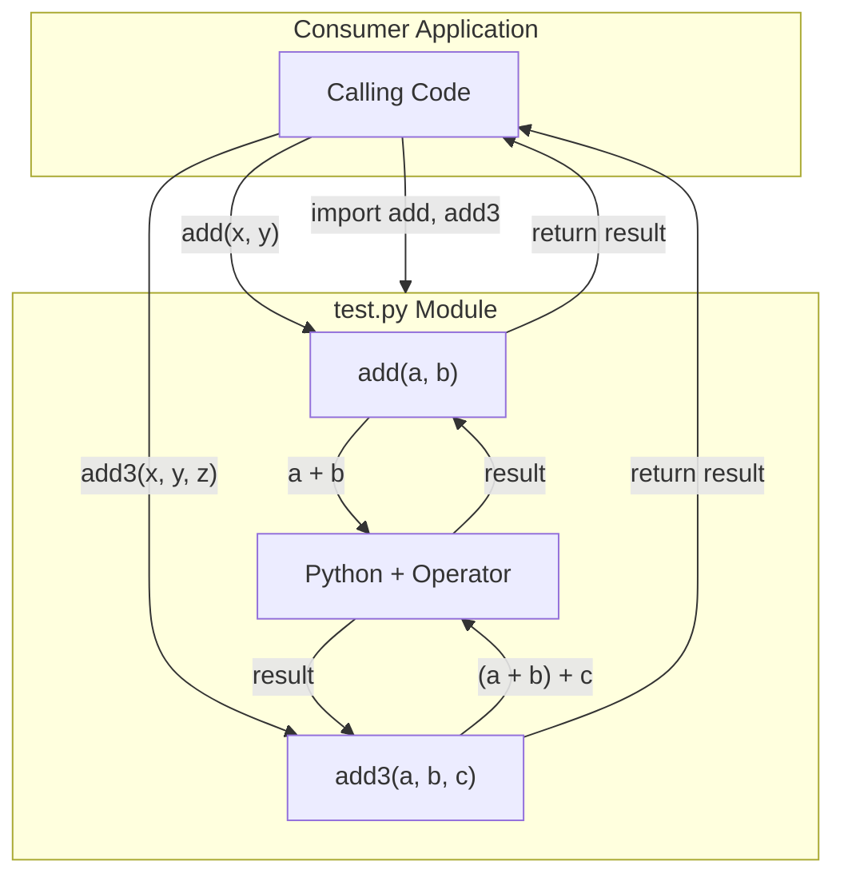
```mermaid
graph TB
    subgraph Consumer_Application["Consumer Application"]
        caller["Calling Code"]
    end
    
    subgraph Test_Module["test.py Module"]
        add_func["add(a, b)"]
        add3_func["add3(a, b, c)"]
        operator["Python + Operator"]
    end
    
    caller -->|"import add, add3"| Test_Module
    caller -->|"add(x, y)"| add_func
    caller -->|"add3(x, y, z)"| add3_func
    add_func -->|"a + b"| operator
    add3_func -->|"(a + b) + c"| operator
    operator -->|"result"| add_func
    operator -->|"result"| add3_func
    add_func -->|"return result"| caller
    add3_func -->|"return result"| caller
```

### 5.2.3 Sequence Diagram for Addition Operations

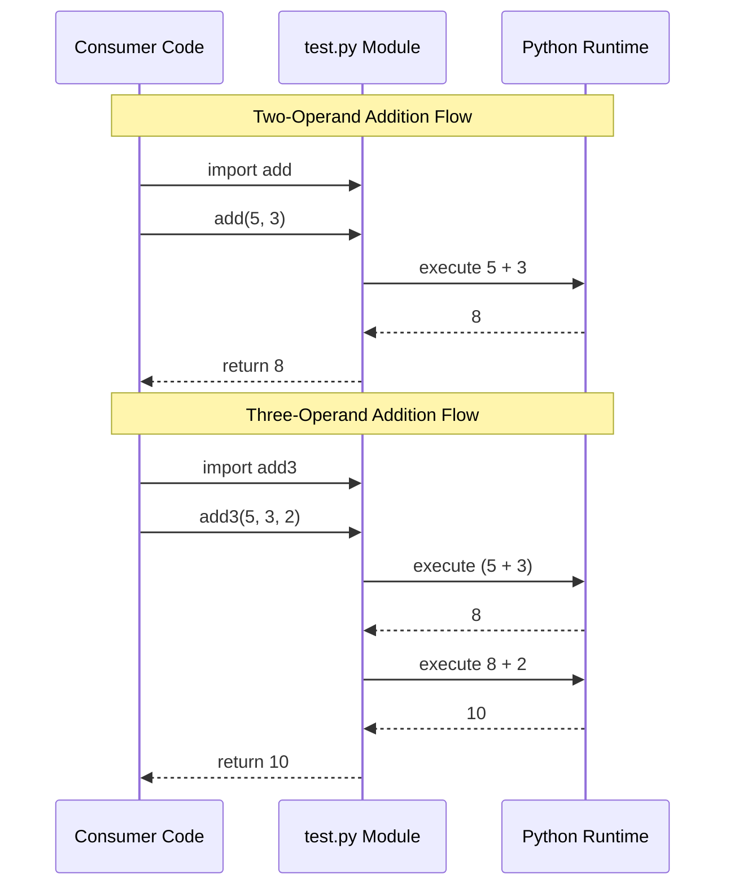
```mermaid
sequenceDiagram
    participant C as Consumer Code
    participant M as test.py Module
    participant P as Python Runtime
    
    Note over C,P: Two-Operand Addition Flow
    C->>M: import add
    C->>M: add(5, 3)
    M->>P: execute 5 + 3
    P-->>M: 8
    M-->>C: return 8
    
    Note over C,P: Three-Operand Addition Flow
    C->>M: import add3
    C->>M: add3(5, 3, 2)
    M->>P: execute (5 + 3)
    P-->>M: 8
    M->>P: execute 8 + 2
    P-->>M: 10
    M-->>C: return 10
```

### 5.2.4 State Transition Diagram

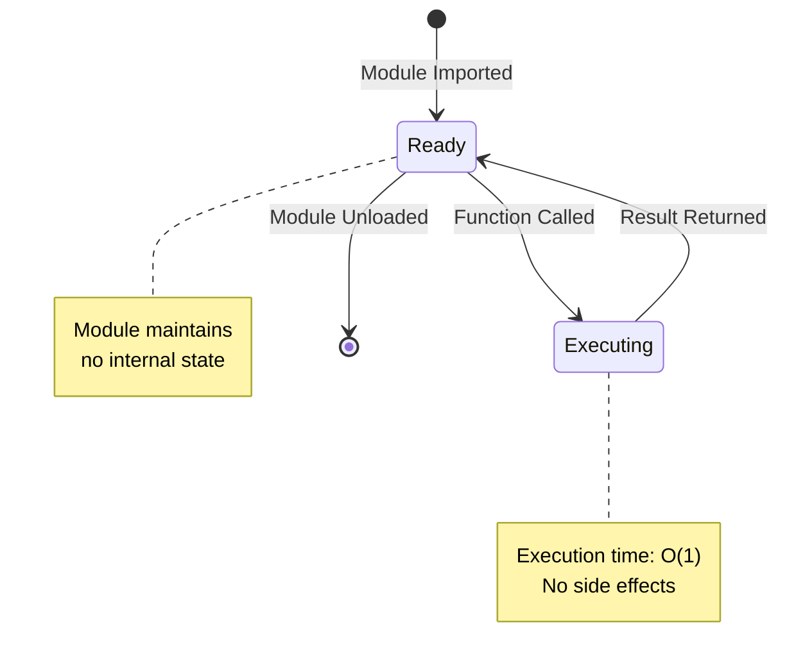
```mermaid
stateDiagram-v2
    [*] --> Ready: Module Imported
    Ready --> Executing: Function Called
    Executing --> Ready: Result Returned
    Ready --> [*]: Module Unloaded
    
    note right of Ready
        Module maintains
        no internal state
    end note
    
    note right of Executing
        Execution time: O(1)
        No side effects
    end note
```

## 5.3 Technical Decisions

### 5.3.1 Architecture Style Decision

| Aspect | Decision | Rationale | Tradeoffs |
|--------|----------|-----------|-----------|
| **Pattern** | Single-module utility library | Matches scope of two simple functions; avoids over-engineering | Limited extensibility for complex features |
| **State Management** | Stateless pure functions | Ensures thread-safety, predictability, and testability | No caching or optimization opportunities |
| **Type System** | Dynamic typing without annotations | Supports polymorphic addition (numbers, strings, lists, custom objects) | No compile-time type checking |

### 5.3.2 Communication Pattern Choices

**Decision**: Synchronous function calls with immediate returns

**Justification**: 
- Operations complete in O(1) time for numeric types
- No I/O or blocking operations
- Consumer expects immediate results for arithmetic operations
- Asynchronous processing would add unnecessary complexity

**Alternatives Considered**:
- Asynchronous/await pattern: Rejected due to operation simplicity
- Callback-based: Rejected—no need for deferred execution
- Event-driven: Rejected—no event sources or subscriptions needed

### 5.3.3 Data Storage Solution

**Decision**: No data storage implementation

**Rationale**: The system performs ephemeral computations with no persistence requirements. Each function invocation is independent, and results are immediately consumed by the caller.

**Future Considerations**: If audit logging or computation caching becomes necessary, could introduce optional storage layer without modifying core functions.

### 5.3.4 Dependency Management Strategy

| Decision Area | Choice | Justification |
|---------------|--------|---------------|
| **External Packages** | Zero dependencies | Addition operations require only native Python operators |
| **Standard Library** | Minimal usage | No standard library imports needed for core functionality |
| **Versioning** | Python 3.x compatibility | Uses universal syntax compatible with all Python 3 versions |

### 5.3.5 Architecture Decision Record

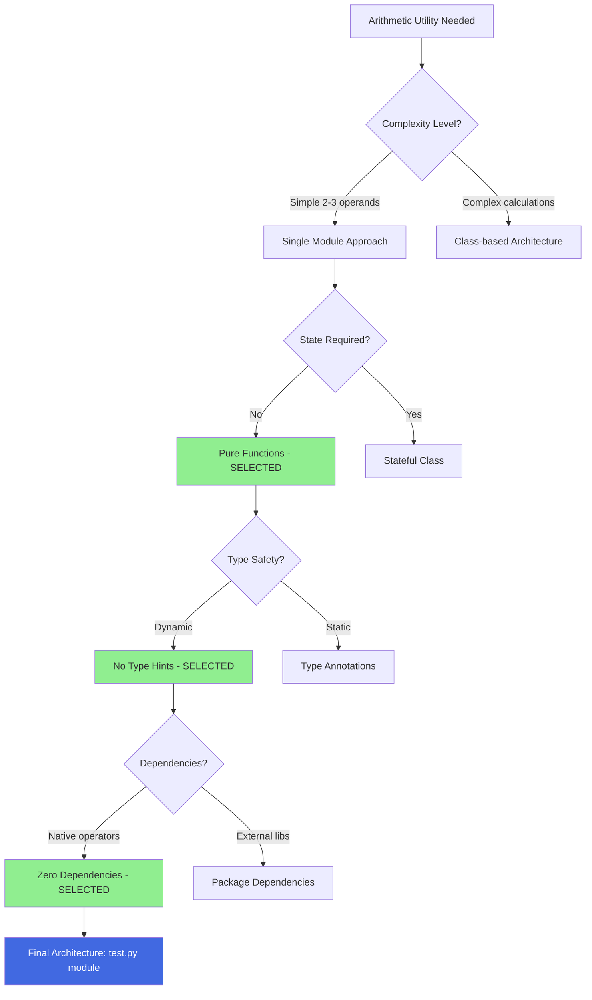
```mermaid
graph TD
    A[Arithmetic Utility Needed] --> B{Complexity Level?}
    B -->|Simple 2-3 operands| C[Single Module Approach]
    B -->|Complex calculations| D[Class-based Architecture]
    
    C --> E{State Required?}
    E -->|No| F[Pure Functions - SELECTED]
    E -->|Yes| G[Stateful Class]
    
    F --> H{Type Safety?}
    H -->|Dynamic| I[No Type Hints - SELECTED]
    H -->|Static| J[Type Annotations]
    
    I --> K{Dependencies?}
    K -->|Native operators| L[Zero Dependencies - SELECTED]
    K -->|External libs| M[Package Dependencies]
    
    L --> N[Final Architecture: test.py module]
    
    style F fill:#90EE90
    style I fill:#90EE90
    style L fill:#90EE90
    style N fill:#4169E1,color:#FFFFFF
```

## 5.4 Cross-Cutting Concerns

### 5.4.1 Monitoring and Observability

**Approach**: No built-in monitoring or observability infrastructure

**Rationale**: As a utility library, monitoring responsibilities belong to the consumer application. The module's simplicity (two pure functions with O(1) complexity) presents minimal monitoring needs.

**Consumer Integration**: Consumer applications can implement their own instrumentation by wrapping function calls:
- Timing measurements for performance profiling
- Result logging for audit trails
- Error capture for exception tracking

### 5.4.2 Logging and Tracing Strategy

| Concern | Implementation | Justification |
|---------|----------------|---------------|
| **Application Logging** | None | No internal state changes or side effects to log |
| **Error Logging** | Delegated to caller | Exceptions propagate to consumer for handling |
| **Trace Context** | Not applicable | Synchronous single-step operations require no distributed tracing |

### 5.4.3 Error Handling Patterns

**Strategy**: Fail-fast with native Python exception propagation

**Implementation**:
- The module performs no input validation
- Invalid operand types trigger Python's native `TypeError`
- Exceptions immediately propagate to the caller
- No exception catching or transformation within the module

**Error Scenarios**:
1. **Type Mismatch**: Attempting to add incompatible types (e.g., `add(5, "text")` for numeric context)
2. **Operator Not Implemented**: Custom objects without `__add__` method
3. **Memory Exhaustion**: Extremely large operands causing memory errors (handled by Python runtime)

### 5.4.4 Error Handling Flow Diagram

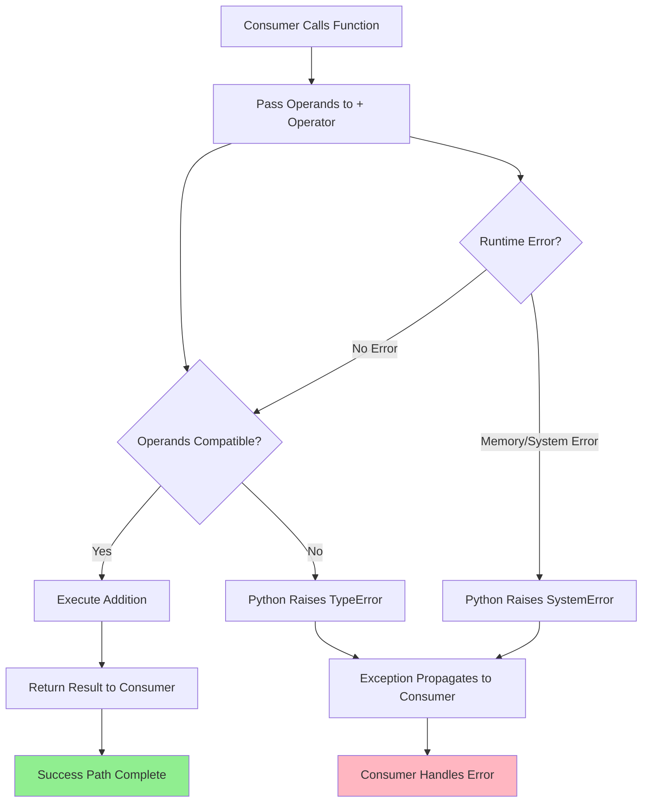
```mermaid
flowchart TD
    A[Consumer Calls Function] --> B[Pass Operands to + Operator]
    B --> C{Operands Compatible?}
    
    C -->|Yes| D[Execute Addition]
    D --> E[Return Result to Consumer]
    E --> F[Success Path Complete]
    
    C -->|No| G[Python Raises TypeError]
    G --> H[Exception Propagates to Consumer]
    H --> I[Consumer Handles Error]
    
    B --> J{Runtime Error?}
    J -->|Memory/System Error| K[Python Raises SystemError]
    K --> H
    J -->|No Error| C
    
    style F fill:#90EE90
    style I fill:#FFB6C1
```

### 5.4.5 Authentication and Authorization Framework

**Implementation**: Not applicable

**Rationale**: As an importable module executing within the consumer's process space, the system inherits the security context of the host application. There are no network boundaries, API endpoints, or user sessions requiring authentication.

### 5.4.6 Performance Requirements and SLAs

| Metric | Target | Measurement Method |
|--------|--------|-------------------|
| **Execution Time** | O(1) for numeric types | Python operator performance |
| **Memory Usage** | O(1) additional overhead | Single result object creation |
| **Throughput** | Limited by Python interpreter GIL | Consumer's multi-processing strategy |
| **Latency** | Sub-microsecond for integers | Direct operator invocation |

**Performance Characteristics**:
- No I/O operations—CPU-bound only
- No network latency—local function calls
- No database query time—stateless operations
- No serialization overhead—in-memory Python objects

**Scaling Strategy**: Consumer applications requiring high throughput should leverage Python's multiprocessing module to distribute work across processes, bypassing the Global Interpreter Lock (GIL).

### 5.4.7 Disaster Recovery Procedures

**Strategy**: Not applicable

**Rationale**: The system maintains no persistent state, sessions, or external resources requiring recovery. In failure scenarios:
1. **Process Crash**: Consumer restarts and re-imports the module—no state loss
2. **Function Exception**: Caller handles exception and retries with corrected inputs
3. **Module Corruption**: Consumer reinstalls or redownloads the file from source control

**Backup Requirements**: None—the single source file (`test.py`) should be maintained in version control.

## 5.5 Deployment Architecture

### 5.5.1 Distribution Model

The system deploys as a **source file inclusion pattern**:
1. Consumer obtains `test.py` via Git clone, direct file copy, or potential pip package installation
2. Module placed in Python's module search path (e.g., project directory, site-packages)
3. Consumer imports functions using standard Python import statements

**Build Process**: None required—pure Python source executes directly without compilation.

**Configuration**: No configuration files, environment variables, or deployment parameters needed.

### 5.5.2 Runtime Environment

**Requirements**:
- Python 3.x interpreter (any minor version)
- No additional Python packages
- No system-level dependencies

**Environment Isolation**: The `.gitignore` file specifies standard Python artifact exclusions:
- `venv/` - Virtual environment directories
- `__pycache__/` - Compiled bytecode cache
- `dist/`, `build/` - Package distribution artifacts
- IDE configuration files (`.idea/`, `.vscode/`)

### 5.5.3 Deployment Diagram

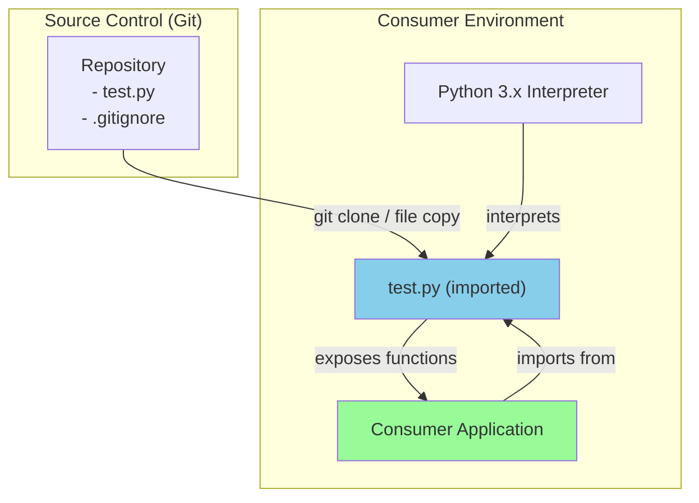
```mermaid
graph TB
    subgraph Source_Control["Source Control (Git)"]
        repo["Repository<br/>- test.py<br/>- .gitignore"]
    end
    
    subgraph Consumer_Environment["Consumer Environment"]
        python["Python 3.x Interpreter"]
        app["Consumer Application"]
        module["test.py (imported)"]
    end
    
    repo -->|"git clone / file copy"| module
    python -->|"interprets"| module
    app -->|"imports from"| module
    module -->|"exposes functions"| app
    
    style module fill:#87CEEB
    style app fill:#98FB98
```

## 5.6 Architectural Assumptions and Constraints

### 5.6.1 Assumptions

1. **Execution Environment**: Consumer provides a Python 3.x interpreter
2. **Operand Compatibility**: Callers pass objects compatible with the `+` operator
3. **Error Responsibility**: Consumer handles exception cases appropriately
4. **Import Mechanism**: Standard Python import system available
5. **Single-threaded Context**: While thread-safe, the module assumes synchronous invocation patterns

### 5.6.2 Constraints

| Constraint Type | Description | Impact |
|----------------|-------------|--------|
| **Language Binding** | Python-only implementation | Cannot integrate with non-Python applications without bridges |
| **Operand Count** | Fixed at 2 or 3 operands per function | Multiple additions require chaining function calls |
| **Type Validation** | No runtime type checking | Incompatible types fail at operator execution |
| **Extension Points** | No plugin or middleware infrastructure | Custom behavior requires forking or wrapping |

## 5.7 Architecture Quality Attributes

### 5.7.1 Maintainability

**Score**: High
- **Simplicity**: Two functions, 6 lines of code total
- **Clarity**: Self-documenting function names and obvious implementations
- **Testability**: Pure functions enable trivial unit testing
- **Modularity**: Single responsibility—addition operations only

### 5.7.2 Reliability

**Score**: High
- **Determinism**: Pure functions guarantee consistent outputs for given inputs
- **Error Handling**: Relies on Python's robust native error handling
- **No Failure Points**: Zero external dependencies or I/O operations
- **Thread Safety**: Stateless design eliminates race conditions

### 5.7.3 Portability

**Score**: High
- **Platform Independence**: Runs on any OS supporting Python 3.x
- **Dependency Freedom**: No external packages simplify deployment
- **Version Flexibility**: Compatible with all Python 3 minor versions

### 5.7.4 Extensibility

**Score**: Low (by design)
- **Current Design**: Minimal surface area optimized for specific use case
- **Extension Path**: Consumers can wrap functions or fork for customization
- **Rationale**: System scope doesn't warrant extensibility infrastructure

## 5.8 References

### 5.8.1 Files Examined

- `test.py` - Core module implementation with add() and add3() functions
- `.gitignore` - Python artifact exclusion patterns for version control

### 5.8.2 Folders Analyzed

- `` (root directory) - Complete repository containing all system files

### 5.8.3 Technical Specification Sections Referenced

- `1.2 System Overview` - Project context and success criteria
- `3.1 Programming Languages` - Python language selection rationale
- `4.1 High-Level System Workflow` - Process flow documentation
- `2.1 Feature Catalog` - Feature specifications for F-001 (add) and F-002 (add3)

# 6. SYSTEM COMPONENTS DESIGN

## 6.1 Core Services Architecture

#### INFRASTRUCTURE AND DEPLOYMENT

## 6.1 Core Services Architecture

### 6.1.1 Applicability Assessment

**Core Services Architecture is not applicable for this system.**

This repository implements a standalone Python utility module consisting of a single file (`test.py`) with two pure arithmetic functions. The system does not employ microservices, distributed architecture, or distinct service components that would require core services architecture documentation.

### 6.1.2 System Architecture Classification

#### Single-Module Utility Library

The system is classified as a direct-import utility library with the following characteristics:

- **Deployment Model**: Library code imported directly into consumer applications
- **Execution Context**: Runs within the caller's process space
- **Integration Pattern**: Direct function invocation through Python import statements
- **Communication Model**: In-process function calls with no inter-service communication

#### Architecture Characteristics

| Characteristic | Status | Rationale |
|---------------|--------|-----------|
| Service Boundaries | Not Applicable | Single-module design with no logical service separation |
| Distributed Components | Not Present | All functionality contained in one 6-line file |
| Network Communication | Not Required | Direct in-process function calls only |

### 6.1.3 Why Services Architecture Is Not Applicable

#### Absence of Service-Oriented Patterns

The system lacks fundamental characteristics that would necessitate core services architecture:

1. **No Service Decomposition**: The entire system consists of two pure functions (`add` and `add3`) with no logical boundaries requiring service separation

2. **No Network Layer**: Functions are invoked directly through Python imports with no HTTP, RPC, or message-based communication

3. **No Independent Deployability**: The module is distributed as library code that becomes part of the consumer's deployment unit

4. **No Scalability Requirements**: Scaling occurs naturally through the consumer application's scaling strategy, not through independent service scaling

#### Library Integration Model

Consumer applications integrate this module using standard Python import mechanisms:

```python
from test import add, add3
result = add(2, 3)
```

This integration pattern eliminates the need for:
- Service discovery mechanisms
- Load balancing strategies
- Circuit breaker patterns
- Inter-service communication protocols
- Service mesh infrastructure
- API gateways

### 6.1.4 Scaling and Resilience Considerations

#### Scaling Model

**Approach**: Inherits scaling characteristics from the consuming application.

- **Horizontal Scaling**: When consumer applications scale horizontally, the library code scales with each instance
- **Vertical Scaling**: Performance scales with the underlying Python interpreter and hardware
- **Resource Consumption**: Minimal - two arithmetic functions with negligible memory footprint

#### Resilience Characteristics

**Built-in Resilience**: Pure functions with deterministic behavior provide inherent reliability.

- **Fault Isolation**: Failures are contained within the calling application's error handling
- **No External Dependencies**: Zero external dependencies eliminate external points of failure
- **Deterministic Behavior**: Pure functions with no side effects ensure predictable outcomes

### 6.1.5 Alternative Architecture Patterns

If this system were to evolve into a service-oriented architecture, the following patterns would become relevant:

| Pattern | Current State | Would Require |
|---------|--------------|---------------|
| Microservices | Not Implemented | Network layer, API endpoints, service registry |
| API Gateway | Not Applicable | HTTP/REST interface, routing logic |
| Service Mesh | Not Applicable | Multiple services, inter-service communication |

However, given the simplicity of the arithmetic operations provided, maintaining the current library pattern is architecturally appropriate.

### 6.1.6 References

**Files Examined:**
- `test.py` - Core implementation containing add() and add3() functions
- `.gitignore` - Repository configuration

**Related Sections:**
- Section 1.2 System Overview - Confirms standalone utility module nature
- Section 5.1 High-Level Architecture - Documents single-module library pattern

## 6.2 Database Design

### 6.2.1 Applicability Statement

**Database Design is not applicable to this system.**

This repository implements a standalone Python utility module that provides pure arithmetic functions without any database or persistent storage requirements.

#### 6.2.1.1 System Characteristics

The system consists of a single-file Python module (`test.py`) containing two stateless functions:
- `add(a, b)` - Performs addition of two numbers
- `add3(a, b, c)` - Performs addition of three numbers

These functions are pure operations that:
- Accept input parameters
- Perform immediate calculations
- Return results directly to the caller
- Maintain no state between invocations
- Require no data persistence

#### 6.2.1.2 Architecture Justification

The absence of database design is appropriate for this system because:

**No Data Persistence Required**: All functions return immediate computational results with no need to store data beyond the function execution context.

**Stateless Operation**: The module maintains no application state, session data, or historical information that would require database storage.

**Library Design Pattern**: As a direct-import utility library, the module operates entirely within the consumer application's process space, inheriting any persistence mechanisms from the consuming application if needed.

**Zero External Dependencies**: The system has no database drivers, ORM frameworks, or data access layers in its dependency tree.

#### 6.2.1.3 Data Flow

All data flow in the system follows a simple pattern:

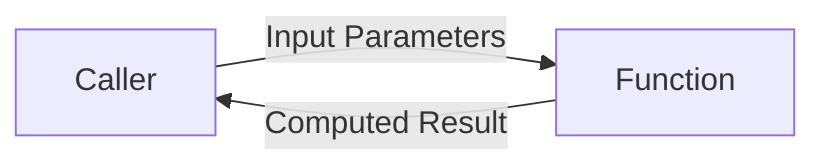
```mermaid
graph LR
    A[Caller] -->|Input Parameters| B[Function]
    B -->|Computed Result| A
```

No intermediate storage, caching, or persistence layers exist in this data flow.

### 6.2.2 References

#### Files Examined
- `test.py` - Core module implementation containing pure arithmetic functions with no database operations

#### Technical Specification Sections Referenced
- Section 1.2 System Overview - Confirmed standalone utility module characteristics
- Section 6.1 Core Services Architecture - Validated single-module library design with no persistence layer

## 6.3 Integration Architecture

### 6.3.1 Integration Scope

**Integration Architecture is not applicable for this system.**

This repository implements a standalone Python utility module consisting of basic arithmetic functions. The system has no external integrations, API endpoints, message processing capabilities, or connections to external services. It operates as a self-contained library that is consumed through standard Python import mechanisms.

### 6.3.2 System Integration Pattern

#### 6.3.2.1 Library Integration Model

The system follows a **library/utility module pattern** where integration occurs at the code level rather than through network or inter-process communication. Consumer applications integrate with this module by importing its functions directly into their Python runtime environment.

**Integration Characteristics:**

| Characteristic | Implementation |
|---------------|----------------|
| Integration Type | Direct Python imports |
| Communication | In-process function calls |
| Dependency Management | Python package management |

#### 6.3.2.2 No External System Integration

The following integration components are explicitly **not present** in this system:

- **API Design**: No REST, GraphQL, or gRPC endpoints; no authentication or authorization mechanisms
- **Message Processing**: No event queues, message brokers, or stream processing infrastructure
- **External Systems**: No third-party service integrations, API gateways, or external service contracts
- **Network Communication**: No HTTP servers, websockets, or network protocols

#### 6.3.2.3 Consumer Integration Approach

Applications consume this utility module through standard Python import statements. The integration architecture is effectively delegated to the consuming application, which determines how and when to invoke the module's functions within its own runtime context.

### 6.3.3 References

- `test.py` - Core utility module containing arithmetic functions with no integration code
- Technical Specification Section 5.1.4 - Confirms no external integrations
- Technical Specification Section 1.2.1 - Documents standalone utility nature

## 6.4 Security Architecture

### 6.4.1 Security Posture Overview

Detailed Security Architecture is not applicable for this system. The repository contains a standalone Python utility module (`test.py`) that provides pure arithmetic functions without any security-sensitive operations, network communication, data persistence, or user management capabilities.

#### 6.4.1.1 System Security Classification

This utility module operates as an importable library that executes entirely within the consumer application's process space. As documented in Section 5.4.5 of this specification, authentication and authorization mechanisms are not applicable to this system architecture.

#### 6.4.1.2 Security Boundary Analysis

The module has no security boundaries of its own:
- No network-facing endpoints requiring protection
- No API authentication or authorization layers
- No session management or token handling
- No data storage requiring encryption or access controls
- No user identity management requirements

### 6.4.2 Security Context Inheritance

#### 6.4.2.1 Host Application Security Model

The security posture of this utility module is entirely determined by the consuming application's security context. When integrated into a host system, the module:

- Executes with the same privileges as the parent process
- Inherits all security policies from the runtime environment
- Operates under the host application's security controls
- Relies on the consumer's implementation for any security requirements

#### 6.4.2.2 Responsibility Boundaries

| Security Domain | Responsibility | Rationale |
|-----------------|----------------|-----------|
| Authentication | Host Application | No user identity required |
| Authorization | Host Application | No resource access controls |
| Data Protection | Host Application | No data persistence layer |

### 6.4.3 Standard Security Practices

#### 6.4.3.1 Code Security

The module follows standard secure coding practices for Python utilities:
- Pure functions with deterministic behavior
- No external dependencies requiring security vetting
- No dynamic code execution or eval operations
- No file system or network access

#### 6.4.3.2 Deployment Security

Security considerations for deployment are delegated to the consuming application:
- Package integrity verification through standard Python package management
- Execution environment security controlled by host system
- No special security configurations required

#### 6.4.3.3 Security Diagram

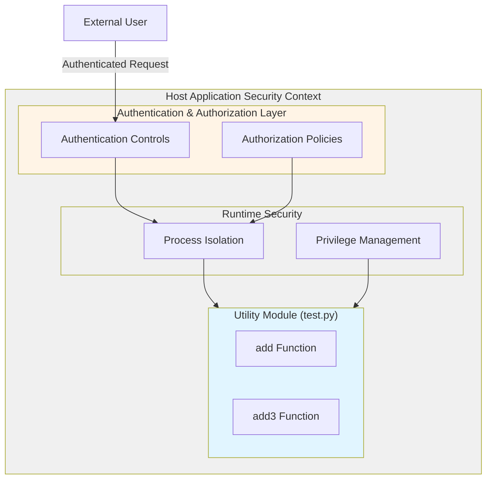
```mermaid
graph TB
    subgraph HostApp["Host Application Security Context"]
        subgraph AuthLayer["Authentication & Authorization Layer"]
            Auth[Authentication Controls]
            Authz[Authorization Policies]
        end
        
        subgraph RuntimeSec["Runtime Security"]
            Process[Process Isolation]
            Privileges[Privilege Management]
        end
        
        subgraph UtilityMod["Utility Module (test.py)"]
            AddFunc[add Function]
            Add3Func[add3 Function]
        end
        
        Auth --> Process
        Authz --> Process
        Process --> UtilityMod
        Privileges --> UtilityMod
    end
    
    User[External User] -->|Authenticated Request| Auth
    
    style UtilityMod fill:#e1f5ff
    style HostApp fill:#f0f0f0
    style AuthLayer fill:#fff4e6
    style RuntimeSec fill:#f0f0f0
```

### 6.4.4 Security Recommendations for Consumers

#### 6.4.4.1 Integration Guidelines

Applications integrating this utility module should:
- Apply their own input validation before passing values to module functions
- Implement appropriate error handling around function calls
- Ensure the module is sourced from trusted package repositories
- Apply standard dependency scanning in their security pipeline

#### 6.4.4.2 Security Scope Matrix

| Security Control Type | Module Requirement | Consumer Responsibility |
|----------------------|-------------------|------------------------|
| Input Validation | None (pure arithmetic) | Validate business logic constraints |
| Access Control | None | Implement as needed |
| Audit Logging | None | Log at application level |

### 6.4.5 References

#### 6.4.5.1 Files Examined
- `test.py` - Core arithmetic utility functions confirmed to contain no security mechanisms

#### 6.4.5.2 Related Specification Sections
- Section 1.2 System Overview - Standalone utility module architecture
- Section 5.4.5 Cross-Cutting Concerns - Authentication/Authorization documented as not applicable

#### 6.4.5.3 Security Analysis
Based on comprehensive repository analysis, no security infrastructure, authentication mechanisms, authorization controls, encryption implementations, or security configurations were identified in the codebase.

## 6.5 Monitoring and Observability

### 6.5.1 Monitoring Architecture Assessment

**Detailed Monitoring Architecture is not applicable for this system.**

The repository consists of a minimal Python utility module (`test.py`) containing pure arithmetic functions with no runtime infrastructure, service components, or external dependencies that would require dedicated monitoring infrastructure.

#### 6.5.1.1 System Characteristics

The system exhibits the following characteristics that inform the monitoring approach:

- **No Runtime Services**: The module contains only stateless utility functions (`add` and `add3`) with no persistent processes or service endpoints
- **No External Dependencies**: No database connections, API integrations, or third-party service calls requiring health monitoring
- **No Infrastructure Components**: No web servers, message queues, or distributed system components
- **Library Nature**: Designed as a utility module to be imported into other applications rather than deployed as a standalone service

#### 6.5.1.2 Monitoring Applicability

Traditional monitoring infrastructure components are not present or required:

| Component | Applicability | Rationale |
|-----------|--------------|-----------|
| Metrics Collection | Not Applicable | No runtime metrics to capture |
| Log Aggregation | Not Applicable | No application logs generated |
| Distributed Tracing | Not Applicable | No distributed operations |
| Alert Management | Not Applicable | No service health to monitor |

### 6.5.2 Basic Monitoring Practices

#### 6.5.2.1 Development-Time Monitoring

If this module is integrated into a larger application, the following basic practices should be observed:

**Code Quality Monitoring**:
- Static analysis and linting to ensure code standards
- Type checking for function signatures and return values
- Unit test execution and coverage tracking

**Exception Handling**:
- Standard Python exception propagation to calling applications
- Error context preserved through the call stack
- Proper error messages for debugging

#### 6.5.2.2 Integration Monitoring

When incorporated into host applications, monitoring responsibility transfers to the parent system:

**Logging Integration**:
- Host application should log function calls if needed
- Standard output (stdout) and error streams (stderr) available for logging frameworks
- No internal logging framework to avoid coupling

**Performance Tracking**:
- Function execution time can be measured by calling applications
- No internal performance instrumentation to maintain simplicity

#### 6.5.2.3 Testing and Validation

Basic validation practices applicable to this utility module:

- **Unit Test Execution**: Verify function correctness through automated tests
- **Code Coverage Metrics**: Track test coverage percentages for quality assurance
- **Continuous Integration**: Automated test execution on code changes

### 6.5.3 Future Monitoring Considerations

#### 6.5.3.1 If Service Evolution Occurs

Should the module evolve into a service-oriented architecture, the following monitoring components would become relevant:

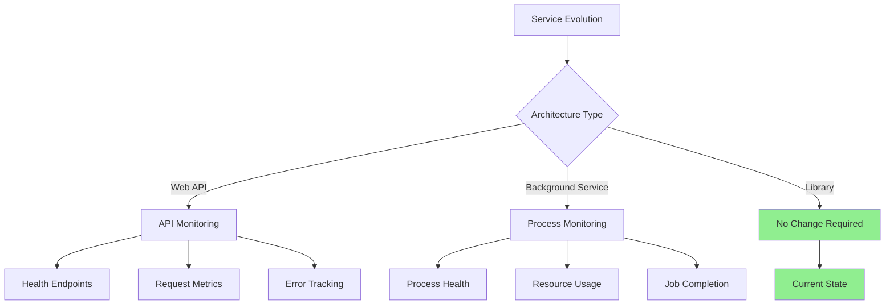
```mermaid
graph TD
    A[Service Evolution] --> B{Architecture Type}
    B -->|Web API| C[API Monitoring]
    B -->|Background Service| D[Process Monitoring]
    B -->|Library| E[No Change Required]
    
    C --> F[Health Endpoints]
    C --> G[Request Metrics]
    C --> H[Error Tracking]
    
    D --> I[Process Health]
    D --> J[Resource Usage]
    D --> K[Job Completion]
    
    E --> L[Current State]
    
    style L fill:#90EE90
    style E fill:#90EE90
```

#### 6.5.3.2 Recommended Monitoring Stack (If Needed)

If service capabilities are added in the future:

| Layer | Recommended Tool | Purpose |
|-------|-----------------|---------|
| Logging | Python logging module | Structured log output |
| Metrics | Prometheus | Performance metrics collection |
| Tracing | OpenTelemetry | Distributed request tracing |

### 6.5.4 Summary

The current implementation is a lightweight utility module that does not warrant dedicated monitoring infrastructure. Monitoring responsibilities should be handled by any host application that integrates this module. The absence of monitoring components is appropriate for the system's scope and complexity.

#### 6.5.4.1 Key Points

- No monitoring infrastructure currently exists or is required
- Basic Python exception handling provides error visibility
- Host application assumes monitoring responsibility upon integration
- Future service evolution would necessitate standard observability patterns

### 6.5.5 References

**Files Examined**:
- `.gitignore` - Confirmed no monitoring tool configurations or artifacts
- `test.py` - Verified simple utility functions with no observability features

**Folders Explored**:
- `` (root directory) - Contains only minimal utility code with no infrastructure components

## 6.6 Testing Strategy

### 6.6.1 Testing Approach Applicability

**Detailed Testing Strategy is not applicable for this system.**

This repository contains a simple Python utility module (`test.py`) with only two pure arithmetic functions (`add` and `add3`). The system exhibits the following characteristics that make comprehensive testing strategy unnecessary:

- **Minimal Complexity**: Only 2 functions with straightforward arithmetic operations
- **Zero Dependencies**: No external libraries, frameworks, or services to integrate
- **Pure Functions**: No side effects, state management, or I/O operations
- **No Infrastructure**: No databases, APIs, authentication, or external integrations
- **Single Module**: Entire codebase consists of one file with <10 lines of code

Given this simplicity, only basic unit testing is required and documented below.

### 6.6.2 Basic Unit Testing Approach

#### 6.6.2.1 Testing Framework

**Primary Framework**: `pytest` (recommended) or Python's built-in `unittest`

**Rationale**: 
- `pytest` provides simple syntax and excellent reporting for small projects
- `unittest` requires no additional dependencies if minimalism is preferred
- Both frameworks are sufficient for testing pure arithmetic functions

#### 6.6.2.2 Test Organization Structure

```
project-root/
├── test.py                 # Source code
└── tests/
    ├── __init__.py
    └── test_arithmetic.py  # Unit tests
```

**Test File Naming**: Prefix test files with `test_` to enable automatic discovery

**Test Function Naming**: Use descriptive names following pattern `test_<function>_<scenario>_<expected_result>`

#### 6.6.2.3 Unit Testing Coverage

#### Test Cases for `add(a, b)` Function

| Test Scenario | Input Values | Expected Output | Purpose |
|--------------|--------------|-----------------|---------|
| Integer addition | `add(2, 3)` | `5` | Verify basic arithmetic |
| Float addition | `add(2.5, 1.5)` | `4.0` | Verify decimal support |
| String concatenation | `add("hello", "world")` | `"helloworld"` | Verify operator overload |
| Negative numbers | `add(-5, 3)` | `-2` | Verify signed arithmetic |

#### Test Cases for `add3(a, b, c)` Function

| Test Scenario | Input Values | Expected Output | Purpose |
|--------------|--------------|-----------------|---------|
| Integer addition | `add3(1, 2, 3)` | `6` | Verify three-operand arithmetic |
| Mixed types | `add3(1, 2.5, 1.5)` | `5.0` | Verify type coercion |
| List concatenation | `add3([1], [2], [3])` | `[1, 2, 3]` | Verify sequence support |
| Zero values | `add3(0, 0, 0)` | `0` | Verify identity element |

#### 6.6.2.4 Example Test Implementation Pattern

**Pytest Style:**
```python
# tests/test_arithmetic.py
import pytest
from test import add, add3

class TestAddFunction:
    def test_add_integers_returns_sum(self):
        assert add(2, 3) == 5
    
    def test_add_floats_returns_sum(self):
        assert add(2.5, 1.5) == 4.0
    
    def test_add_strings_returns_concatenation(self):
        assert add("hello", "world") == "helloworld"

class TestAdd3Function:
    def test_add3_integers_returns_sum(self):
        assert add3(1, 2, 3) == 6
    
    def test_add3_lists_returns_concatenation(self):
        assert add3([1], [2], [3]) == [1, 2, 3]
```

#### 6.6.2.5 Code Coverage Requirements

**Target**: 100% code coverage (achievable given only 2 functions)

**Measurement Tool**: `pytest-cov` plugin

**Execution Command**: 
```bash
pytest --cov=test --cov-report=html
```

#### 6.6.2.6 Test Data Management

**Strategy**: Inline test data

- No external test data files required
- All test values defined directly in test functions
- No fixtures or complex setup/teardown needed

### 6.6.3 Test Automation

#### 6.6.3.1 CI/CD Integration

**Minimal CI Pipeline** (if desired):

```yaml
# Example: .github/workflows/test.yml
name: Run Tests
on: [push, pull_request]
jobs:
  test:
    runs-on: ubuntu-latest
    steps:
      - uses: actions/checkout@v2
      - name: Set up Python
        uses: actions/setup-python@v2
        with:
          python-version: '3.9'
      - name: Install pytest
        run: pip install pytest pytest-cov
      - name: Run tests
        run: pytest --cov=test
```

**Test Triggers**: Execute on every commit and pull request

**Test Execution Time**: <1 second (2 simple functions)

#### 6.6.3.2 Test Reporting

**Console Output**: Standard pytest output sufficient

**Coverage Report**: HTML report for detailed line coverage

**No Complex Reporting**: Dashboard, metrics tracking, or test management tools not required

### 6.6.4 Quality Metrics

#### 6.6.4.1 Coverage Targets

| Metric | Target | Rationale |
|--------|--------|-----------|
| Line Coverage | 100% | Only 2 functions with 2 lines each |
| Branch Coverage | N/A | No conditional logic present |
| Function Coverage | 100% | All functions must be tested |

#### 6.6.4.2 Quality Gates

**Pass Criteria**: All tests pass with 100% coverage

**No Performance Thresholds**: Arithmetic operations are instantaneous

**No Security Scanning**: No security-sensitive operations present

### 6.6.5 Test Execution Flow


```mermaid
flowchart TD
    Start([Developer Commits Code]) --> Trigger[CI Pipeline Triggered]
    Trigger --> Setup[Setup Python Environment]
    Setup --> Install[Install pytest]
    Install --> Discover[Discover Test Files]
    Discover --> Execute[Execute Unit Tests]
    Execute --> Coverage[Generate Coverage Report]
    Coverage --> Check{All Tests Pass?}
    Check -->|Yes| Report[Generate Success Report]
    Check -->|No| Fail[Report Failed Tests]
    Report --> Success([Build Success])
    Fail --> Failure([Build Failure])
```

### 6.6.6 Test Environment Architecture

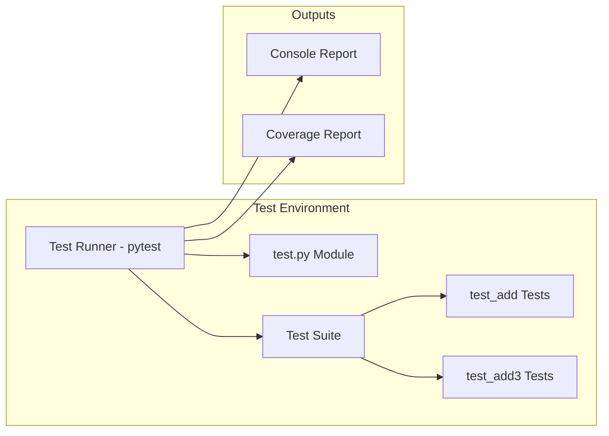
```mermaid
graph LR
    subgraph Test Environment
        A[Test Runner - pytest] --> B[test.py Module]
        A --> C[Test Suite]
        C --> D[test_add Tests]
        C --> E[test_add3 Tests]
    end
    
    subgraph Outputs
        A --> F[Console Report]
        A --> G[Coverage Report]
    end
```

### 6.6.7 Testing Strategy Summary

This minimal testing strategy reflects the simplicity of the system:

- **No Integration Testing**: No services or external dependencies to integrate
- **No End-to-End Testing**: No user interface or complex workflows
- **No Performance Testing**: Operations complete in microseconds
- **No Security Testing**: No authentication, authorization, or data handling
- **No Load Testing**: Not applicable for utility functions
- **No Browser Testing**: No web interface present

**Recommendation**: Implement basic unit tests with pytest to achieve 100% coverage of the two arithmetic functions. Total implementation effort: <30 minutes.

### 6.6.8 References

#### Files Examined
- `test.py` - Source code containing `add()` and `add3()` functions (2 functions to be tested)

#### Technical Specification Sections Referenced
- Section 1.2 System Overview - Confirmed simple utility module classification
- Section 3.1 Programming Languages - Confirmed Python-only implementation

#### Testing Framework Documentation
- pytest: Standard Python testing framework for simple test implementation
- pytest-cov: Coverage plugin for measuring code coverage metrics

## 6.1 Core Services Architecture

### 6.1.1 Applicability Assessment

**Core Services Architecture is not applicable for this system.**

This repository implements a standalone Python utility module consisting of a single file (`test.py`) with two pure arithmetic functions. The system does not employ microservices, distributed architecture, or distinct service components that would require core services architecture documentation.

### 6.1.2 System Architecture Classification

#### Single-Module Utility Library

The system is classified as a direct-import utility library with the following characteristics:

- **Deployment Model**: Library code imported directly into consumer applications
- **Execution Context**: Runs within the caller's process space
- **Integration Pattern**: Direct function invocation through Python import statements
- **Communication Model**: In-process function calls with no inter-service communication

#### Architecture Characteristics

| Characteristic | Status | Rationale |
|---------------|--------|-----------|
| Service Boundaries | Not Applicable | Single-module design with no logical service separation |
| Distributed Components | Not Present | All functionality contained in one 6-line file |
| Network Communication | Not Required | Direct in-process function calls only |

### 6.1.3 Why Services Architecture Is Not Applicable

#### Absence of Service-Oriented Patterns

The system lacks fundamental characteristics that would necessitate core services architecture:

1. **No Service Decomposition**: The entire system consists of two pure functions (`add` and `add3`) with no logical boundaries requiring service separation

2. **No Network Layer**: Functions are invoked directly through Python imports with no HTTP, RPC, or message-based communication

3. **No Independent Deployability**: The module is distributed as library code that becomes part of the consumer's deployment unit

4. **No Scalability Requirements**: Scaling occurs naturally through the consumer application's scaling strategy, not through independent service scaling

#### Library Integration Model

Consumer applications integrate this module using standard Python import mechanisms:

```python
from test import add, add3
result = add(2, 3)
```

This integration pattern eliminates the need for:
- Service discovery mechanisms
- Load balancing strategies
- Circuit breaker patterns
- Inter-service communication protocols
- Service mesh infrastructure
- API gateways

### 6.1.4 Scaling and Resilience Considerations

#### Scaling Model

**Approach**: Inherits scaling characteristics from the consuming application.

- **Horizontal Scaling**: When consumer applications scale horizontally, the library code scales with each instance
- **Vertical Scaling**: Performance scales with the underlying Python interpreter and hardware
- **Resource Consumption**: Minimal - two arithmetic functions with negligible memory footprint

#### Resilience Characteristics

**Built-in Resilience**: Pure functions with deterministic behavior provide inherent reliability.

- **Fault Isolation**: Failures are contained within the calling application's error handling
- **No External Dependencies**: Zero external dependencies eliminate external points of failure
- **Deterministic Behavior**: Pure functions with no side effects ensure predictable outcomes

### 6.1.5 Alternative Architecture Patterns

If this system were to evolve into a service-oriented architecture, the following patterns would become relevant:

| Pattern | Current State | Would Require |
|---------|--------------|---------------|
| Microservices | Not Implemented | Network layer, API endpoints, service registry |
| API Gateway | Not Applicable | HTTP/REST interface, routing logic |
| Service Mesh | Not Applicable | Multiple services, inter-service communication |

However, given the simplicity of the arithmetic operations provided, maintaining the current library pattern is architecturally appropriate.

### 6.1.6 References

**Files Examined:**
- `test.py` - Core implementation containing add() and add3() functions
- `.gitignore` - Repository configuration

**Related Sections:**
- Section 1.2 System Overview - Confirms standalone utility module nature
- Section 5.1 High-Level Architecture - Documents single-module library pattern

## 6.2 Database Design

### 6.2.1 Applicability Statement

**Database Design is not applicable to this system.**

This repository implements a standalone Python utility module that provides pure arithmetic functions without any database or persistent storage requirements.

#### 6.2.1.1 System Characteristics

The system consists of a single-file Python module (`test.py`) containing two stateless functions:
- `add(a, b)` - Performs addition of two numbers
- `add3(a, b, c)` - Performs addition of three numbers

These functions are pure operations that:
- Accept input parameters
- Perform immediate calculations
- Return results directly to the caller
- Maintain no state between invocations
- Require no data persistence

#### 6.2.1.2 Architecture Justification

The absence of database design is appropriate for this system because:

**No Data Persistence Required**: All functions return immediate computational results with no need to store data beyond the function execution context.

**Stateless Operation**: The module maintains no application state, session data, or historical information that would require database storage.

**Library Design Pattern**: As a direct-import utility library, the module operates entirely within the consumer application's process space, inheriting any persistence mechanisms from the consuming application if needed.

**Zero External Dependencies**: The system has no database drivers, ORM frameworks, or data access layers in its dependency tree.

#### 6.2.1.3 Data Flow

All data flow in the system follows a simple pattern:

```mermaid
graph LR
    A[Caller] -->|Input Parameters| B[Function]
    B -->|Computed Result| A
```

No intermediate storage, caching, or persistence layers exist in this data flow.

### 6.2.2 References

#### Files Examined
- `test.py` - Core module implementation containing pure arithmetic functions with no database operations

#### Technical Specification Sections Referenced
- Section 1.2 System Overview - Confirmed standalone utility module characteristics
- Section 6.1 Core Services Architecture - Validated single-module library design with no persistence layer

## 6.3 Integration Architecture

### 6.3.1 Integration Scope

**Integration Architecture is not applicable for this system.**

This repository implements a standalone Python utility module consisting of basic arithmetic functions. The system has no external integrations, API endpoints, message processing capabilities, or connections to external services. It operates as a self-contained library that is consumed through standard Python import mechanisms.

### 6.3.2 System Integration Pattern

#### 6.3.2.1 Library Integration Model

The system follows a **library/utility module pattern** where integration occurs at the code level rather than through network or inter-process communication. Consumer applications integrate with this module by importing its functions directly into their Python runtime environment.

**Integration Characteristics:**

| Characteristic | Implementation |
|---------------|----------------|
| Integration Type | Direct Python imports |
| Communication | In-process function calls |
| Dependency Management | Python package management |

#### 6.3.2.2 No External System Integration

The following integration components are explicitly **not present** in this system:

- **API Design**: No REST, GraphQL, or gRPC endpoints; no authentication or authorization mechanisms
- **Message Processing**: No event queues, message brokers, or stream processing infrastructure
- **External Systems**: No third-party service integrations, API gateways, or external service contracts
- **Network Communication**: No HTTP servers, websockets, or network protocols

#### 6.3.2.3 Consumer Integration Approach

Applications consume this utility module through standard Python import statements. The integration architecture is effectively delegated to the consuming application, which determines how and when to invoke the module's functions within its own runtime context.

### 6.3.3 References

- `test.py` - Core utility module containing arithmetic functions with no integration code
- Technical Specification Section 5.1.4 - Confirms no external integrations
- Technical Specification Section 1.2.1 - Documents standalone utility nature

## 6.4 Security Architecture

### 6.4.1 Security Posture Overview

Detailed Security Architecture is not applicable for this system. The repository contains a standalone Python utility module (`test.py`) that provides pure arithmetic functions without any security-sensitive operations, network communication, data persistence, or user management capabilities.

#### 6.4.1.1 System Security Classification

This utility module operates as an importable library that executes entirely within the consumer application's process space. As documented in Section 5.4.5 of this specification, authentication and authorization mechanisms are not applicable to this system architecture.

#### 6.4.1.2 Security Boundary Analysis

The module has no security boundaries of its own:
- No network-facing endpoints requiring protection
- No API authentication or authorization layers
- No session management or token handling
- No data storage requiring encryption or access controls
- No user identity management requirements

### 6.4.2 Security Context Inheritance

#### 6.4.2.1 Host Application Security Model

The security posture of this utility module is entirely determined by the consuming application's security context. When integrated into a host system, the module:

- Executes with the same privileges as the parent process
- Inherits all security policies from the runtime environment
- Operates under the host application's security controls
- Relies on the consumer's implementation for any security requirements

#### 6.4.2.2 Responsibility Boundaries

| Security Domain | Responsibility | Rationale |
|-----------------|----------------|-----------|
| Authentication | Host Application | No user identity required |
| Authorization | Host Application | No resource access controls |
| Data Protection | Host Application | No data persistence layer |

### 6.4.3 Standard Security Practices

#### 6.4.3.1 Code Security

The module follows standard secure coding practices for Python utilities:
- Pure functions with deterministic behavior
- No external dependencies requiring security vetting
- No dynamic code execution or eval operations
- No file system or network access

#### 6.4.3.2 Deployment Security

Security considerations for deployment are delegated to the consuming application:
- Package integrity verification through standard Python package management
- Execution environment security controlled by host system
- No special security configurations required

#### 6.4.3.3 Security Diagram

```mermaid
graph TB
    subgraph HostApp["Host Application Security Context"]
        subgraph AuthLayer["Authentication & Authorization Layer"]
            Auth[Authentication Controls]
            Authz[Authorization Policies]
        end
        
        subgraph RuntimeSec["Runtime Security"]
            Process[Process Isolation]
            Privileges[Privilege Management]
        end
        
        subgraph UtilityMod["Utility Module (test.py)"]
            AddFunc[add Function]
            Add3Func[add3 Function]
        end
        
        Auth --> Process
        Authz --> Process
        Process --> UtilityMod
        Privileges --> UtilityMod
    end
    
    User[External User] -->|Authenticated Request| Auth
    
    style UtilityMod fill:#e1f5ff
    style HostApp fill:#f0f0f0
    style AuthLayer fill:#fff4e6
    style RuntimeSec fill:#f0f0f0
```

### 6.4.4 Security Recommendations for Consumers

#### 6.4.4.1 Integration Guidelines

Applications integrating this utility module should:
- Apply their own input validation before passing values to module functions
- Implement appropriate error handling around function calls
- Ensure the module is sourced from trusted package repositories
- Apply standard dependency scanning in their security pipeline

#### 6.4.4.2 Security Scope Matrix

| Security Control Type | Module Requirement | Consumer Responsibility |
|----------------------|-------------------|------------------------|
| Input Validation | None (pure arithmetic) | Validate business logic constraints |
| Access Control | None | Implement as needed |
| Audit Logging | None | Log at application level |

### 6.4.5 References

#### 6.4.5.1 Files Examined
- `test.py` - Core arithmetic utility functions confirmed to contain no security mechanisms

#### 6.4.5.2 Related Specification Sections
- Section 1.2 System Overview - Standalone utility module architecture
- Section 5.4.5 Cross-Cutting Concerns - Authentication/Authorization documented as not applicable

#### 6.4.5.3 Security Analysis
Based on comprehensive repository analysis, no security infrastructure, authentication mechanisms, authorization controls, encryption implementations, or security configurations were identified in the codebase.

## 6.5 Monitoring and Observability

### 6.5.1 Monitoring Architecture Assessment

**Detailed Monitoring Architecture is not applicable for this system.**

The repository consists of a minimal Python utility module (`test.py`) containing pure arithmetic functions with no runtime infrastructure, service components, or external dependencies that would require dedicated monitoring infrastructure.

#### 6.5.1.1 System Characteristics

The system exhibits the following characteristics that inform the monitoring approach:

- **No Runtime Services**: The module contains only stateless utility functions (`add` and `add3`) with no persistent processes or service endpoints
- **No External Dependencies**: No database connections, API integrations, or third-party service calls requiring health monitoring
- **No Infrastructure Components**: No web servers, message queues, or distributed system components
- **Library Nature**: Designed as a utility module to be imported into other applications rather than deployed as a standalone service

#### 6.5.1.2 Monitoring Applicability

Traditional monitoring infrastructure components are not present or required:

| Component | Applicability | Rationale |
|-----------|--------------|-----------|
| Metrics Collection | Not Applicable | No runtime metrics to capture |
| Log Aggregation | Not Applicable | No application logs generated |
| Distributed Tracing | Not Applicable | No distributed operations |
| Alert Management | Not Applicable | No service health to monitor |

### 6.5.2 Basic Monitoring Practices

#### 6.5.2.1 Development-Time Monitoring

If this module is integrated into a larger application, the following basic practices should be observed:

**Code Quality Monitoring**:
- Static analysis and linting to ensure code standards
- Type checking for function signatures and return values
- Unit test execution and coverage tracking

**Exception Handling**:
- Standard Python exception propagation to calling applications
- Error context preserved through the call stack
- Proper error messages for debugging

#### 6.5.2.2 Integration Monitoring

When incorporated into host applications, monitoring responsibility transfers to the parent system:

**Logging Integration**:
- Host application should log function calls if needed
- Standard output (stdout) and error streams (stderr) available for logging frameworks
- No internal logging framework to avoid coupling

**Performance Tracking**:
- Function execution time can be measured by calling applications
- No internal performance instrumentation to maintain simplicity

#### 6.5.2.3 Testing and Validation

Basic validation practices applicable to this utility module:

- **Unit Test Execution**: Verify function correctness through automated tests
- **Code Coverage Metrics**: Track test coverage percentages for quality assurance
- **Continuous Integration**: Automated test execution on code changes

### 6.5.3 Future Monitoring Considerations

#### 6.5.3.1 If Service Evolution Occurs

Should the module evolve into a service-oriented architecture, the following monitoring components would become relevant:

```mermaid
graph TD
    A[Service Evolution] --> B{Architecture Type}
    B -->|Web API| C[API Monitoring]
    B -->|Background Service| D[Process Monitoring]
    B -->|Library| E[No Change Required]
    
    C --> F[Health Endpoints]
    C --> G[Request Metrics]
    C --> H[Error Tracking]
    
    D --> I[Process Health]
    D --> J[Resource Usage]
    D --> K[Job Completion]
    
    E --> L[Current State]
    
    style L fill:#90EE90
    style E fill:#90EE90
```

#### 6.5.3.2 Recommended Monitoring Stack (If Needed)

If service capabilities are added in the future:

| Layer | Recommended Tool | Purpose |
|-------|-----------------|---------|
| Logging | Python logging module | Structured log output |
| Metrics | Prometheus | Performance metrics collection |
| Tracing | OpenTelemetry | Distributed request tracing |

### 6.5.4 Summary

The current implementation is a lightweight utility module that does not warrant dedicated monitoring infrastructure. Monitoring responsibilities should be handled by any host application that integrates this module. The absence of monitoring components is appropriate for the system's scope and complexity.

#### 6.5.4.1 Key Points

- No monitoring infrastructure currently exists or is required
- Basic Python exception handling provides error visibility
- Host application assumes monitoring responsibility upon integration
- Future service evolution would necessitate standard observability patterns

### 6.5.5 References

**Files Examined**:
- `.gitignore` - Confirmed no monitoring tool configurations or artifacts
- `test.py` - Verified simple utility functions with no observability features

**Folders Explored**:
- `` (root directory) - Contains only minimal utility code with no infrastructure components

## 6.6 Testing Strategy

### 6.6.1 Testing Approach Applicability

**Detailed Testing Strategy is not applicable for this system.**

This repository contains a simple Python utility module (`test.py`) with only two pure arithmetic functions (`add` and `add3`). The system exhibits the following characteristics that make comprehensive testing strategy unnecessary:

- **Minimal Complexity**: Only 2 functions with straightforward arithmetic operations
- **Zero Dependencies**: No external libraries, frameworks, or services to integrate
- **Pure Functions**: No side effects, state management, or I/O operations
- **No Infrastructure**: No databases, APIs, authentication, or external integrations
- **Single Module**: Entire codebase consists of one file with <10 lines of code

Given this simplicity, only basic unit testing is required and documented below.

### 6.6.2 Basic Unit Testing Approach

#### 6.6.2.1 Testing Framework

**Primary Framework**: `pytest` (recommended) or Python's built-in `unittest`

**Rationale**: 
- `pytest` provides simple syntax and excellent reporting for small projects
- `unittest` requires no additional dependencies if minimalism is preferred
- Both frameworks are sufficient for testing pure arithmetic functions

#### 6.6.2.2 Test Organization Structure

```
project-root/
├── test.py                 # Source code
└── tests/
    ├── __init__.py
    └── test_arithmetic.py  # Unit tests
```

**Test File Naming**: Prefix test files with `test_` to enable automatic discovery

**Test Function Naming**: Use descriptive names following pattern `test_<function>_<scenario>_<expected_result>`

#### 6.6.2.3 Unit Testing Coverage

#### Test Cases for `add(a, b)` Function

| Test Scenario | Input Values | Expected Output | Purpose |
|--------------|--------------|-----------------|---------|
| Integer addition | `add(2, 3)` | `5` | Verify basic arithmetic |
| Float addition | `add(2.5, 1.5)` | `4.0` | Verify decimal support |
| String concatenation | `add("hello", "world")` | `"helloworld"` | Verify operator overload |
| Negative numbers | `add(-5, 3)` | `-2` | Verify signed arithmetic |

#### Test Cases for `add3(a, b, c)` Function

| Test Scenario | Input Values | Expected Output | Purpose |
|--------------|--------------|-----------------|---------|
| Integer addition | `add3(1, 2, 3)` | `6` | Verify three-operand arithmetic |
| Mixed types | `add3(1, 2.5, 1.5)` | `5.0` | Verify type coercion |
| List concatenation | `add3([1], [2], [3])` | `[1, 2, 3]` | Verify sequence support |
| Zero values | `add3(0, 0, 0)` | `0` | Verify identity element |

#### 6.6.2.4 Example Test Implementation Pattern

**Pytest Style:**
```python
# tests/test_arithmetic.py
import pytest
from test import add, add3

class TestAddFunction:
    def test_add_integers_returns_sum(self):
        assert add(2, 3) == 5
    
    def test_add_floats_returns_sum(self):
        assert add(2.5, 1.5) == 4.0
    
    def test_add_strings_returns_concatenation(self):
        assert add("hello", "world") == "helloworld"

class TestAdd3Function:
    def test_add3_integers_returns_sum(self):
        assert add3(1, 2, 3) == 6
    
    def test_add3_lists_returns_concatenation(self):
        assert add3([1], [2], [3]) == [1, 2, 3]
```

#### 6.6.2.5 Code Coverage Requirements

**Target**: 100% code coverage (achievable given only 2 functions)

**Measurement Tool**: `pytest-cov` plugin

**Execution Command**: 
```bash
pytest --cov=test --cov-report=html
```

#### 6.6.2.6 Test Data Management

**Strategy**: Inline test data

- No external test data files required
- All test values defined directly in test functions
- No fixtures or complex setup/teardown needed

### 6.6.3 Test Automation

#### 6.6.3.1 CI/CD Integration

**Minimal CI Pipeline** (if desired):

```yaml
# Example: .github/workflows/test.yml
name: Run Tests
on: [push, pull_request]
jobs:
  test:
    runs-on: ubuntu-latest
    steps:
      - uses: actions/checkout@v2
      - name: Set up Python
        uses: actions/setup-python@v2
        with:
          python-version: '3.9'
      - name: Install pytest
        run: pip install pytest pytest-cov
      - name: Run tests
        run: pytest --cov=test
```

**Test Triggers**: Execute on every commit and pull request

**Test Execution Time**: <1 second (2 simple functions)

#### 6.6.3.2 Test Reporting

**Console Output**: Standard pytest output sufficient

**Coverage Report**: HTML report for detailed line coverage

**No Complex Reporting**: Dashboard, metrics tracking, or test management tools not required

### 6.6.4 Quality Metrics

#### 6.6.4.1 Coverage Targets

| Metric | Target | Rationale |
|--------|--------|-----------|
| Line Coverage | 100% | Only 2 functions with 2 lines each |
| Branch Coverage | N/A | No conditional logic present |
| Function Coverage | 100% | All functions must be tested |

#### 6.6.4.2 Quality Gates

**Pass Criteria**: All tests pass with 100% coverage

**No Performance Thresholds**: Arithmetic operations are instantaneous

**No Security Scanning**: No security-sensitive operations present

### 6.6.5 Test Execution Flow

```mermaid
flowchart TD
    Start([Developer Commits Code]) --> Trigger[CI Pipeline Triggered]
    Trigger --> Setup[Setup Python Environment]
    Setup --> Install[Install pytest]
    Install --> Discover[Discover Test Files]
    Discover --> Execute[Execute Unit Tests]
    Execute --> Coverage[Generate Coverage Report]
    Coverage --> Check{All Tests Pass?}
    Check -->|Yes| Report[Generate Success Report]
    Check -->|No| Fail[Report Failed Tests]
    Report --> Success([Build Success])
    Fail --> Failure([Build Failure])
```

### 6.6.6 Test Environment Architecture

```mermaid
graph LR
    subgraph Test Environment
        A[Test Runner - pytest] --> B[test.py Module]
        A --> C[Test Suite]
        C --> D[test_add Tests]
        C --> E[test_add3 Tests]
    end
    
    subgraph Outputs
        A --> F[Console Report]
        A --> G[Coverage Report]
    end
```

### 6.6.7 Testing Strategy Summary

This minimal testing strategy reflects the simplicity of the system:

- **No Integration Testing**: No services or external dependencies to integrate
- **No End-to-End Testing**: No user interface or complex workflows
- **No Performance Testing**: Operations complete in microseconds
- **No Security Testing**: No authentication, authorization, or data handling
- **No Load Testing**: Not applicable for utility functions
- **No Browser Testing**: No web interface present

**Recommendation**: Implement basic unit tests with pytest to achieve 100% coverage of the two arithmetic functions. Total implementation effort: <30 minutes.

### 6.6.8 References

#### Files Examined
- `test.py` - Source code containing `add()` and `add3()` functions (2 functions to be tested)

#### Technical Specification Sections Referenced
- Section 1.2 System Overview - Confirmed simple utility module classification
- Section 3.1 Programming Languages - Confirmed Python-only implementation

#### Testing Framework Documentation
- pytest: Standard Python testing framework for simple test implementation
- pytest-cov: Coverage plugin for measuring code coverage metrics

# 7. User Interface Design

No user interface required.

# 7. User Interface Design

No user interface required.

## 7.1 UI Assessment

This project is a Python utility library that provides basic arithmetic functions (`add` and `add3` in `test.py`) and does not include any user-facing interface components.

### 7.1.1 Project Type

The repository contains only backend logic with no web, desktop, or mobile UI elements.

## 7.2 References

- `test.py` - Core functionality module (arithmetic operations only)
- `.gitignore` - Standard Python project configuration

# 8. Infrastructure

## 8.1 Infrastructure Applicability Assessment

**Detailed Infrastructure Architecture is not applicable for this system.**

This repository contains a standalone Python utility module (`test.py`) that provides basic arithmetic functions intended for direct import by other Python applications. The system does not require deployment infrastructure, cloud services, containerization, or orchestration as it is designed to be consumed as a library component rather than deployed as an independent service or application.

### 8.1.1 System Characteristics

The codebase exhibits the following characteristics that eliminate the need for traditional infrastructure:

- **Single-file module**: Contains only `test.py` with two arithmetic functions (`add` and `add3`)
- **No external dependencies**: Functions using only Python standard library capabilities
- **No runtime services**: Does not operate as a standalone service, API, or application
- **No persistent state**: Pure functional implementation with no database or storage requirements
- **Import-based consumption**: Designed to be imported directly into other Python codebases

## 8.2 Minimal Build and Distribution Requirements

### 8.2.1 Runtime Requirements

| Component | Requirement | Notes |
|-----------|-------------|-------|
| Python Interpreter | Python 3.x | No specific version constraints identified |
| Operating System | Platform-independent | Standard Python compatibility |
| Dependencies | None | No external packages required |

### 8.2.2 Distribution Approaches

The module can be distributed through multiple lightweight approaches:

**Direct File Inclusion**
- Copy `test.py` directly into consuming project's source tree
- Import using standard Python import mechanisms
- Suitable for small projects or internal use

**Git Repository Reference**
- Reference repository as a Git submodule
- Clone repository into project dependencies
- Maintains version control integration

**Python Package Distribution (Potential)**
- Could be packaged using setuptools for PyPI distribution
- No `setup.py` or `pyproject.toml` currently present
- Would enable `pip install` capability if implemented

### 8.2.3 Distribution Workflow

```mermaid
graph LR
    A[test.py Source] --> B[Direct Copy]
    A --> C[Git Submodule]
    A --> D[Potential PyPI Package]
    
    B --> E[Consumer Project]
    C --> E
    D --> E
    
    E --> F[Import Statement]
    F --> G[Function Usage]
```

## 8.3 Development Environment Setup

### 8.3.1 Developer Requirements

Minimal setup required for development or testing:

1. **Python Installation**: Any Python 3.x interpreter
2. **Text Editor**: No IDE requirements
3. **Version Control**: Git for repository access
4. **Testing**: Python's built-in capabilities (no test framework detected)

### 8.3.2 Integration into Consumer Projects

```mermaid
graph TD
    A[Consumer Application] --> B{Distribution Method}
    B -->|Direct Copy| C[Copy test.py to src/]
    B -->|Git Submodule| D[Add as submodule]
    B -->|Package Install| E[pip install future package]
    
    C --> F[from test import add, add3]
    D --> F
    E --> F
    
    F --> G[Use Functions in Code]
```

## 8.4 Absence of Traditional Infrastructure Components

### 8.4.1 No Containerization

**Rationale**: As a library module intended for import, containerization provides no benefit. Consuming applications may containerize their own deployments and include this module as a dependency.

### 8.4.2 No Orchestration

**Rationale**: No services to orchestrate. The module executes within the process space of the importing application.

### 8.4.3 No CI/CD Pipeline

**Current State**: No CI/CD configuration files detected (no `.github/workflows/`, `.gitlab-ci.yml`, `Jenkinsfile`, etc.)

**Potential Future Implementation**: Could add:
- Automated testing on commit
- Package building for PyPI distribution
- Version tagging and release automation

### 8.4.4 No Cloud Services

**Rationale**: Module operates entirely in-process with no external service dependencies, API calls, or cloud resource requirements.

## 8.5 Version Control Infrastructure

### 8.5.1 Git Configuration

The repository includes minimal Git infrastructure:

| File | Purpose |
|------|---------|
| `.gitignore` | Standard Python exclusions (*.pyc, __pycache__, etc.) |

No additional version control tooling or hooks identified.

## 8.6 Future Infrastructure Considerations

### 8.6.1 Potential Enhancements

Should the module evolve beyond its current scope, the following infrastructure additions may become relevant:

**Package Distribution**
- Add `setup.py` or `pyproject.toml` for PyPI packaging
- Implement semantic versioning
- Create package build pipeline

**Automated Testing**
- Add pytest or unittest framework
- Implement CI pipeline for automated test execution
- Add code coverage reporting

**Documentation Hosting**
- Generate Sphinx documentation
- Host on Read the Docs or similar platform

### 8.6.2 Consumer Application Responsibilities

Applications that import this module are responsible for:
- Their own deployment infrastructure
- Containerization if required
- Cloud service integration
- Monitoring and logging of function usage
- Error handling around function calls

## 8.7 Summary

This standalone Python utility module requires no dedicated infrastructure beyond a Python interpreter. Distribution occurs through direct file inclusion, Git repository references, or potential future package management integration. Traditional infrastructure components (containers, orchestration, cloud services, CI/CD) are not applicable to a library designed for in-process import and execution within consuming applications.

## 8.8 References

#### Files Examined
- `test.py` - Core arithmetic utility module containing add() and add3() functions
- `.gitignore` - Python development environment exclusions

#### Technical Specification Sections Referenced
- Section 1.2 System Overview - Confirmed standalone utility module nature
- Section 3.4 Development & Deployment - Validated absence of deployment infrastructure

# 9. Appendices

## 9.1 Additional Technical Information

### 9.1.1 Function Specifications

**add(a, b)**
- **Parameters**: Two operands (a, b)
- **Return Value**: Sum of operands using Python's `+` operator
- **Type Support**: Any Python objects implementing `__add__` magic method
- **Behavior**: Untyped, dynamically typed at runtime

**add3(a, b, c)**
- **Parameters**: Three operands (a, b, c)
- **Return Value**: Sum of all three operands using Python's `+` operator
- **Type Support**: Any Python objects implementing `__add__` magic method
- **Behavior**: Untyped, dynamically typed at runtime

### 9.1.2 Repository Exclusion Patterns

The `.gitignore` file excludes the following categories of artifacts:

| Category | Patterns | Purpose |
|----------|----------|---------|
| Virtual Environments | venv/, env/, ENV/, .venv | Python environment isolation |
| Python Cache | `__pycache__/`, `*.py[cod]` | Bytecode compilation artifacts |
| Distribution | dist/, build/, *.egg-info/ | Package build outputs |
| IDE Artifacts | .vscode/, .idea/, *.swp | Editor-specific files |
| OS Metadata | .DS_Store, Thumbs.db | Operating system generated files |

## 9.2 Glossary

### 9.2.1 Architectural Terms

**Library/Utility Module Pattern**: An architectural style where reusable code components are organized as importable modules without framework dependencies or runtime infrastructure requirements.

**Pure Functions**: Functions that produce no side effects and return consistent outputs for identical inputs, enabling predictable behavior and simplified testing.

**Statelessness**: A design pattern where no data persists between function invocations, ensuring thread safety and eliminating shared state management complexity.

**Synchronous Request-Response**: An execution pattern where operations complete immediately within the caller's thread and return results directly without asynchronous callbacks or promises.

**Zero Dependencies**: Software architecture requiring no external package installations beyond the standard library, minimizing deployment complexity and dependency management overhead.

### 9.2.2 Python-Specific Terms

**`__add__`**: Python magic method (dunder method) invoked when the addition operator (`+`) is applied to an object, enabling operator overloading for custom types.

**`__pycache__`**: Directory automatically created by Python to store bytecode-compiled versions of modules, improving import performance on subsequent executions.

**Dynamic Typing**: Type system where variable types are determined at runtime rather than compile time, allowing flexible type usage without explicit declarations.

**Type Flexibility**: Capability to operate on multiple data types through duck typing, where object suitability is determined by method presence rather than inheritance hierarchy.

**Virtual Environment**: Isolated Python environment containing independent package installations, preventing dependency conflicts between projects.

### 9.2.3 Development Terms

**Abstract Syntax Tree (AST)**: Tree representation of source code structure used by compilers and static analysis tools to parse and analyze code semantically.

**Pre-commit Hooks**: Automated validation scripts executed before Git commits are finalized, enforcing code quality standards and preventing defective commits.

**Type Hints**: Optional Python syntax (PEP 484) allowing developers to annotate expected parameter and return types for documentation and static analysis purposes.

## 9.3 Acronyms

| Acronym | Expanded Form | Context |
|---------|---------------|---------|
| API | Application Programming Interface | Generic interface contracts |
| AST | Abstract Syntax Tree | Static analysis and parsing |
| CI | Continuous Integration | Automated testing workflows |
| IDE | Integrated Development Environment | Code editing tools |
| OS | Operating System | Platform-specific behaviors |
| PEP | Python Enhancement Proposal | Python language standards |
| QA | Quality Assurance | Testing and validation practices |

## 9.4 References

### 9.4.1 Files Examined

- `test.py` - Core arithmetic utility module containing add() and add3() functions
- `.gitignore` - Repository exclusion patterns for Python artifacts

### 9.4.2 Folders Explored

- `` (root directory, depth: 0) - Complete repository structure analysis

### 9.4.3 Technical Specification Sections

Information synthesized from existing technical specification sections including system overview, technology stack, architectural patterns, and deployment considerations as documented throughout sections 1-8.