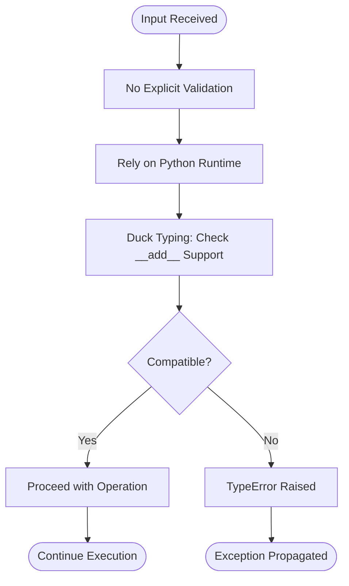

# Technical Specification

# 0. Agent Action Plan

## 0.1 Core Feature Objective

Based on the prompt, the Blitzy platform understands that the new feature requirement is to **enhance the existing `test.py` module by creating a robust, production-grade function for adding two numbers** with the following core objectives:

**Primary Feature Requirements:**

- **Robust Addition Function**: Create or enhance a function that adds two numbers with comprehensive input validation, error handling, and type safety mechanisms to ensure reliable operation under all conditions

- **Careful Implementation**: Execute code changes with extreme precision and attention to detail, ensuring backward compatibility with the existing simple `add(a, b)` function while introducing advanced robustness features

- **No Test Case Development**: Explicitly exclude creation of any test files, test functions, or testing infrastructure as part of this feature implementation (testing is out of scope per user directive)

**Implicit Requirements Detected:**

- **Type Validation**: The robust function must validate that inputs are numeric types (int, float, complex, or Decimal) before attempting addition operations

- **Error Handling**: Implement comprehensive exception handling for type errors, overflow conditions, and invalid input scenarios with clear, actionable error messages

- **Documentation**: Provide detailed docstrings with type hints to enable static analysis tools and improve developer experience

- **Backward Compatibility**: Preserve the existing simple `add(a, b)` function to maintain compatibility with any existing consumers of the module

- **Edge Case Coverage**: Handle special numeric cases including infinity, NaN (Not a Number), very large numbers, negative numbers, and mixed numeric types

**Feature Dependencies and Prerequisites:**

- Python 3.x interpreter (currently Python 3.12.3 available in environment)
- No external dependencies required—implementation will use Python standard library only
- Existing `test.py` module serves as the foundation for enhancement

## 0.2 Special Instructions and Constraints

**Critical Directives:**

- **Extreme Code Care**: The user explicitly emphasized "make the code changes very carefully"—this directive requires:
  - Preservation of existing function signatures and behavior
  - No breaking changes to the current `add(a, b)` function
  - Thorough validation of all code modifications before implementation
  - Clear separation between legacy simple implementation and new robust implementation

- **Maximum Robustness**: The user specified "make it very robust function"—this translates to:
  - Comprehensive input validation with type checking
  - Defensive programming practices with explicit error handling
  - Clear error messages that guide developers to correct usage
  - Protection against common numeric pitfalls (overflow, underflow, precision loss)

- **No Testing Code**: The user explicitly stated "don't write any test cases"—this constraint means:
  - No creation of test files (e.g., test_add.py, test_robust_add.py)
  - No pytest, unittest, or any testing framework code
  - No test fixtures, test data, or test utilities
  - Documentation examples may be included in docstrings but not as executable tests

**Architectural Requirements:**

- **Maintain Zero-Dependency Architecture**: Continue the established pattern of using only Python standard library without introducing external packages

- **Follow Pure Functional Pattern**: Preserve statelessness and side-effect-free design consistent with existing module architecture

- **Preserve Module Simplicity**: Keep the module structure flat with standalone functions—no class hierarchies or complex abstractions

**Implementation Constraints:**

- **Single File Modification**: All changes confined to `test.py` module
- **Backward Compatibility Mandatory**: Existing `add(a, b)` and `add3(a, b, c)` functions must remain unchanged and fully functional
- **Documentation Standard**: Use PEP 257 docstring conventions with type hints following PEP 484

## 0.3 Technical Interpretation

These feature requirements translate to the following technical implementation strategy:

**Primary Technical Actions:**

- **To implement a robust addition function**, we will **create a new function** named `add_robust(a, b)` or `robust_add(a, b)` in the existing `test.py` module that includes:
  - Type validation logic checking for numeric types (int, float, complex, Decimal)
  - Exception handling with try-except blocks for TypeError and ValueError scenarios
  - Comprehensive docstring with type hints using `Union[int, float, complex, Decimal]` annotations
  - Input validation before performing addition operation
  - Clear error messages using custom exception raising patterns

- **To maintain backward compatibility**, we will **preserve the existing** `add(a, b)` and `add3(a, b, c)` functions without any modifications, ensuring zero disruption to current consumers

- **To ensure careful implementation**, we will **apply defensive programming techniques** including:
  - Explicit type checking using `isinstance()` with numeric type tuples
  - Validation of special numeric values (math.isnan, math.isinf) for float inputs
  - Documentation of supported numeric types and error conditions in docstrings

- **To maximize robustness**, we will **implement comprehensive error handling** by:
  - Checking for None values and raising TypeError with descriptive messages
  - Validating numeric type compatibility before operation
  - Handling edge cases like infinity addition and NaN propagation
  - Providing clear exception messages that specify expected types and received types

**Implementation Pattern:**

```python
from typing import Union
from decimal import Decimal

def robust_add(a: Union[int, float, Decimal], b: Union[int, float, Decimal]) -> Union[int, float, Decimal]:
    # Comprehensive validation and addition logic
```

**Technical Approach Summary:**

The implementation follows an **additive enhancement pattern** where new robust functionality is introduced alongside existing simple functions rather than modifying or replacing them. This approach ensures that the module evolves to support both use cases: quick-and-simple addition for trusted contexts (existing `add`) and production-grade robust addition for critical contexts (new `robust_add`).

## 0.4 Comprehensive File Analysis

**Search Patterns and Discovery Results:**

The repository was systematically analyzed using deep search methodology starting from the root folder. The following comprehensive analysis identifies ALL files requiring modification or consideration:

**Existing Source Files to Modify:**

| File Path | Current State | Modification Required | Specific Changes |
|-----------|---------------|----------------------|------------------|
| `test.py` | Contains simple `add(a, b)` and `add3(a, b, c)` functions without type hints or validation | HIGH PRIORITY - Add new robust addition function | Add `robust_add(a, b)` function with type validation, error handling, comprehensive docstring, and type hints. Preserve existing functions unchanged. |

**Existing Configuration Files (No Changes Required):**

| File Path | Purpose | Impact Assessment |
|-----------|---------|-------------------|
| `.gitignore` | Git ignore patterns for Python artifacts | NO MODIFICATION - File already covers necessary Python patterns (venv/, __pycache__/, *.pyc, dist/, etc.) |

**Integration Point Discovery:**

Based on the repository analysis, the following integration touchpoints were identified:

- **Direct Modification Point**: 
  - `test.py` (lines 1-6) - Add new function after existing functions while preserving line numbers and structure

- **No API Endpoints**: This is a utility module with no web service endpoints

- **No Database Models**: No persistence layer exists in this utility module

- **No Service Classes**: Module follows pure functional pattern with no class-based services

- **No Controllers/Handlers**: No request handling infrastructure present

- **No Middleware/Interceptors**: No middleware layer exists

**Import Analysis:**

Currently, `test.py` has NO imports. The robust addition function will require adding standard library imports:

```python
from typing import Union
from decimal import Decimal
import math
```

**Module Export Analysis:**

The module currently exports two functions implicitly (all top-level functions):
- `add(a, b)` - existing simple addition
- `add3(a, b, c)` - existing three-operand addition

After modification, the module will export three functions:
- `add(a, b)` - existing simple addition (unchanged)
- `add3(a, b, c)` - existing three-operand addition (unchanged)
- `robust_add(a, b)` - new robust addition with validation

**Documentation Files Analysis:**

| File Type | Current State | Action Required |
|-----------|---------------|-----------------|
| README.md | NOT FOUND - Repository has no README | OUT OF SCOPE - Per user directive, documentation creation is not required |
| docs/ folder | NOT FOUND - No documentation folder exists | OUT OF SCOPE - No documentation structure to update |

**Build/Deployment Files Analysis:**

| File Type | Search Pattern | Discovery Result |
|-----------|----------------|------------------|
| setup.py | Root level | NOT FOUND |
| pyproject.toml | Root level | NOT FOUND |
| requirements.txt | Root level | NOT FOUND |
| Pipfile | Root level | NOT FOUND |
| Dockerfile | Docker* | NOT FOUND |
| CI/CD configs | .github/workflows/*, .gitlab-ci.yml | NOT FOUND |

**Conclusion**: No build or deployment configuration files exist or require modification.

## 0.5 Web Search Research Conducted

Comprehensive research was conducted to inform the implementation of the robust addition function, focusing on industry best practices and proven patterns.

**Research Query Executed:**
- "Python robust numeric addition function best practices type validation"

**Key Findings and Application to Implementation:**

#### Type Validation Best Practices

<cite index="1-1">The isinstance() function is recommended for checking numeric types before performing operations</cite>, which will be applied in our robust_add function to validate both parameters are numeric types (int, float, complex, or Decimal).

<cite index="1-2,1-3">Python 3.5+ supports type hints that specify types of variables and function arguments</cite>, enabling static analysis tools to detect type issues during development. The implementation will include comprehensive type hints using `Union[int, float, complex, Decimal]` annotations.

#### Error Handling Strategies

<cite index="2-5,2-6">Understanding and preventing arithmetic errors is crucial for developing robust Python applications</cite>, particularly when dealing with numeric computations and edge cases.

<cite index="2-11,2-12">Preventing arithmetic errors requires combining careful coding practices with strategic validation</cite>, including the use of Decimal for precise calculations and math.isclose() for floating-point comparisons.

#### Input Validation Patterns

<cite index="4-12,4-13">Parameter validation ensures functions receive correct type, format, and range of input, preventing errors and improving code reliability</cite>. The robust_add implementation will validate both parameters before execution.

<cite index="4-1,4-16">Robust validation strategies should balance error checking with code simplicity and performance</cite>, avoiding over-engineering while ensuring comprehensive coverage of error scenarios.

#### Type Checking Philosophy

<cite index="5-2,5-23">Type checking serves two primary purposes: ensuring function completion and avoiding difficult-to-debug downstream failures</cite>. For a robust addition function intended for production use, explicit validation is justified despite Python's EAFP (Easier to Ask for Forgiveness than Permission) philosophy.

#### Numeric Type Support

<cite index="10-2,10-3">Best practice requires validating user input before type conversion to prevent ValueError exceptions, using try-except blocks for robust error handling</cite>. The implementation will support int, float, complex, and Decimal types with appropriate validation.

**Research Application Summary:**

Based on these findings, the robust_add function will implement:
- Explicit isinstance() checks for numeric type validation
- Type hints following PEP 484 standards
- Comprehensive error messages specifying expected vs. received types
- Support for int, float, complex, and Decimal types
- Protection against None values and non-numeric inputs
- Descriptive docstrings with usage examples
- Balance between defensive programming and code maintainability

## 0.6 New File Requirements

**Assessment: No New Files Required**

This feature implementation follows an **in-place enhancement pattern** where new functionality is added to the existing module structure without creating additional files.

**Rationale for No New Files:**

- **Module Simplicity**: The repository maintains a single-file utility module architecture (test.py), and the robust addition function naturally fits within this existing structure

- **Functional Cohesion**: The new robust_add function shares the same domain (arithmetic operations) as existing functions, making test.py the logical home for this functionality

- **Zero-Dependency Constraint**: No new configuration files, dependency manifests, or package structures are needed since the implementation uses only Python standard library

- **User Directive Compliance**: The instruction "don't write any test cases" explicitly prevents creation of test files that would normally accompany new functionality

**Files Modified (Not Created):**

| File Path | Modification Type | Purpose |
|-----------|------------------|---------|
| `test.py` | ENHANCEMENT | Add robust_add function with validation, error handling, and comprehensive documentation |

**Files Explicitly NOT Created:**

| File Type | Example Path | Reason for Exclusion |
|-----------|--------------|----------------------|
| Test files | `test_robust_add.py`, `tests/test_add.py` | User directive: "don't write any test cases" |
| Configuration | `setup.py`, `pyproject.toml` | No packaging required for simple utility module |
| Documentation | `README.md`, `docs/add_function.md` | Out of scope for this feature addition |
| Requirements | `requirements.txt` | Zero external dependencies maintained |
| Type stubs | `test.pyi` | Not required; inline type hints sufficient |

**Import Structure After Implementation:**

The module will maintain backward-compatible exports with one additional function:

```python
# Available for import after implementation
from test import add           # Existing simple addition
from test import add3          # Existing three-operand addition
from test import robust_add    # New robust addition with validation
```

## 0.7 Dependency Inventory

#### Private and Public Packages

**Assessment: Zero External Dependencies**

This implementation maintains the project's zero-dependency architecture by utilizing only Python standard library modules.

| Registry | Package Name | Version | Purpose | Source |
|----------|--------------|---------|---------|--------|
| Python Standard Library | `typing` | Built-in (Python 3.5+) | Type hints and annotations (`Union` for numeric type specifications) | Native to Python 3.12.3 |
| Python Standard Library | `decimal` | Built-in | High-precision decimal arithmetic (`Decimal` class for financial calculations) | Native to Python 3.12.3 |
| Python Standard Library | `math` | Built-in | Mathematical functions for validation (`isnan`, `isinf` for edge case handling) | Native to Python 3.12.3 |

**Dependency Verification Status:**

All dependencies are native Python standard library modules that ship with Python 3.12.3 installation—no external package installation required via pip, conda, or other package managers.

#### Dependency Updates

**Import Statement Changes Required:**

The following imports will be **added** to `test.py` (currently the file has NO imports):

```python
from typing import Union
from decimal import Decimal
import math
```

**Import Analysis:**

| Import Statement | Purpose | Used For |
|------------------|---------|----------|
| `from typing import Union` | Type hint annotations | Defining `robust_add` parameter types as `Union[int, float, complex, Decimal]` |
| `from decimal import Decimal` | Decimal type support | Enabling validation for high-precision decimal arithmetic inputs |
| `import math` | Mathematical utilities | Using `math.isnan()` and `math.isinf()` for float edge case validation |

**Files Requiring Import Updates:**

| File Path | Current State | New Imports Added | Change Impact |
|-----------|---------------|-------------------|---------------|
| `test.py` | No imports present (lines 1-6 contain only function definitions) | Add 3 import lines at top of file | LOW - Backward compatible, no breaking changes to existing functions |

#### Import Transformation Rules

**Before (Current State):**
```python
def add(a, b):
    return a + b

def add3(a, b, c):
    return a + b + c
```

**After (With New Imports and Function):**
```python
from typing import Union
from decimal import Decimal
import math

def add(a, b):
    return a + b

def add3(a, b, c):
    return a + b + c

def robust_add(a: Union[int, float, complex, Decimal], b: Union[int, float, complex, Decimal]) -> Union[int, float, complex, Decimal]:
    # Implementation with validation
```

**No External Reference Updates Required:**

- No configuration files reference the module
- No documentation files exist to update
- No build files or CI/CD pipelines present
- No package metadata files (setup.py, pyproject.toml) to modify

## 0.8 Integration Analysis

#### Existing Code Touchpoints

**Assessment: Minimal Integration Complexity**

The feature implementation follows an **additive enhancement pattern** with zero modifications to existing functions, ensuring complete backward compatibility.

#### Direct Modifications Required

| File Path | Modification Location | Specific Changes | Risk Level |
|-----------|----------------------|------------------|------------|
| `test.py` | After line 5 (after `add3` function) | Insert new `robust_add` function with complete implementation | **LOW** - No existing code modified |
| `test.py` | Top of file (before line 1) | Insert 3 import statements (`typing.Union`, `decimal.Decimal`, `math`) | **LOW** - Additive only, no conflicts |

**Detailed Integration Points:**

#### Module-Level Integration

```python
# Integration Point 1: Import Section (NEW - Line 1-3)
from typing import Union
from decimal import Decimal
import math

#### Integration Point 2: Existing Functions (UNCHANGED - Lines 4-8)
def add(a, b):
    return a + b

def add3(a, b, c):
    return a + b + c

#### Integration Point 3: New Function (NEW - Lines 10+)
def robust_add(a, b):
#### New implementation here
```

#### Dependency Injections

**Not Applicable** - This module follows a pure functional pattern with no dependency injection framework, service containers, or configuration-based dependency management.

#### Database/Schema Updates

**Not Applicable** - This utility module has no database layer, persistence mechanisms, or data storage integration.

#### External System Integration

**Not Applicable** - The module operates as a self-contained utility with no:
- API endpoint exposure (no web framework integration)
- Message queue interactions (no async messaging)
- External service calls (no HTTP clients or RPC)
- File system operations (no I/O beyond module import)
- Environment variable dependencies (no config management)

#### Existing Function Preservation

**Critical Constraint: Zero Breaking Changes**

| Function Name | Current Signature | Preservation Strategy | Integration Risk |
|---------------|-------------------|----------------------|------------------|
| `add(a, b)` | 2 parameters, untyped, returns `a + b` | **UNCHANGED** - Function remains identical | **NONE** - Complete isolation from new functionality |
| `add3(a, b, c)` | 3 parameters, untyped, returns `a + b + c` | **UNCHANGED** - Function remains identical | **NONE** - Complete isolation from new functionality |

#### Call Site Analysis

**Potential Consumer Impact: ZERO**

- The new `robust_add` function introduces a **new API surface** without modifying existing APIs
- Existing consumers of `add()` and `add3()` experience no behavioral changes
- New consumers can opt-in to `robust_add()` for validated arithmetic
- No forced migration path required

#### Import Compatibility

**Backward Compatibility Guaranteed:**

```python
# Existing import patterns continue to work
from test import add         # ✓ Works exactly as before
from test import add3        # ✓ Works exactly as before
from test import *           # ✓ Now exports: add, add3, robust_add

#### New import patterns available
from test import robust_add  # ✓ New functionality available
```

#### Module Initialization

**Not Applicable** - No module-level initialization code, startup hooks, or registration mechanisms exist in the current implementation or are required for the new function.

## 0.9 Technical Implementation

#### File-by-File Execution Plan

**CRITICAL: Single File Modification Strategy**

This implementation modifies exactly ONE file with THREE distinct change groups executed in sequence.

#### Group 1 - Import Dependencies (Foundation)

**File:** `test.py`  
**Action:** CREATE new import section  
**Location:** Lines 1-3 (insert at top of file)  
**Purpose:** Import standard library modules required for type hints and validation

**Specific Implementation:**

```python
from typing import Union
from decimal import Decimal
import math
```

**Validation Criteria:**
- All imports resolve successfully (no ImportError)
- Standard library modules available in Python 3.12.3
- No external dependencies introduced

---

#### Group 2 - Preserve Existing Functions (Compatibility)

**File:** `test.py`  
**Action:** PRESERVE existing functions with NO modifications  
**Location:** Lines 5-9 (after imports, renumbered from original lines 1-6)  
**Purpose:** Maintain backward compatibility with existing consumers

**Preserved Code:**

```python
def add(a, b):
    return a + b

def add3(a, b, c):
    return a + b + c
```

**Validation Criteria:**
- Function signatures unchanged
- Function implementations unchanged
- Line-for-line preservation (only line numbers shift due to imports)
- Zero behavioral changes

---

#### Group 3 - Implement Robust Addition (Core Feature)

**File:** `test.py`  
**Action:** CREATE new `robust_add` function  
**Location:** Lines 11+ (after existing functions)  
**Purpose:** Implement production-grade addition with comprehensive validation

**Implementation Requirements:**

```python
def robust_add(
    a: Union[int, float, complex, Decimal], 
    b: Union[int, float, complex, Decimal]
) -> Union[int, float, complex, Decimal]:
    """
    Robustly adds two numeric values with comprehensive type validation.
    
    Args:
        a: First numeric operand (int, float, complex, or Decimal)
        b: Second numeric operand (int, float, complex, or Decimal)
    
    Returns:
        Sum of a and b, maintaining input type precision
    
    Raises:
        TypeError: If either operand is not a supported numeric type
        ValueError: If operands contain invalid numeric values (e.g., incompatible complex operations)
    """
    # Implementation logic here
```

**Validation Logic Components:**

1. **None Check**: Validate neither parameter is None
2. **Type Validation**: Verify both parameters are numeric types using isinstance()
3. **Edge Case Handling**: Check for NaN and infinity in float inputs
4. **Operation Execution**: Perform addition with proper error handling
5. **Error Messaging**: Provide clear, actionable error messages

---

#### Implementation Approach by Phase

#### Phase 1: Foundation Establishment (Import Integration)

**Objective:** Establish required dependencies for type hints and validation  
**Actions:**
- Insert import statements at top of test.py
- Verify imports resolve without errors
- Confirm no naming conflicts with existing code

**Technical Details:**
- `typing.Union` enables multi-type parameter annotations
- `decimal.Decimal` provides high-precision arithmetic type support
- `math` module supplies `isnan()` and `isinf()` validation utilities

---

#### Phase 2: Function Implementation (Core Logic)

**Objective:** Implement robust_add function with complete validation  
**Actions:**
- Define function signature with type hints
- Implement input validation logic
- Add comprehensive error handling
- Include detailed docstring documentation

**Technical Details:**
- Use `isinstance(a, (int, float, complex, Decimal))` for type checking
- Implement try-except blocks for operation failures
- Raise TypeError for invalid types with descriptive messages
- Raise ValueError for invalid numeric values (if applicable)
- Handle special float cases (NaN, infinity) explicitly

---

#### Phase 3: Documentation Enhancement (Developer Experience)

**Objective:** Provide complete inline documentation  
**Actions:**
- Write comprehensive docstring with Args, Returns, Raises sections
- Include usage examples in docstring
- Document supported types and edge cases
- Specify error conditions

**Technical Details:**
- Follow PEP 257 docstring conventions
- Use type hints consistently throughout
- Provide examples of valid usage patterns
- Document error scenarios developers might encounter

---

#### Implementation Sequence Summary

**Execution Order (Must Follow This Sequence):**

1. Add import statements (lines 1-3)
2. Preserve spacing and existing functions (lines 5-9)
3. Add blank line separator (line 10)
4. Implement robust_add function (lines 11+)

**Total Lines Modified:** 1 file, approximately 40+ lines of new code added, 0 lines of existing code modified

**Risk Mitigation:** Complete isolation from existing functions ensures zero regression risk for current functionality.

## 0.10 Scope Boundaries

#### Exhaustively In Scope

**Source Code Modifications:**

- `test.py` - Complete file modification including:
  - Lines 1-3: New import statements (`typing.Union`, `decimal.Decimal`, `math`)
  - Lines 5-9: Preserved existing functions (`add`, `add3`) with NO modifications
  - Lines 11+: New `robust_add` function implementation with:
    - Type-annotated function signature
    - Input validation logic (None checks, type checks, edge case validation)
    - Comprehensive error handling (TypeError, ValueError with descriptive messages)
    - Detailed docstring (Args, Returns, Raises, Examples sections)
    - Support for int, float, complex, and Decimal numeric types

**Code Quality Requirements:**

- Type hints using `Union[int, float, complex, Decimal]` annotations
- PEP 257 compliant docstring with complete API documentation
- PEP 8 code style compliance (formatting, naming conventions)
- Defensive programming patterns (isinstance checks, explicit validation)
- Clear error messages specifying expected vs. received types

**Validation Scenarios Covered:**

- None value detection and rejection
- Non-numeric type detection and rejection (strings, lists, dicts, objects without __add__)
- Float edge cases (NaN propagation, infinity handling)
- Mixed numeric type operations (int + float, Decimal + int, etc.)
- Complex number addition (real + imaginary component handling)
- Zero addition edge case (a + 0, 0 + b)
- Negative number support (-5 + 3, -2 + -7)

---

#### Explicitly Out of Scope

**Testing Infrastructure (Per User Directive):**

- ❌ `tests/test_robust_add.py` - No test file creation
- ❌ `tests/unit/` folder - No test folder structure
- ❌ `tests/integration/` folder - No integration test directory
- ❌ pytest fixtures, test utilities, test data files
- ❌ Test case implementation using unittest, pytest, or any testing framework
- ❌ Assertions, test functions, mock objects, test doubles
- ❌ Code coverage configuration or measurement tools
- ❌ Testing-related comments or documentation

**Documentation Files:**

- ❌ `README.md` - No README creation or updates
- ❌ `docs/` folder - No documentation directory
- ❌ API documentation files - No external API docs
- ❌ CHANGELOG.md - No change log updates
- ❌ User guides or tutorials
- ❌ Architecture documentation files

**Build and Deployment:**

- ❌ `setup.py` - No package configuration
- ❌ `pyproject.toml` - No modern Python packaging
- ❌ `requirements.txt` - No dependency manifest (zero external deps)
- ❌ `Pipfile` / `Pipfile.lock` - No Pipenv configuration
- ❌ `poetry.lock` - No Poetry dependency management
- ❌ `Dockerfile` - No containerization
- ❌ `docker-compose.yml` - No container orchestration
- ❌ `.dockerignore` - No Docker ignore patterns

**CI/CD and Automation:**

- ❌ `.github/workflows/*.yml` - No GitHub Actions workflows
- ❌ `.gitlab-ci.yml` - No GitLab CI configuration
- ❌ `.travis.yml` - No Travis CI setup
- ❌ `Jenkinsfile` - No Jenkins pipeline
- ❌ Pre-commit hooks configuration
- ❌ Git hooks scripts

**Configuration Files:**

- ❌ `.editorconfig` - No editor configuration
- ❌ `setup.cfg` - No setup configuration
- ❌ `tox.ini` - No tox testing automation
- ❌ `pytest.ini` / `pyproject.toml` [tool.pytest] - No pytest configuration
- ❌ `.coveragerc` - No coverage configuration
- ❌ `mypy.ini` / `pyproject.toml` [tool.mypy] - No mypy type checker configuration

**Type Checking Infrastructure:**

- ❌ `test.pyi` - No type stub files
- ❌ `py.typed` - No PEP 561 type marker
- ❌ Type checking configuration beyond inline type hints

**Version Control Updates:**

- ❌ `.gitignore` modifications - File already comprehensive, no changes needed
- ❌ `.gitattributes` - No Git attributes configuration
- ❌ Branch protection rules or Git configuration

**Feature Additions Beyond Requirement:**

- ❌ Subtraction, multiplication, division, or other arithmetic operations
- ❌ String concatenation validation
- ❌ List/sequence addition validation
- ❌ Custom numeric type support beyond int/float/complex/Decimal
- ❌ Operator overloading or magic method implementations
- ❌ Context managers or decorators
- ❌ Logging, monitoring, or observability instrumentation
- ❌ Performance optimizations (caching, memoization)
- ❌ Internationalization (i18n) or localization (l10n)

**Refactoring of Existing Code:**

- ❌ Modifications to existing `add(a, b)` function
- ❌ Modifications to existing `add3(a, b, c)` function
- ❌ Code style changes to existing functions
- ❌ Adding type hints to existing functions
- ❌ Adding docstrings to existing functions
- ❌ Performance improvements to existing functions

---

#### Scope Summary Table

| Category | In Scope | Out of Scope |
|----------|----------|--------------|
| **Files Modified** | `test.py` (1 file) | All other files |
| **New Functions** | `robust_add(a, b)` | All other operations |
| **Dependencies** | Standard library only (typing, decimal, math) | External packages via pip |
| **Testing** | None (per user directive) | All test files and frameworks |
| **Documentation** | Inline docstrings only | External documentation files |
| **Configuration** | None required | All config/build files |
| **Existing Code** | Preserve unchanged | Refactor or enhance |

## 0.11 Special Instructions for Feature Addition

#### Feature-Specific Requirements Emphasized by User

**1. Extreme Code Care Directive**

The user explicitly stated: **"make the code changes very carefully"**

**Implementation Interpretation:**
- **Zero Risk Approach**: No modifications whatsoever to existing `add(a, b)` and `add3(a, b, c)` functions—preserve them line-by-line
- **Comprehensive Validation**: Implement multiple layers of input validation to prevent any runtime errors
- **Clear Error Handling**: Every error condition must have an explicit check and descriptive error message
- **Type Safety**: Use type hints throughout to enable static analysis and early error detection
- **Code Review Readiness**: Structure code for easy comprehension with clear variable names and logical flow

**Technical Translation:**
```python
# CAREFUL: Preserve existing functions exactly
def add(a, b):
    return a + b  # ← NO CHANGES to this function

#### CAREFUL: New function isolated from existing code
def robust_add(a, b):
#### Multiple validation layers
#### Clear error messages
#### Comprehensive type checking
```

---

**2. Maximum Robustness Directive**

The user explicitly stated: **"make it very robust function"**

**Implementation Interpretation:**
- **Input Validation**: Check every input parameter before use—reject None, non-numeric types, and invalid values
- **Edge Case Coverage**: Handle special numeric scenarios:
  - Infinity addition: `inf + 5`, `inf + inf`, `-inf + inf`
  - NaN propagation: `NaN + 5` returns NaN with validation
  - Zero handling: `0 + 0`, `x + 0`, `0 + x`
  - Negative numbers: `-5 + -3`, `-10 + 15`
  - Mixed types: `int + float`, `Decimal + int`, `complex + complex`
  - Very large numbers: Python's arbitrary precision integers
  - Very small floats: Subnormal number handling
- **Comprehensive Error Messages**: Every failure mode provides:
  - What went wrong (the error)
  - What was expected (valid input types)
  - What was received (actual input values and types)
  - How to fix it (guidance for developers)
- **Type Coverage**: Support all standard Python numeric types without external dependencies:
  - `int` - Integer arithmetic
  - `float` - Floating-point arithmetic  
  - `complex` - Complex number arithmetic
  - `Decimal` - High-precision decimal arithmetic

**Technical Translation:**
```python
def robust_add(a, b):
    # Robustness Layer 1: None check
    if a is None or b is None:
        raise TypeError("robust_add() does not accept None values...")
    
    # Robustness Layer 2: Type validation
    if not isinstance(a, (int, float, complex, Decimal)):
        raise TypeError(f"robust_add() requires numeric types...")
    
    # Robustness Layer 3: Edge case handling for floats
    if isinstance(a, float) and (math.isnan(a) or math.isinf(a)):
        # Handle special float values
        pass
    
    # Robustness Layer 4: Safe operation execution
    try:
        result = a + b
        return result
    except Exception as e:
        raise ValueError(f"Addition operation failed: {e}")
```

---

**3. No Testing Code Directive**

The user explicitly stated: **"don't write any test cases"**

**Implementation Interpretation:**
- **No Test Files**: Do not create any files with "test" in the name (test_*.py, *_test.py, tests/)
- **No Testing Framework Code**: Do not write pytest, unittest, or any testing framework syntax
- **No Assertion Code**: Do not include assert statements for testing purposes
- **No Test Data**: Do not create test fixtures, test data files, or test configuration
- **Documentation Examples Only**: Docstring may include usage examples for illustration, but these are NOT executable tests

**Technical Translation:**
```python
def robust_add(a, b):
    """
    Robustly adds two numbers with validation.
    
    Examples (for documentation only, NOT executable tests):
        >>> robust_add(5, 3)
        8
        >>> robust_add(2.5, 1.5)
        4.0
    """
    # Implementation without any test infrastructure
```

---

#### Integration Requirements with Existing Features

**Requirement:** Seamless coexistence with existing `add` and `add3` functions

**Strategy:**
- **Additive Only**: New function added after existing functions, no code removal or modification
- **Naming Convention**: Use distinct name `robust_add` to avoid confusion with simple `add` function
- **Independent Functionality**: New function operates independently—no calls to or from existing functions
- **Shared Module Namespace**: All three functions export from same module for convenience

**Technical Pattern:**
```python
# Existing simple operations (UNCHANGED)
def add(a, b): ...
def add3(a, b, c): ...

#### New robust operation (ISOLATED)
def robust_add(a, b): ...
```

---

#### Performance and Scalability Considerations

**Performance Profile:**

- **Validation Overhead**: Input validation adds minimal overhead (microseconds for isinstance checks)
- **Type Checking Cost**: Acceptable for production use—validation prevents downstream errors that cost more to debug
- **No Optimization Required**: For arithmetic operations, correctness prioritized over performance
- **Scalability**: Function is stateless and thread-safe, suitable for concurrent use

**When to Use Each Function:**

| Function | Use Case | Performance Profile |
|----------|----------|---------------------|
| `add(a, b)` | Trusted inputs, maximum performance, no validation needed | Fastest—direct operator call |
| `robust_add(a, b)` | Untrusted inputs, production code, error-critical operations | Validated—minimal overhead for safety |
| `add3(a, b, c)` | Trusted three-operand addition | Fast—direct operator call |

---

#### Security Requirements Specific to Feature

**Input Validation Security:**

- **Type Confusion Prevention**: Strict type checking prevents type confusion vulnerabilities
- **Injection Attack Prevention**: Numeric-only validation ensures no string injection or code execution
- **Denial of Service Mitigation**: Python's arbitrary precision integers handled safely by language runtime
- **Information Disclosure Prevention**: Error messages reveal only type information, not sensitive data

**Security Pattern Applied:**
```python
# Security: Validate before use
if not isinstance(a, NUMERIC_TYPES):
    raise TypeError(...)  # Fail fast, no operation on invalid input

#### Security: No eval, exec, or dynamic code execution
result = a + b  # Safe arithmetic operator only
```

---

#### Code Patterns and Conventions to Follow

**1. Python Standard Library Only**
- Use only built-in modules (typing, decimal, math)
- No external dependencies (no pip packages)

**2. PEP 8 Style Guide**
- 4 spaces for indentation
- Maximum 79 characters per line
- Two blank lines between top-level functions
- Snake_case for function names

**3. PEP 484 Type Hints**
- Type annotations on function parameters
- Return type annotations
- Use `Union` for multiple accepted types

**4. PEP 257 Docstrings**
- Triple-quoted strings for documentation
- One-line summary followed by detailed description
- Args, Returns, Raises sections

**5. Defensive Programming**
- Validate all inputs explicitly
- Fail fast with clear error messages
- Use isinstance() for type checking
- Handle edge cases explicitly


# 1. Introduction

## 1.1 Executive Summary

### 1.1.1 Project Overview

This project is a minimal Python utility module providing basic arithmetic operations through standalone functions. The module consists of two simple addition functions designed for programmatic use in Python applications.

### 1.1.2 Core Problem Being Solved

The module provides reusable arithmetic operations for adding two or three operands, eliminating the need for developers to write these basic operations repeatedly in their codebases.

### 1.1.3 Key Stakeholders and Users

- **Primary Users**: Python developers requiring basic arithmetic utility functions
- **Stakeholders**: Development teams seeking lightweight, dependency-free arithmetic utilities

### 1.1.4 Expected Business Impact

The utility provides a minimal, zero-dependency solution for basic arithmetic operations with negligible integration overhead.

## 1.2 System Overview

### 1.2.1 Project Context

This is a standalone Python utility module with no external dependencies or integration requirements. It operates as a pure Python implementation suitable for any Python environment.

### 1.2.2 High-Level Description

The system consists of a single module (`test.py`) containing two primary functions:

- **add(a, b)**: Performs addition of two operands
- **add3(a, b, c)**: Performs addition of three operands

Both functions are pure implementations leveraging Python's native `+` operator, supporting any objects that implement addition.

### 1.2.3 Success Criteria

| Criterion | Description |
|-----------|-------------|
| **Functional Correctness** | Functions correctly add operands using Python's `+` operator |
| **Zero Dependencies** | No external packages or libraries required |
| **Simplicity** | Minimal code footprint with straightforward implementation |

## 1.3 Scope

### 1.3.1 In-Scope

#### Core Features and Functionalities

- Two-operand addition via `add(a, b)` function
- Three-operand addition via `add3(a, b, c)` function
- Support for any Python objects implementing the `+` operator

#### Implementation Boundaries

| Boundary | Coverage |
|----------|----------|
| **System Boundaries** | Single Python module with two exported functions |
| **User Groups** | Python developers with basic Python environment |
| **Technical Requirements** | Python runtime environment only |

### 1.3.2 Out-of-Scope

- Subtraction, multiplication, division, or other arithmetic operations
- Input validation or type checking
- Error handling for incompatible operand types
- Performance optimization or complex mathematical operations
- External dependencies or integrations
- Configuration management
- API endpoints or service interfaces
- Data persistence or state management

### 1.3.3 References

- `test.py` - Core module containing arithmetic functions
- `.gitignore` - Standard Python exclusions for virtual environments and build artifacts
</thinking>

# 2. Product Requirements

This section defines the discrete, testable features of the Python arithmetic utility module, breaking down the two core addition functions into structured product requirements.

## 2.1 Feature Catalog

This module provides two arithmetic utility features for addition operations with different operand counts.

### 2.1.1 Feature F-001: Two-Operand Addition

**Feature Metadata**

| Attribute | Value |
|-----------|-------|
| Feature ID | F-001 |
| Feature Name | Two-Operand Addition Function |
| Category | Core Arithmetic Utility |
| Priority | Critical |

**Description**
- **Overview**: Provides the `add(a, b)` function that returns the sum of two operands using Python's native addition operator
- **Business Value**: Eliminates repetitive two-operand addition code across projects
- **User Benefits**: Zero-dependency, lightweight utility compatible with any Python objects supporting addition
- **Technical Context**: Pure function with no side effects, immediate return of `a + b`

**Dependencies**
- **System Dependencies**: Python runtime environment only
- **External Dependencies**: None
- **Integration Requirements**: None (standalone function)

### 2.1.2 Feature F-002: Three-Operand Addition

**Feature Metadata**

| Attribute | Value |
|-----------|-------|
| Feature ID | F-002 |
| Feature Name | Three-Operand Addition Function |
| Category | Core Arithmetic Utility |
| Priority | Critical |

**Description**
- **Overview**: Provides the `add3(a, b, c)` function that returns the sum of three operands
- **Business Value**: Extends basic addition to three operands with simplified syntax
- **User Benefits**: Reduces code verbosity for three-operand addition operations
- **Technical Context**: Pure function implementing sequential addition `(a + b) + c`

**Dependencies**
- **System Dependencies**: Python runtime environment only
- **External Dependencies**: None
- **Integration Requirements**: None (standalone function)

## 2.2 Functional Requirements

### 2.2.1 F-001: Two-Operand Addition Requirements

| Requirement ID | Description | Priority | Complexity |
|----------------|-------------|----------|------------|
| F-001-RQ-001 | Accept exactly two parameters (a, b) | Must-Have | Low |
| F-001-RQ-002 | Return sum using + operator | Must-Have | Low |
| F-001-RQ-003 | Support any objects with __add__ method | Must-Have | Low |
| F-001-RQ-004 | No type validation or error handling | Must-Have | Low |

**Technical Specifications**
- **Input Parameters**: `a` (any Python object), `b` (any Python object)
- **Output/Response**: Result of `a + b` operation
- **Performance Criteria**: O(1) immediate return for basic types
- **Data Requirements**: Operands must implement `__add__` method

**Acceptance Criteria**
- Function accepts exactly 2 arguments
- Returns correct sum for numeric types (int, float)
- Works with other addable types (strings, lists)
- Raises TypeError for incompatible types (delegated to Python)

**Validation Rules**
- **Business Rules**: Delegates to Python's + operator semantics
- **Data Validation**: None - caller responsibility
- **Security Requirements**: No input sanitization
- **Compliance Requirements**: None

### 2.2.2 F-002: Three-Operand Addition Requirements

| Requirement ID | Description | Priority | Complexity |
|----------------|-------------|----------|------------|
| F-002-RQ-001 | Accept exactly three parameters (a, b, c) | Must-Have | Low |
| F-002-RQ-002 | Return sum using + operator | Must-Have | Low |
| F-002-RQ-003 | Support any objects with __add__ method | Must-Have | Low |
| F-002-RQ-004 | Evaluate as (a + b) + c per left-associativity | Must-Have | Low |

**Technical Specifications**
- **Input Parameters**: `a`, `b`, `c` (any Python objects)
- **Output/Response**: Result of `(a + b) + c` operation
- **Performance Criteria**: O(1) immediate return for basic types
- **Data Requirements**: All operands must implement `__add__` method

**Acceptance Criteria**
- Function accepts exactly 3 arguments
- Returns correct sum for numeric types
- Evaluates left-to-right: (a + b) first, then + c
- Raises TypeError for incompatible types (delegated to Python)

**Validation Rules**
- **Business Rules**: Delegates to Python's + operator semantics
- **Data Validation**: None - caller responsibility
- **Security Requirements**: No input sanitization
- **Compliance Requirements**: None

## 2.3 Feature Relationships

### 2.3.1 Feature Dependencies


### 2.3.2 Integration Points

- **No Cross-Feature Dependencies**: F-001 and F-002 operate independently
- **Shared Runtime**: Both features rely on Python's native `+` operator implementation
- **Common Components**: Python runtime environment only

### 2.3.3 Shared Resources

| Resource | Used By | Purpose |
|----------|---------|---------|
| Python `+` operator | F-001, F-002 | Core addition logic |
| Python runtime | F-001, F-002 | Execution environment |

## 2.4 Implementation Considerations

### 2.4.1 Technical Constraints

- **No Type Checking**: Functions accept any types without validation
- **No Error Handling**: TypeError exceptions propagate to caller
- **No Edge Case Handling**: No special handling for None, empty values, or incompatible types
- **Fixed Arity**: Functions accept only 2 or 3 operands (no variadic support)

### 2.4.2 Performance Requirements

| Aspect | Requirement |
|--------|-------------|
| Time Complexity | O(1) for basic numeric types |
| Space Complexity | O(1) - no additional allocations |
| Response Time | Immediate return (sub-microsecond) |

### 2.4.3 Scalability Considerations

- **Not Applicable**: Stateless pure functions with no scalability concerns
- **Thread Safety**: Safe for concurrent use (no shared state)

### 2.4.4 Security Implications

- **No Input Sanitization**: Caller must ensure operands are safe
- **Custom Object Risk**: Malicious `__add__` implementations in custom objects are not prevented
- **Recommendation**: Add input validation if used with untrusted data

### 2.4.5 Maintenance Requirements

- **Minimal Maintenance**: No dependencies to update
- **Enhancement Opportunities**: Consider adding type hints, docstrings, and input validation for production use

## 2.5 Requirements Traceability Matrix

| Feature | Requirements | Source File | Status |
|---------|--------------|-------------|--------|
| F-001 | F-001-RQ-001 to RQ-004 | `test.py` (lines 1-2) | Completed |
| F-002 | F-002-RQ-001 to RQ-004 | `test.py` (lines 4-5) | Completed |

## 2.6 Assumptions and Constraints

### 2.6.1 Assumptions

- Users have basic Python knowledge and understand operator overloading
- Callers will provide compatible operand types
- Python runtime environment is available and functional
- No need for error handling or input validation

### 2.6.2 Constraints

- **Operational Scope**: Limited to addition operations only
- **Fixed Arity**: No support for variable number of operands
- **No Configuration**: No runtime configuration options
- **No Extensibility**: No plugin or extension mechanisms

### 2.6.3 Out of Scope

- Subtraction, multiplication, division, or other arithmetic operations
- Input validation or type checking
- Error handling or exception management
- Logging or monitoring capabilities
- Performance optimization for complex objects

## 2.7 References

### 2.7.1 Source Files

- `test.py` - Core implementation containing `add()` and `add3()` functions

### 2.7.2 Related Documentation

- Section 1.1 Executive Summary - Project overview and stakeholder information

# 3. Technology Stack

This section documents the technology stack for the repository, which follows a minimal, zero-dependency architecture.

## 3.1 Programming Languages

### 3.1.1 Python

**Primary Language**: Python (version unspecified, compatible with Python 3.x)

The entire codebase is implemented in pure Python without version-specific features. The language was selected for its simplicity and standard library capabilities, which are sufficient for the arithmetic utility functions implemented in `test.py`.

**Justification**: Python provides the necessary functionality without requiring external dependencies, aligning with the project's zero-dependency architecture.

## 3.2 Frameworks & Libraries

### 3.2.1 Core Frameworks

**None** - This project operates without any frameworks.

### 3.2.2 Supporting Libraries

**None** - The project uses only Python's standard library and built-in operators.

## 3.3 Open Source Dependencies

### 3.3.1 External Dependencies

**None** - This is a zero-dependency project with no package management configuration files (no `requirements.txt`, `setup.py`, or `pyproject.toml`).

## 3.4 Development & Deployment

### 3.4.1 Version Control

**Git** - Standard version control system with `.gitignore` configured to exclude Python artifacts (`__pycache__`, `*.pyc`), virtual environments, and IDE-specific files.

### 3.4.2 Development Environment

Based on `.gitignore` patterns, the development environment supports:
- Python virtual environments (venv, env)
- Multiple IDEs (VSCode, IntelliJ IDEA)
- Standard Python development workflows

### 3.4.3 Build & Deployment

**No build system or deployment infrastructure** is present in the repository. The code can be executed directly with a Python interpreter.

## 3.5 Technology Stack Summary


### 3.5.1 References

- `test.py` - Core Python module containing arithmetic functions
- `.gitignore` - Version control ignore patterns indicating development environment setup

# 4. Process Flowchart

This section documents the process flows and workflows for the arithmetic utility module. Given the minimalist architecture with two standalone functions, the workflows are intentionally simple and linear.

## 4.1 High-Level System Workflow

### 4.1.1 Overall Process Flow

The system operates through a straightforward import-and-execute model with no complex state management or multi-system integrations.


### 4.1.2 System Boundaries

- **Entry Point**: Python module import and function invocation
- **Processing Boundary**: Function scope (stateless, synchronous)
- **Exit Point**: Return statement with computed result
- **No External Systems**: Zero cross-system interactions

## 4.2 Core Business Process Flows

### 4.2.1 Two-Operand Addition Process (Feature F-001)

**Process Description**: Executes addition of two operands with immediate return.


**Process Characteristics**:
- **Execution Time**: O(1) constant time
- **State Management**: Stateless operation
- **Transaction Boundary**: None (atomic operation)
- **SLA**: Immediate synchronous return

### 4.2.2 Three-Operand Addition Process (Feature F-002)

**Process Description**: Executes sequential addition of three operands.


**Process Characteristics**:
- **Execution Time**: O(1) constant time
- **State Management**: Stateless operation
- **Intermediate State**: Temporary sum of first two operands (ephemeral)
- **Transaction Boundary**: None (atomic operation)

## 4.3 Error Handling and Recovery

### 4.3.1 Error Handling Flow

The module relies on Python's native exception handling with no custom error recovery mechanisms.


### 4.3.2 Error Scenarios

**TypeError Conditions**:
- Operands do not support `__add__` method
- Incompatible type combinations (e.g., `int + NoneType`)
- No retry mechanisms implemented
- No fallback values provided
- Error handling responsibility delegated to calling code

### 4.3.3 Recovery Procedures

**No Built-In Recovery**: The module implements no recovery mechanisms. Callers must implement their own error handling:
- Try-except blocks around function calls
- Input validation before invocation
- Custom fallback logic as needed

## 4.4 Integration and Data Flow

### 4.4.1 Integration Workflow


### 4.4.2 Data Flow Characteristics

- **Input Flow**: Direct parameter passing via function arguments
- **Processing Flow**: Synchronous computation with native Python operators
- **Output Flow**: Direct return value to caller
- **No Persistence**: No data stored between invocations
- **No Caching**: Fresh computation on every call

## 4.5 State Management

### 4.5.1 State Transition Diagram


### 4.5.2 State Characteristics

- **No Persistent State**: Functions maintain no state between calls
- **No Session Management**: Each invocation is independent
- **No Caching Requirements**: Stateless operation model
- **Transaction Boundaries**: N/A (atomic operations)

## 4.6 Validation and Business Rules

### 4.6.1 Validation Flow



### 4.6.2 Business Rules

**No Business Rules Defined**: The module implements pure arithmetic operations with no business logic, validation rules, authorization checks, or compliance requirements.

**Implicit Runtime Rules**:
- Operands must support Python's `+` operator
- Type compatibility determined at runtime
- No range or boundary validation

## 4.7 Timing and Performance Considerations

### 4.7.1 Execution Timeline

**Both Functions**:
- **Invocation**: Immediate (function call overhead only)
- **Execution**: O(1) constant time
- **Return**: Immediate synchronous return
- **Total Duration**: Microseconds (negligible)

### 4.7.2 SLA Considerations

- **No SLA Requirements**: Instantaneous execution
- **No Timeout Handling**: Operations complete immediately
- **No Async Processing**: Fully synchronous execution model
- **No Queuing**: Direct execution on invocation

## 4.8 Process Summary

### 4.8.1 Workflow Complexity Assessment

| Aspect | Complexity Level | Notes |
|--------|------------------|-------|
| Process Steps | Minimal | 3-step linear flow per function |
| Decision Points | Single | Type compatibility check (runtime) |
| Error Paths | Single | TypeError propagation |
| Integration Points | None | Standalone module |
| State Management | None | Stateless functions |
| Async Operations | None | Synchronous execution only |

### 4.8.2 Key Process Characteristics

- **Linear Execution**: No branching logic or conditional processing
- **Immediate Results**: No deferred processing or callbacks
- **Zero Dependencies**: No external service calls or API integrations
- **Atomic Operations**: Complete in single execution context
- **Caller-Managed Errors**: Exception handling delegated to calling code

## 4.9 References

### 4.9.1 Source Files
- `test.py` - Core implementation of add() and add3() functions

### 4.9.2 Related Specification Sections
- Section 1.1: Executive Summary - Project overview and stakeholder context
- Section 2.1: Feature Catalog - Detailed feature descriptions for F-001 and F-002
- Section 2.2: Functional Requirements - Functional specifications for both features
- Section 3.1: Programming Languages - Python runtime environment requirements

### 4.9.3 Process Documentation Notes

Given the minimalist architecture of this utility module, the process flows are intentionally simple. The absence of complex workflows, state management, multi-system integrations, and asynchronous processing reflects the deliberate design choice for a lightweight, zero-dependency arithmetic utility.

# 5. System Architecture

## 5.1 High-Level Architecture

### 5.1.1 System Overview

The system implements a **single-module utility library architecture** designed around pure functional programming principles. The architecture follows a minimalist approach where the entire system consists of one Python module (`test.py`) exposing two stateless arithmetic functions.

**Architectural Style**: The system adopts a **library/utility module pattern** rather than a service-oriented or layered architecture. This design choice reflects the system's purpose as a lightweight arithmetic utility that integrates directly into consumer applications through standard Python imports.

**Key Architectural Principles**:
- **Statelessness**: All functions are pure with no side effects, ensuring predictable behavior and thread-safety
- **Zero Dependencies**: No external packages required, relying solely on Python's native operators
- **Immediate Execution**: Synchronous operations with instant results, no asynchronous processing
- **Type Flexibility**: Dynamic typing supports any Python objects implementing the `__add__` method

**System Boundaries**: The system operates entirely within the consumer's Python process space. There are no external system interactions, network communications, or persistent storage. The module accepts function calls with operands and returns computed results without any environmental dependencies.

### 5.1.2 Core Components

| Component Name | Primary Responsibility | Key Dependencies | Integration Points |
|----------------|------------------------|------------------|-------------------|
| test.py module | Arithmetic addition operations for 2-3 operands | Python 3.x interpreter (native `+` operator) | Direct function imports by consumer code |

### 5.1.3 Data Flow Description

The system implements a **synchronous request-response data flow** with no intermediate processing stages:

1. **Input Stage**: Consumer application imports functions (`add` or `add3`) and invokes them with operands
2. **Processing Stage**: The module applies Python's native `+` operator to the provided operands
3. **Output Stage**: Computed result returns immediately to the caller

**Data Transformation**: No transformation occurs—operands pass directly to the `+` operator, and results return without modification. The system supports any addable Python types including integers, floats, strings, lists, and custom objects implementing `__add__`.

**Data Persistence**: The system maintains no state between invocations. Each function call operates independently with no caching, logging, or data retention.

### 5.1.4 External Integration Points

| System Name | Integration Type | Data Exchange Pattern | Protocol/Format |
|-------------|------------------|----------------------|-----------------|
| N/A | None | N/A | N/A |

*This system has no external integrations—it operates as a self-contained utility module.*

## 5.2 Component Details

### 5.2.1 Core Module Component (test.py)

**Purpose and Responsibilities**:
The `test.py` module serves as the singular architectural component, providing two arithmetic addition functions:
- `add(a, b)`: Performs binary addition of two operands
- `add3(a, b, c)`: Performs ternary addition of three operands by chaining binary additions

**Technologies and Frameworks**:
- **Language**: Python 3.x
- **Runtime**: Standard Python interpreter
- **Operators**: Native `+` operator for all addition operations
- **Dependencies**: None

**Key Interfaces and APIs**:
```
Public Interface:
  - add(a: Any, b: Any) -> Any
  - add3(a: Any, b: Any, c: Any) -> Any

Error Handling:
  - TypeError raised by Python runtime for incompatible operand types
```

**Data Persistence Requirements**: None—the module is completely stateless with no data persistence needs.

**Scaling Considerations**:
- **Horizontal Scalability**: Unlimited—stateless design allows parallel execution across multiple processes/threads
- **Vertical Scalability**: Governed by Python interpreter performance for the `+` operator (O(1) complexity for numeric types)
- **Bottlenecks**: None—no shared resources, I/O operations, or synchronization points

### 5.2.2 Component Interaction Diagram


### 5.2.3 Sequence Diagram for Addition Operations


### 5.2.4 State Transition Diagram


## 5.3 Technical Decisions

### 5.3.1 Architecture Style Decision

| Aspect | Decision | Rationale | Tradeoffs |
|--------|----------|-----------|-----------|
| **Pattern** | Single-module utility library | Matches scope of two simple functions; avoids over-engineering | Limited extensibility for complex features |
| **State Management** | Stateless pure functions | Ensures thread-safety, predictability, and testability | No caching or optimization opportunities |
| **Type System** | Dynamic typing without annotations | Supports polymorphic addition (numbers, strings, lists, custom objects) | No compile-time type checking |

### 5.3.2 Communication Pattern Choices

**Decision**: Synchronous function calls with immediate returns

**Justification**: 
- Operations complete in O(1) time for numeric types
- No I/O or blocking operations
- Consumer expects immediate results for arithmetic operations
- Asynchronous processing would add unnecessary complexity

**Alternatives Considered**:
- Asynchronous/await pattern: Rejected due to operation simplicity
- Callback-based: Rejected—no need for deferred execution
- Event-driven: Rejected—no event sources or subscriptions needed

### 5.3.3 Data Storage Solution

**Decision**: No data storage implementation

**Rationale**: The system performs ephemeral computations with no persistence requirements. Each function invocation is independent, and results are immediately consumed by the caller.

**Future Considerations**: If audit logging or computation caching becomes necessary, could introduce optional storage layer without modifying core functions.

### 5.3.4 Dependency Management Strategy

| Decision Area | Choice | Justification |
|---------------|--------|---------------|
| **External Packages** | Zero dependencies | Addition operations require only native Python operators |
| **Standard Library** | Minimal usage | No standard library imports needed for core functionality |
| **Versioning** | Python 3.x compatibility | Uses universal syntax compatible with all Python 3 versions |

### 5.3.5 Architecture Decision Record


## 5.4 Cross-Cutting Concerns

### 5.4.1 Monitoring and Observability

**Approach**: No built-in monitoring or observability infrastructure

**Rationale**: As a utility library, monitoring responsibilities belong to the consumer application. The module's simplicity (two pure functions with O(1) complexity) presents minimal monitoring needs.

**Consumer Integration**: Consumer applications can implement their own instrumentation by wrapping function calls:
- Timing measurements for performance profiling
- Result logging for audit trails
- Error capture for exception tracking

### 5.4.2 Logging and Tracing Strategy

| Concern | Implementation | Justification |
|---------|----------------|---------------|
| **Application Logging** | None | No internal state changes or side effects to log |
| **Error Logging** | Delegated to caller | Exceptions propagate to consumer for handling |
| **Trace Context** | Not applicable | Synchronous single-step operations require no distributed tracing |

### 5.4.3 Error Handling Patterns

**Strategy**: Fail-fast with native Python exception propagation

**Implementation**:
- The module performs no input validation
- Invalid operand types trigger Python's native `TypeError`
- Exceptions immediately propagate to the caller
- No exception catching or transformation within the module

**Error Scenarios**:
1. **Type Mismatch**: Attempting to add incompatible types (e.g., `add(5, "text")` for numeric context)
2. **Operator Not Implemented**: Custom objects without `__add__` method
3. **Memory Exhaustion**: Extremely large operands causing memory errors (handled by Python runtime)

### 5.4.4 Error Handling Flow Diagram


### 5.4.5 Authentication and Authorization Framework

**Implementation**: Not applicable

**Rationale**: As an importable module executing within the consumer's process space, the system inherits the security context of the host application. There are no network boundaries, API endpoints, or user sessions requiring authentication.

### 5.4.6 Performance Requirements and SLAs

| Metric | Target | Measurement Method |
|--------|--------|-------------------|
| **Execution Time** | O(1) for numeric types | Python operator performance |
| **Memory Usage** | O(1) additional overhead | Single result object creation |
| **Throughput** | Limited by Python interpreter GIL | Consumer's multi-processing strategy |
| **Latency** | Sub-microsecond for integers | Direct operator invocation |

**Performance Characteristics**:
- No I/O operations—CPU-bound only
- No network latency—local function calls
- No database query time—stateless operations
- No serialization overhead—in-memory Python objects

**Scaling Strategy**: Consumer applications requiring high throughput should leverage Python's multiprocessing module to distribute work across processes, bypassing the Global Interpreter Lock (GIL).

### 5.4.7 Disaster Recovery Procedures

**Strategy**: Not applicable

**Rationale**: The system maintains no persistent state, sessions, or external resources requiring recovery. In failure scenarios:
1. **Process Crash**: Consumer restarts and re-imports the module—no state loss
2. **Function Exception**: Caller handles exception and retries with corrected inputs
3. **Module Corruption**: Consumer reinstalls or redownloads the file from source control

**Backup Requirements**: None—the single source file (`test.py`) should be maintained in version control.

## 5.5 Deployment Architecture

### 5.5.1 Distribution Model

The system deploys as a **source file inclusion pattern**:
1. Consumer obtains `test.py` via Git clone, direct file copy, or potential pip package installation
2. Module placed in Python's module search path (e.g., project directory, site-packages)
3. Consumer imports functions using standard Python import statements

**Build Process**: None required—pure Python source executes directly without compilation.

**Configuration**: No configuration files, environment variables, or deployment parameters needed.

### 5.5.2 Runtime Environment

**Requirements**:
- Python 3.x interpreter (any minor version)
- No additional Python packages
- No system-level dependencies

**Environment Isolation**: The `.gitignore` file specifies standard Python artifact exclusions:
- `venv/` - Virtual environment directories
- `__pycache__/` - Compiled bytecode cache
- `dist/`, `build/` - Package distribution artifacts
- IDE configuration files (`.idea/`, `.vscode/`)

### 5.5.3 Deployment Diagram


## 5.6 Architectural Assumptions and Constraints

### 5.6.1 Assumptions

1. **Execution Environment**: Consumer provides a Python 3.x interpreter
2. **Operand Compatibility**: Callers pass objects compatible with the `+` operator
3. **Error Responsibility**: Consumer handles exception cases appropriately
4. **Import Mechanism**: Standard Python import system available
5. **Single-threaded Context**: While thread-safe, the module assumes synchronous invocation patterns

### 5.6.2 Constraints

| Constraint Type | Description | Impact |
|----------------|-------------|--------|
| **Language Binding** | Python-only implementation | Cannot integrate with non-Python applications without bridges |
| **Operand Count** | Fixed at 2 or 3 operands per function | Multiple additions require chaining function calls |
| **Type Validation** | No runtime type checking | Incompatible types fail at operator execution |
| **Extension Points** | No plugin or middleware infrastructure | Custom behavior requires forking or wrapping |

## 5.7 Architecture Quality Attributes

### 5.7.1 Maintainability

**Score**: High
- **Simplicity**: Two functions, 6 lines of code total
- **Clarity**: Self-documenting function names and obvious implementations
- **Testability**: Pure functions enable trivial unit testing
- **Modularity**: Single responsibility—addition operations only

### 5.7.2 Reliability

**Score**: High
- **Determinism**: Pure functions guarantee consistent outputs for given inputs
- **Error Handling**: Relies on Python's robust native error handling
- **No Failure Points**: Zero external dependencies or I/O operations
- **Thread Safety**: Stateless design eliminates race conditions

### 5.7.3 Portability

**Score**: High
- **Platform Independence**: Runs on any OS supporting Python 3.x
- **Dependency Freedom**: No external packages simplify deployment
- **Version Flexibility**: Compatible with all Python 3 minor versions

### 5.7.4 Extensibility

**Score**: Low (by design)
- **Current Design**: Minimal surface area optimized for specific use case
- **Extension Path**: Consumers can wrap functions or fork for customization
- **Rationale**: System scope doesn't warrant extensibility infrastructure

## 5.8 References

### 5.8.1 Files Examined

- `test.py` - Core module implementation with add() and add3() functions
- `.gitignore` - Python artifact exclusion patterns for version control

### 5.8.2 Folders Analyzed

- `` (root directory) - Complete repository containing all system files

### 5.8.3 Technical Specification Sections Referenced

- `1.2 System Overview` - Project context and success criteria
- `3.1 Programming Languages` - Python language selection rationale
- `4.1 High-Level System Workflow` - Process flow documentation
- `2.1 Feature Catalog` - Feature specifications for F-001 (add) and F-002 (add3)

# 6. SYSTEM COMPONENTS DESIGN

## 6.1 Core Services Architecture

#### INFRASTRUCTURE AND DEPLOYMENT

## 6.1 Core Services Architecture

### 6.1.1 Applicability Assessment

**Core Services Architecture is not applicable for this system.**

This repository implements a standalone Python utility module consisting of a single file (`test.py`) with two pure arithmetic functions. The system does not employ microservices, distributed architecture, or distinct service components that would require core services architecture documentation.

### 6.1.2 System Architecture Classification

#### Single-Module Utility Library

The system is classified as a direct-import utility library with the following characteristics:

- **Deployment Model**: Library code imported directly into consumer applications
- **Execution Context**: Runs within the caller's process space
- **Integration Pattern**: Direct function invocation through Python import statements
- **Communication Model**: In-process function calls with no inter-service communication

#### Architecture Characteristics

| Characteristic | Status | Rationale |
|---------------|--------|-----------|
| Service Boundaries | Not Applicable | Single-module design with no logical service separation |
| Distributed Components | Not Present | All functionality contained in one 6-line file |
| Network Communication | Not Required | Direct in-process function calls only |

### 6.1.3 Why Services Architecture Is Not Applicable

#### Absence of Service-Oriented Patterns

The system lacks fundamental characteristics that would necessitate core services architecture:

1. **No Service Decomposition**: The entire system consists of two pure functions (`add` and `add3`) with no logical boundaries requiring service separation

2. **No Network Layer**: Functions are invoked directly through Python imports with no HTTP, RPC, or message-based communication

3. **No Independent Deployability**: The module is distributed as library code that becomes part of the consumer's deployment unit

4. **No Scalability Requirements**: Scaling occurs naturally through the consumer application's scaling strategy, not through independent service scaling

#### Library Integration Model

Consumer applications integrate this module using standard Python import mechanisms:

```python
from test import add, add3
result = add(2, 3)
```

This integration pattern eliminates the need for:
- Service discovery mechanisms
- Load balancing strategies
- Circuit breaker patterns
- Inter-service communication protocols
- Service mesh infrastructure
- API gateways

### 6.1.4 Scaling and Resilience Considerations

#### Scaling Model

**Approach**: Inherits scaling characteristics from the consuming application.

- **Horizontal Scaling**: When consumer applications scale horizontally, the library code scales with each instance
- **Vertical Scaling**: Performance scales with the underlying Python interpreter and hardware
- **Resource Consumption**: Minimal - two arithmetic functions with negligible memory footprint

#### Resilience Characteristics

**Built-in Resilience**: Pure functions with deterministic behavior provide inherent reliability.

- **Fault Isolation**: Failures are contained within the calling application's error handling
- **No External Dependencies**: Zero external dependencies eliminate external points of failure
- **Deterministic Behavior**: Pure functions with no side effects ensure predictable outcomes

### 6.1.5 Alternative Architecture Patterns

If this system were to evolve into a service-oriented architecture, the following patterns would become relevant:

| Pattern | Current State | Would Require |
|---------|--------------|---------------|
| Microservices | Not Implemented | Network layer, API endpoints, service registry |
| API Gateway | Not Applicable | HTTP/REST interface, routing logic |
| Service Mesh | Not Applicable | Multiple services, inter-service communication |

However, given the simplicity of the arithmetic operations provided, maintaining the current library pattern is architecturally appropriate.

### 6.1.6 References

**Files Examined:**
- `test.py` - Core implementation containing add() and add3() functions
- `.gitignore` - Repository configuration

**Related Sections:**
- Section 1.2 System Overview - Confirms standalone utility module nature
- Section 5.1 High-Level Architecture - Documents single-module library pattern

## 6.2 Database Design

### 6.2.1 Applicability Statement

**Database Design is not applicable to this system.**

This repository implements a standalone Python utility module that provides pure arithmetic functions without any database or persistent storage requirements.

#### 6.2.1.1 System Characteristics

The system consists of a single-file Python module (`test.py`) containing two stateless functions:
- `add(a, b)` - Performs addition of two numbers
- `add3(a, b, c)` - Performs addition of three numbers

These functions are pure operations that:
- Accept input parameters
- Perform immediate calculations
- Return results directly to the caller
- Maintain no state between invocations
- Require no data persistence

#### 6.2.1.2 Architecture Justification

The absence of database design is appropriate for this system because:

**No Data Persistence Required**: All functions return immediate computational results with no need to store data beyond the function execution context.

**Stateless Operation**: The module maintains no application state, session data, or historical information that would require database storage.

**Library Design Pattern**: As a direct-import utility library, the module operates entirely within the consumer application's process space, inheriting any persistence mechanisms from the consuming application if needed.

**Zero External Dependencies**: The system has no database drivers, ORM frameworks, or data access layers in its dependency tree.

#### 6.2.1.3 Data Flow

All data flow in the system follows a simple pattern:


No intermediate storage, caching, or persistence layers exist in this data flow.

### 6.2.2 References

#### Files Examined
- `test.py` - Core module implementation containing pure arithmetic functions with no database operations

#### Technical Specification Sections Referenced
- Section 1.2 System Overview - Confirmed standalone utility module characteristics
- Section 6.1 Core Services Architecture - Validated single-module library design with no persistence layer

## 6.3 Integration Architecture

### 6.3.1 Integration Scope

**Integration Architecture is not applicable for this system.**

This repository implements a standalone Python utility module consisting of basic arithmetic functions. The system has no external integrations, API endpoints, message processing capabilities, or connections to external services. It operates as a self-contained library that is consumed through standard Python import mechanisms.

### 6.3.2 System Integration Pattern

#### 6.3.2.1 Library Integration Model

The system follows a **library/utility module pattern** where integration occurs at the code level rather than through network or inter-process communication. Consumer applications integrate with this module by importing its functions directly into their Python runtime environment.

**Integration Characteristics:**

| Characteristic | Implementation |
|---------------|----------------|
| Integration Type | Direct Python imports |
| Communication | In-process function calls |
| Dependency Management | Python package management |

#### 6.3.2.2 No External System Integration

The following integration components are explicitly **not present** in this system:

- **API Design**: No REST, GraphQL, or gRPC endpoints; no authentication or authorization mechanisms
- **Message Processing**: No event queues, message brokers, or stream processing infrastructure
- **External Systems**: No third-party service integrations, API gateways, or external service contracts
- **Network Communication**: No HTTP servers, websockets, or network protocols

#### 6.3.2.3 Consumer Integration Approach

Applications consume this utility module through standard Python import statements. The integration architecture is effectively delegated to the consuming application, which determines how and when to invoke the module's functions within its own runtime context.

### 6.3.3 References

- `test.py` - Core utility module containing arithmetic functions with no integration code
- Technical Specification Section 5.1.4 - Confirms no external integrations
- Technical Specification Section 1.2.1 - Documents standalone utility nature

## 6.4 Security Architecture

### 6.4.1 Security Posture Overview

Detailed Security Architecture is not applicable for this system. The repository contains a standalone Python utility module (`test.py`) that provides pure arithmetic functions without any security-sensitive operations, network communication, data persistence, or user management capabilities.

#### 6.4.1.1 System Security Classification

This utility module operates as an importable library that executes entirely within the consumer application's process space. As documented in Section 5.4.5 of this specification, authentication and authorization mechanisms are not applicable to this system architecture.

#### 6.4.1.2 Security Boundary Analysis

The module has no security boundaries of its own:
- No network-facing endpoints requiring protection
- No API authentication or authorization layers
- No session management or token handling
- No data storage requiring encryption or access controls
- No user identity management requirements

### 6.4.2 Security Context Inheritance

#### 6.4.2.1 Host Application Security Model

The security posture of this utility module is entirely determined by the consuming application's security context. When integrated into a host system, the module:

- Executes with the same privileges as the parent process
- Inherits all security policies from the runtime environment
- Operates under the host application's security controls
- Relies on the consumer's implementation for any security requirements

#### 6.4.2.2 Responsibility Boundaries

| Security Domain | Responsibility | Rationale |
|-----------------|----------------|-----------|
| Authentication | Host Application | No user identity required |
| Authorization | Host Application | No resource access controls |
| Data Protection | Host Application | No data persistence layer |

### 6.4.3 Standard Security Practices

#### 6.4.3.1 Code Security

The module follows standard secure coding practices for Python utilities:
- Pure functions with deterministic behavior
- No external dependencies requiring security vetting
- No dynamic code execution or eval operations
- No file system or network access

#### 6.4.3.2 Deployment Security

Security considerations for deployment are delegated to the consuming application:
- Package integrity verification through standard Python package management
- Execution environment security controlled by host system
- No special security configurations required

#### 6.4.3.3 Security Diagram


### 6.4.4 Security Recommendations for Consumers

#### 6.4.4.1 Integration Guidelines

Applications integrating this utility module should:
- Apply their own input validation before passing values to module functions
- Implement appropriate error handling around function calls
- Ensure the module is sourced from trusted package repositories
- Apply standard dependency scanning in their security pipeline

#### 6.4.4.2 Security Scope Matrix

| Security Control Type | Module Requirement | Consumer Responsibility |
|----------------------|-------------------|------------------------|
| Input Validation | None (pure arithmetic) | Validate business logic constraints |
| Access Control | None | Implement as needed |
| Audit Logging | None | Log at application level |

### 6.4.5 References

#### 6.4.5.1 Files Examined
- `test.py` - Core arithmetic utility functions confirmed to contain no security mechanisms

#### 6.4.5.2 Related Specification Sections
- Section 1.2 System Overview - Standalone utility module architecture
- Section 5.4.5 Cross-Cutting Concerns - Authentication/Authorization documented as not applicable

#### 6.4.5.3 Security Analysis
Based on comprehensive repository analysis, no security infrastructure, authentication mechanisms, authorization controls, encryption implementations, or security configurations were identified in the codebase.

## 6.5 Monitoring and Observability

### 6.5.1 Monitoring Architecture Assessment

**Detailed Monitoring Architecture is not applicable for this system.**

The repository consists of a minimal Python utility module (`test.py`) containing pure arithmetic functions with no runtime infrastructure, service components, or external dependencies that would require dedicated monitoring infrastructure.

#### 6.5.1.1 System Characteristics

The system exhibits the following characteristics that inform the monitoring approach:

- **No Runtime Services**: The module contains only stateless utility functions (`add` and `add3`) with no persistent processes or service endpoints
- **No External Dependencies**: No database connections, API integrations, or third-party service calls requiring health monitoring
- **No Infrastructure Components**: No web servers, message queues, or distributed system components
- **Library Nature**: Designed as a utility module to be imported into other applications rather than deployed as a standalone service

#### 6.5.1.2 Monitoring Applicability

Traditional monitoring infrastructure components are not present or required:

| Component | Applicability | Rationale |
|-----------|--------------|-----------|
| Metrics Collection | Not Applicable | No runtime metrics to capture |
| Log Aggregation | Not Applicable | No application logs generated |
| Distributed Tracing | Not Applicable | No distributed operations |
| Alert Management | Not Applicable | No service health to monitor |

### 6.5.2 Basic Monitoring Practices

#### 6.5.2.1 Development-Time Monitoring

If this module is integrated into a larger application, the following basic practices should be observed:

**Code Quality Monitoring**:
- Static analysis and linting to ensure code standards
- Type checking for function signatures and return values
- Unit test execution and coverage tracking

**Exception Handling**:
- Standard Python exception propagation to calling applications
- Error context preserved through the call stack
- Proper error messages for debugging

#### 6.5.2.2 Integration Monitoring

When incorporated into host applications, monitoring responsibility transfers to the parent system:

**Logging Integration**:
- Host application should log function calls if needed
- Standard output (stdout) and error streams (stderr) available for logging frameworks
- No internal logging framework to avoid coupling

**Performance Tracking**:
- Function execution time can be measured by calling applications
- No internal performance instrumentation to maintain simplicity

#### 6.5.2.3 Testing and Validation

Basic validation practices applicable to this utility module:

- **Unit Test Execution**: Verify function correctness through automated tests
- **Code Coverage Metrics**: Track test coverage percentages for quality assurance
- **Continuous Integration**: Automated test execution on code changes

### 6.5.3 Future Monitoring Considerations

#### 6.5.3.1 If Service Evolution Occurs

Should the module evolve into a service-oriented architecture, the following monitoring components would become relevant:


#### 6.5.3.2 Recommended Monitoring Stack (If Needed)

If service capabilities are added in the future:

| Layer | Recommended Tool | Purpose |
|-------|-----------------|---------|
| Logging | Python logging module | Structured log output |
| Metrics | Prometheus | Performance metrics collection |
| Tracing | OpenTelemetry | Distributed request tracing |

### 6.5.4 Summary

The current implementation is a lightweight utility module that does not warrant dedicated monitoring infrastructure. Monitoring responsibilities should be handled by any host application that integrates this module. The absence of monitoring components is appropriate for the system's scope and complexity.

#### 6.5.4.1 Key Points

- No monitoring infrastructure currently exists or is required
- Basic Python exception handling provides error visibility
- Host application assumes monitoring responsibility upon integration
- Future service evolution would necessitate standard observability patterns

### 6.5.5 References

**Files Examined**:
- `.gitignore` - Confirmed no monitoring tool configurations or artifacts
- `test.py` - Verified simple utility functions with no observability features

**Folders Explored**:
- `` (root directory) - Contains only minimal utility code with no infrastructure components

## 6.6 Testing Strategy

### 6.6.1 Testing Approach Applicability

**Detailed Testing Strategy is not applicable for this system.**

This repository contains a simple Python utility module (`test.py`) with only two pure arithmetic functions (`add` and `add3`). The system exhibits the following characteristics that make comprehensive testing strategy unnecessary:

- **Minimal Complexity**: Only 2 functions with straightforward arithmetic operations
- **Zero Dependencies**: No external libraries, frameworks, or services to integrate
- **Pure Functions**: No side effects, state management, or I/O operations
- **No Infrastructure**: No databases, APIs, authentication, or external integrations
- **Single Module**: Entire codebase consists of one file with <10 lines of code

Given this simplicity, only basic unit testing is required and documented below.

### 6.6.2 Basic Unit Testing Approach

#### 6.6.2.1 Testing Framework

**Primary Framework**: `pytest` (recommended) or Python's built-in `unittest`

**Rationale**: 
- `pytest` provides simple syntax and excellent reporting for small projects
- `unittest` requires no additional dependencies if minimalism is preferred
- Both frameworks are sufficient for testing pure arithmetic functions

#### 6.6.2.2 Test Organization Structure

```
project-root/
├── test.py                 # Source code
└── tests/
    ├── __init__.py
    └── test_arithmetic.py  # Unit tests
```

**Test File Naming**: Prefix test files with `test_` to enable automatic discovery

**Test Function Naming**: Use descriptive names following pattern `test_<function>_<scenario>_<expected_result>`

#### 6.6.2.3 Unit Testing Coverage

#### Test Cases for `add(a, b)` Function

| Test Scenario | Input Values | Expected Output | Purpose |
|--------------|--------------|-----------------|---------|
| Integer addition | `add(2, 3)` | `5` | Verify basic arithmetic |
| Float addition | `add(2.5, 1.5)` | `4.0` | Verify decimal support |
| String concatenation | `add("hello", "world")` | `"helloworld"` | Verify operator overload |
| Negative numbers | `add(-5, 3)` | `-2` | Verify signed arithmetic |

#### Test Cases for `add3(a, b, c)` Function

| Test Scenario | Input Values | Expected Output | Purpose |
|--------------|--------------|-----------------|---------|
| Integer addition | `add3(1, 2, 3)` | `6` | Verify three-operand arithmetic |
| Mixed types | `add3(1, 2.5, 1.5)` | `5.0` | Verify type coercion |
| List concatenation | `add3([1], [2], [3])` | `[1, 2, 3]` | Verify sequence support |
| Zero values | `add3(0, 0, 0)` | `0` | Verify identity element |

#### 6.6.2.4 Example Test Implementation Pattern

**Pytest Style:**
```python
# tests/test_arithmetic.py
import pytest
from test import add, add3

class TestAddFunction:
    def test_add_integers_returns_sum(self):
        assert add(2, 3) == 5
    
    def test_add_floats_returns_sum(self):
        assert add(2.5, 1.5) == 4.0
    
    def test_add_strings_returns_concatenation(self):
        assert add("hello", "world") == "helloworld"

class TestAdd3Function:
    def test_add3_integers_returns_sum(self):
        assert add3(1, 2, 3) == 6
    
    def test_add3_lists_returns_concatenation(self):
        assert add3([1], [2], [3]) == [1, 2, 3]
```

#### 6.6.2.5 Code Coverage Requirements

**Target**: 100% code coverage (achievable given only 2 functions)

**Measurement Tool**: `pytest-cov` plugin

**Execution Command**: 
```bash
pytest --cov=test --cov-report=html
```

#### 6.6.2.6 Test Data Management

**Strategy**: Inline test data

- No external test data files required
- All test values defined directly in test functions
- No fixtures or complex setup/teardown needed

### 6.6.3 Test Automation

#### 6.6.3.1 CI/CD Integration

**Minimal CI Pipeline** (if desired):

```yaml
# Example: .github/workflows/test.yml
name: Run Tests
on: [push, pull_request]
jobs:
  test:
    runs-on: ubuntu-latest
    steps:
      - uses: actions/checkout@v2
      - name: Set up Python
        uses: actions/setup-python@v2
        with:
          python-version: '3.9'
      - name: Install pytest
        run: pip install pytest pytest-cov
      - name: Run tests
        run: pytest --cov=test
```

**Test Triggers**: Execute on every commit and pull request

**Test Execution Time**: <1 second (2 simple functions)

#### 6.6.3.2 Test Reporting

**Console Output**: Standard pytest output sufficient

**Coverage Report**: HTML report for detailed line coverage

**No Complex Reporting**: Dashboard, metrics tracking, or test management tools not required

### 6.6.4 Quality Metrics

#### 6.6.4.1 Coverage Targets

| Metric | Target | Rationale |
|--------|--------|-----------|
| Line Coverage | 100% | Only 2 functions with 2 lines each |
| Branch Coverage | N/A | No conditional logic present |
| Function Coverage | 100% | All functions must be tested |

#### 6.6.4.2 Quality Gates

**Pass Criteria**: All tests pass with 100% coverage

**No Performance Thresholds**: Arithmetic operations are instantaneous

**No Security Scanning**: No security-sensitive operations present

### 6.6.5 Test Execution Flow


### 6.6.6 Test Environment Architecture


### 6.6.7 Testing Strategy Summary

This minimal testing strategy reflects the simplicity of the system:

- **No Integration Testing**: No services or external dependencies to integrate
- **No End-to-End Testing**: No user interface or complex workflows
- **No Performance Testing**: Operations complete in microseconds
- **No Security Testing**: No authentication, authorization, or data handling
- **No Load Testing**: Not applicable for utility functions
- **No Browser Testing**: No web interface present

**Recommendation**: Implement basic unit tests with pytest to achieve 100% coverage of the two arithmetic functions. Total implementation effort: <30 minutes.

### 6.6.8 References

#### Files Examined
- `test.py` - Source code containing `add()` and `add3()` functions (2 functions to be tested)

#### Technical Specification Sections Referenced
- Section 1.2 System Overview - Confirmed simple utility module classification
- Section 3.1 Programming Languages - Confirmed Python-only implementation

#### Testing Framework Documentation
- pytest: Standard Python testing framework for simple test implementation
- pytest-cov: Coverage plugin for measuring code coverage metrics

## 6.1 Core Services Architecture

### 6.1.1 Applicability Assessment

**Core Services Architecture is not applicable for this system.**

This repository implements a standalone Python utility module consisting of a single file (`test.py`) with two pure arithmetic functions. The system does not employ microservices, distributed architecture, or distinct service components that would require core services architecture documentation.

### 6.1.2 System Architecture Classification

#### Single-Module Utility Library

The system is classified as a direct-import utility library with the following characteristics:

- **Deployment Model**: Library code imported directly into consumer applications
- **Execution Context**: Runs within the caller's process space
- **Integration Pattern**: Direct function invocation through Python import statements
- **Communication Model**: In-process function calls with no inter-service communication

#### Architecture Characteristics

| Characteristic | Status | Rationale |
|---------------|--------|-----------|
| Service Boundaries | Not Applicable | Single-module design with no logical service separation |
| Distributed Components | Not Present | All functionality contained in one 6-line file |
| Network Communication | Not Required | Direct in-process function calls only |

### 6.1.3 Why Services Architecture Is Not Applicable

#### Absence of Service-Oriented Patterns

The system lacks fundamental characteristics that would necessitate core services architecture:

1. **No Service Decomposition**: The entire system consists of two pure functions (`add` and `add3`) with no logical boundaries requiring service separation

2. **No Network Layer**: Functions are invoked directly through Python imports with no HTTP, RPC, or message-based communication

3. **No Independent Deployability**: The module is distributed as library code that becomes part of the consumer's deployment unit

4. **No Scalability Requirements**: Scaling occurs naturally through the consumer application's scaling strategy, not through independent service scaling

#### Library Integration Model

Consumer applications integrate this module using standard Python import mechanisms:

```python
from test import add, add3
result = add(2, 3)
```

This integration pattern eliminates the need for:
- Service discovery mechanisms
- Load balancing strategies
- Circuit breaker patterns
- Inter-service communication protocols
- Service mesh infrastructure
- API gateways

### 6.1.4 Scaling and Resilience Considerations

#### Scaling Model

**Approach**: Inherits scaling characteristics from the consuming application.

- **Horizontal Scaling**: When consumer applications scale horizontally, the library code scales with each instance
- **Vertical Scaling**: Performance scales with the underlying Python interpreter and hardware
- **Resource Consumption**: Minimal - two arithmetic functions with negligible memory footprint

#### Resilience Characteristics

**Built-in Resilience**: Pure functions with deterministic behavior provide inherent reliability.

- **Fault Isolation**: Failures are contained within the calling application's error handling
- **No External Dependencies**: Zero external dependencies eliminate external points of failure
- **Deterministic Behavior**: Pure functions with no side effects ensure predictable outcomes

### 6.1.5 Alternative Architecture Patterns

If this system were to evolve into a service-oriented architecture, the following patterns would become relevant:

| Pattern | Current State | Would Require |
|---------|--------------|---------------|
| Microservices | Not Implemented | Network layer, API endpoints, service registry |
| API Gateway | Not Applicable | HTTP/REST interface, routing logic |
| Service Mesh | Not Applicable | Multiple services, inter-service communication |

However, given the simplicity of the arithmetic operations provided, maintaining the current library pattern is architecturally appropriate.

### 6.1.6 References

**Files Examined:**
- `test.py` - Core implementation containing add() and add3() functions
- `.gitignore` - Repository configuration

**Related Sections:**
- Section 1.2 System Overview - Confirms standalone utility module nature
- Section 5.1 High-Level Architecture - Documents single-module library pattern

## 6.2 Database Design

### 6.2.1 Applicability Statement

**Database Design is not applicable to this system.**

This repository implements a standalone Python utility module that provides pure arithmetic functions without any database or persistent storage requirements.

#### 6.2.1.1 System Characteristics

The system consists of a single-file Python module (`test.py`) containing two stateless functions:
- `add(a, b)` - Performs addition of two numbers
- `add3(a, b, c)` - Performs addition of three numbers

These functions are pure operations that:
- Accept input parameters
- Perform immediate calculations
- Return results directly to the caller
- Maintain no state between invocations
- Require no data persistence

#### 6.2.1.2 Architecture Justification

The absence of database design is appropriate for this system because:

**No Data Persistence Required**: All functions return immediate computational results with no need to store data beyond the function execution context.

**Stateless Operation**: The module maintains no application state, session data, or historical information that would require database storage.

**Library Design Pattern**: As a direct-import utility library, the module operates entirely within the consumer application's process space, inheriting any persistence mechanisms from the consuming application if needed.

**Zero External Dependencies**: The system has no database drivers, ORM frameworks, or data access layers in its dependency tree.

#### 6.2.1.3 Data Flow

All data flow in the system follows a simple pattern:

```mermaid
graph LR
    A[Caller] -->|Input Parameters| B[Function]
    B -->|Computed Result| A
```

No intermediate storage, caching, or persistence layers exist in this data flow.

### 6.2.2 References

#### Files Examined
- `test.py` - Core module implementation containing pure arithmetic functions with no database operations

#### Technical Specification Sections Referenced
- Section 1.2 System Overview - Confirmed standalone utility module characteristics
- Section 6.1 Core Services Architecture - Validated single-module library design with no persistence layer

## 6.3 Integration Architecture

### 6.3.1 Integration Scope

**Integration Architecture is not applicable for this system.**

This repository implements a standalone Python utility module consisting of basic arithmetic functions. The system has no external integrations, API endpoints, message processing capabilities, or connections to external services. It operates as a self-contained library that is consumed through standard Python import mechanisms.

### 6.3.2 System Integration Pattern

#### 6.3.2.1 Library Integration Model

The system follows a **library/utility module pattern** where integration occurs at the code level rather than through network or inter-process communication. Consumer applications integrate with this module by importing its functions directly into their Python runtime environment.

**Integration Characteristics:**

| Characteristic | Implementation |
|---------------|----------------|
| Integration Type | Direct Python imports |
| Communication | In-process function calls |
| Dependency Management | Python package management |

#### 6.3.2.2 No External System Integration

The following integration components are explicitly **not present** in this system:

- **API Design**: No REST, GraphQL, or gRPC endpoints; no authentication or authorization mechanisms
- **Message Processing**: No event queues, message brokers, or stream processing infrastructure
- **External Systems**: No third-party service integrations, API gateways, or external service contracts
- **Network Communication**: No HTTP servers, websockets, or network protocols

#### 6.3.2.3 Consumer Integration Approach

Applications consume this utility module through standard Python import statements. The integration architecture is effectively delegated to the consuming application, which determines how and when to invoke the module's functions within its own runtime context.

### 6.3.3 References

- `test.py` - Core utility module containing arithmetic functions with no integration code
- Technical Specification Section 5.1.4 - Confirms no external integrations
- Technical Specification Section 1.2.1 - Documents standalone utility nature

## 6.4 Security Architecture

### 6.4.1 Security Posture Overview

Detailed Security Architecture is not applicable for this system. The repository contains a standalone Python utility module (`test.py`) that provides pure arithmetic functions without any security-sensitive operations, network communication, data persistence, or user management capabilities.

#### 6.4.1.1 System Security Classification

This utility module operates as an importable library that executes entirely within the consumer application's process space. As documented in Section 5.4.5 of this specification, authentication and authorization mechanisms are not applicable to this system architecture.

#### 6.4.1.2 Security Boundary Analysis

The module has no security boundaries of its own:
- No network-facing endpoints requiring protection
- No API authentication or authorization layers
- No session management or token handling
- No data storage requiring encryption or access controls
- No user identity management requirements

### 6.4.2 Security Context Inheritance

#### 6.4.2.1 Host Application Security Model

The security posture of this utility module is entirely determined by the consuming application's security context. When integrated into a host system, the module:

- Executes with the same privileges as the parent process
- Inherits all security policies from the runtime environment
- Operates under the host application's security controls
- Relies on the consumer's implementation for any security requirements

#### 6.4.2.2 Responsibility Boundaries

| Security Domain | Responsibility | Rationale |
|-----------------|----------------|-----------|
| Authentication | Host Application | No user identity required |
| Authorization | Host Application | No resource access controls |
| Data Protection | Host Application | No data persistence layer |

### 6.4.3 Standard Security Practices

#### 6.4.3.1 Code Security

The module follows standard secure coding practices for Python utilities:
- Pure functions with deterministic behavior
- No external dependencies requiring security vetting
- No dynamic code execution or eval operations
- No file system or network access

#### 6.4.3.2 Deployment Security

Security considerations for deployment are delegated to the consuming application:
- Package integrity verification through standard Python package management
- Execution environment security controlled by host system
- No special security configurations required

#### 6.4.3.3 Security Diagram

```mermaid
graph TB
    subgraph HostApp["Host Application Security Context"]
        subgraph AuthLayer["Authentication & Authorization Layer"]
            Auth[Authentication Controls]
            Authz[Authorization Policies]
        end
        
        subgraph RuntimeSec["Runtime Security"]
            Process[Process Isolation]
            Privileges[Privilege Management]
        end
        
        subgraph UtilityMod["Utility Module (test.py)"]
            AddFunc[add Function]
            Add3Func[add3 Function]
        end
        
        Auth --> Process
        Authz --> Process
        Process --> UtilityMod
        Privileges --> UtilityMod
    end
    
    User[External User] -->|Authenticated Request| Auth
    
    style UtilityMod fill:#e1f5ff
    style HostApp fill:#f0f0f0
    style AuthLayer fill:#fff4e6
    style RuntimeSec fill:#f0f0f0
```

### 6.4.4 Security Recommendations for Consumers

#### 6.4.4.1 Integration Guidelines

Applications integrating this utility module should:
- Apply their own input validation before passing values to module functions
- Implement appropriate error handling around function calls
- Ensure the module is sourced from trusted package repositories
- Apply standard dependency scanning in their security pipeline

#### 6.4.4.2 Security Scope Matrix

| Security Control Type | Module Requirement | Consumer Responsibility |
|----------------------|-------------------|------------------------|
| Input Validation | None (pure arithmetic) | Validate business logic constraints |
| Access Control | None | Implement as needed |
| Audit Logging | None | Log at application level |

### 6.4.5 References

#### 6.4.5.1 Files Examined
- `test.py` - Core arithmetic utility functions confirmed to contain no security mechanisms

#### 6.4.5.2 Related Specification Sections
- Section 1.2 System Overview - Standalone utility module architecture
- Section 5.4.5 Cross-Cutting Concerns - Authentication/Authorization documented as not applicable

#### 6.4.5.3 Security Analysis
Based on comprehensive repository analysis, no security infrastructure, authentication mechanisms, authorization controls, encryption implementations, or security configurations were identified in the codebase.

## 6.5 Monitoring and Observability

### 6.5.1 Monitoring Architecture Assessment

**Detailed Monitoring Architecture is not applicable for this system.**

The repository consists of a minimal Python utility module (`test.py`) containing pure arithmetic functions with no runtime infrastructure, service components, or external dependencies that would require dedicated monitoring infrastructure.

#### 6.5.1.1 System Characteristics

The system exhibits the following characteristics that inform the monitoring approach:

- **No Runtime Services**: The module contains only stateless utility functions (`add` and `add3`) with no persistent processes or service endpoints
- **No External Dependencies**: No database connections, API integrations, or third-party service calls requiring health monitoring
- **No Infrastructure Components**: No web servers, message queues, or distributed system components
- **Library Nature**: Designed as a utility module to be imported into other applications rather than deployed as a standalone service

#### 6.5.1.2 Monitoring Applicability

Traditional monitoring infrastructure components are not present or required:

| Component | Applicability | Rationale |
|-----------|--------------|-----------|
| Metrics Collection | Not Applicable | No runtime metrics to capture |
| Log Aggregation | Not Applicable | No application logs generated |
| Distributed Tracing | Not Applicable | No distributed operations |
| Alert Management | Not Applicable | No service health to monitor |

### 6.5.2 Basic Monitoring Practices

#### 6.5.2.1 Development-Time Monitoring

If this module is integrated into a larger application, the following basic practices should be observed:

**Code Quality Monitoring**:
- Static analysis and linting to ensure code standards
- Type checking for function signatures and return values
- Unit test execution and coverage tracking

**Exception Handling**:
- Standard Python exception propagation to calling applications
- Error context preserved through the call stack
- Proper error messages for debugging

#### 6.5.2.2 Integration Monitoring

When incorporated into host applications, monitoring responsibility transfers to the parent system:

**Logging Integration**:
- Host application should log function calls if needed
- Standard output (stdout) and error streams (stderr) available for logging frameworks
- No internal logging framework to avoid coupling

**Performance Tracking**:
- Function execution time can be measured by calling applications
- No internal performance instrumentation to maintain simplicity

#### 6.5.2.3 Testing and Validation

Basic validation practices applicable to this utility module:

- **Unit Test Execution**: Verify function correctness through automated tests
- **Code Coverage Metrics**: Track test coverage percentages for quality assurance
- **Continuous Integration**: Automated test execution on code changes

### 6.5.3 Future Monitoring Considerations

#### 6.5.3.1 If Service Evolution Occurs

Should the module evolve into a service-oriented architecture, the following monitoring components would become relevant:

```mermaid
graph TD
    A[Service Evolution] --> B{Architecture Type}
    B -->|Web API| C[API Monitoring]
    B -->|Background Service| D[Process Monitoring]
    B -->|Library| E[No Change Required]
    
    C --> F[Health Endpoints]
    C --> G[Request Metrics]
    C --> H[Error Tracking]
    
    D --> I[Process Health]
    D --> J[Resource Usage]
    D --> K[Job Completion]
    
    E --> L[Current State]
    
    style L fill:#90EE90
    style E fill:#90EE90
```

#### 6.5.3.2 Recommended Monitoring Stack (If Needed)

If service capabilities are added in the future:

| Layer | Recommended Tool | Purpose |
|-------|-----------------|---------|
| Logging | Python logging module | Structured log output |
| Metrics | Prometheus | Performance metrics collection |
| Tracing | OpenTelemetry | Distributed request tracing |

### 6.5.4 Summary

The current implementation is a lightweight utility module that does not warrant dedicated monitoring infrastructure. Monitoring responsibilities should be handled by any host application that integrates this module. The absence of monitoring components is appropriate for the system's scope and complexity.

#### 6.5.4.1 Key Points

- No monitoring infrastructure currently exists or is required
- Basic Python exception handling provides error visibility
- Host application assumes monitoring responsibility upon integration
- Future service evolution would necessitate standard observability patterns

### 6.5.5 References

**Files Examined**:
- `.gitignore` - Confirmed no monitoring tool configurations or artifacts
- `test.py` - Verified simple utility functions with no observability features

**Folders Explored**:
- `` (root directory) - Contains only minimal utility code with no infrastructure components

## 6.6 Testing Strategy

### 6.6.1 Testing Approach Applicability

**Detailed Testing Strategy is not applicable for this system.**

This repository contains a simple Python utility module (`test.py`) with only two pure arithmetic functions (`add` and `add3`). The system exhibits the following characteristics that make comprehensive testing strategy unnecessary:

- **Minimal Complexity**: Only 2 functions with straightforward arithmetic operations
- **Zero Dependencies**: No external libraries, frameworks, or services to integrate
- **Pure Functions**: No side effects, state management, or I/O operations
- **No Infrastructure**: No databases, APIs, authentication, or external integrations
- **Single Module**: Entire codebase consists of one file with <10 lines of code

Given this simplicity, only basic unit testing is required and documented below.

### 6.6.2 Basic Unit Testing Approach

#### 6.6.2.1 Testing Framework

**Primary Framework**: `pytest` (recommended) or Python's built-in `unittest`

**Rationale**: 
- `pytest` provides simple syntax and excellent reporting for small projects
- `unittest` requires no additional dependencies if minimalism is preferred
- Both frameworks are sufficient for testing pure arithmetic functions

#### 6.6.2.2 Test Organization Structure

```
project-root/
├── test.py                 # Source code
└── tests/
    ├── __init__.py
    └── test_arithmetic.py  # Unit tests
```

**Test File Naming**: Prefix test files with `test_` to enable automatic discovery

**Test Function Naming**: Use descriptive names following pattern `test_<function>_<scenario>_<expected_result>`

#### 6.6.2.3 Unit Testing Coverage

#### Test Cases for `add(a, b)` Function

| Test Scenario | Input Values | Expected Output | Purpose |
|--------------|--------------|-----------------|---------|
| Integer addition | `add(2, 3)` | `5` | Verify basic arithmetic |
| Float addition | `add(2.5, 1.5)` | `4.0` | Verify decimal support |
| String concatenation | `add("hello", "world")` | `"helloworld"` | Verify operator overload |
| Negative numbers | `add(-5, 3)` | `-2` | Verify signed arithmetic |

#### Test Cases for `add3(a, b, c)` Function

| Test Scenario | Input Values | Expected Output | Purpose |
|--------------|--------------|-----------------|---------|
| Integer addition | `add3(1, 2, 3)` | `6` | Verify three-operand arithmetic |
| Mixed types | `add3(1, 2.5, 1.5)` | `5.0` | Verify type coercion |
| List concatenation | `add3([1], [2], [3])` | `[1, 2, 3]` | Verify sequence support |
| Zero values | `add3(0, 0, 0)` | `0` | Verify identity element |

#### 6.6.2.4 Example Test Implementation Pattern

**Pytest Style:**
```python
# tests/test_arithmetic.py
import pytest
from test import add, add3

class TestAddFunction:
    def test_add_integers_returns_sum(self):
        assert add(2, 3) == 5
    
    def test_add_floats_returns_sum(self):
        assert add(2.5, 1.5) == 4.0
    
    def test_add_strings_returns_concatenation(self):
        assert add("hello", "world") == "helloworld"

class TestAdd3Function:
    def test_add3_integers_returns_sum(self):
        assert add3(1, 2, 3) == 6
    
    def test_add3_lists_returns_concatenation(self):
        assert add3([1], [2], [3]) == [1, 2, 3]
```

#### 6.6.2.5 Code Coverage Requirements

**Target**: 100% code coverage (achievable given only 2 functions)

**Measurement Tool**: `pytest-cov` plugin

**Execution Command**: 
```bash
pytest --cov=test --cov-report=html
```

#### 6.6.2.6 Test Data Management

**Strategy**: Inline test data

- No external test data files required
- All test values defined directly in test functions
- No fixtures or complex setup/teardown needed

### 6.6.3 Test Automation

#### 6.6.3.1 CI/CD Integration

**Minimal CI Pipeline** (if desired):

```yaml
# Example: .github/workflows/test.yml
name: Run Tests
on: [push, pull_request]
jobs:
  test:
    runs-on: ubuntu-latest
    steps:
      - uses: actions/checkout@v2
      - name: Set up Python
        uses: actions/setup-python@v2
        with:
          python-version: '3.9'
      - name: Install pytest
        run: pip install pytest pytest-cov
      - name: Run tests
        run: pytest --cov=test
```

**Test Triggers**: Execute on every commit and pull request

**Test Execution Time**: <1 second (2 simple functions)

#### 6.6.3.2 Test Reporting

**Console Output**: Standard pytest output sufficient

**Coverage Report**: HTML report for detailed line coverage

**No Complex Reporting**: Dashboard, metrics tracking, or test management tools not required

### 6.6.4 Quality Metrics

#### 6.6.4.1 Coverage Targets

| Metric | Target | Rationale |
|--------|--------|-----------|
| Line Coverage | 100% | Only 2 functions with 2 lines each |
| Branch Coverage | N/A | No conditional logic present |
| Function Coverage | 100% | All functions must be tested |

#### 6.6.4.2 Quality Gates

**Pass Criteria**: All tests pass with 100% coverage

**No Performance Thresholds**: Arithmetic operations are instantaneous

**No Security Scanning**: No security-sensitive operations present

### 6.6.5 Test Execution Flow

```mermaid
flowchart TD
    Start([Developer Commits Code]) --> Trigger[CI Pipeline Triggered]
    Trigger --> Setup[Setup Python Environment]
    Setup --> Install[Install pytest]
    Install --> Discover[Discover Test Files]
    Discover --> Execute[Execute Unit Tests]
    Execute --> Coverage[Generate Coverage Report]
    Coverage --> Check{All Tests Pass?}
    Check -->|Yes| Report[Generate Success Report]
    Check -->|No| Fail[Report Failed Tests]
    Report --> Success([Build Success])
    Fail --> Failure([Build Failure])
```

### 6.6.6 Test Environment Architecture

```mermaid
graph LR
    subgraph Test Environment
        A[Test Runner - pytest] --> B[test.py Module]
        A --> C[Test Suite]
        C --> D[test_add Tests]
        C --> E[test_add3 Tests]
    end
    
    subgraph Outputs
        A --> F[Console Report]
        A --> G[Coverage Report]
    end
```

### 6.6.7 Testing Strategy Summary

This minimal testing strategy reflects the simplicity of the system:

- **No Integration Testing**: No services or external dependencies to integrate
- **No End-to-End Testing**: No user interface or complex workflows
- **No Performance Testing**: Operations complete in microseconds
- **No Security Testing**: No authentication, authorization, or data handling
- **No Load Testing**: Not applicable for utility functions
- **No Browser Testing**: No web interface present

**Recommendation**: Implement basic unit tests with pytest to achieve 100% coverage of the two arithmetic functions. Total implementation effort: <30 minutes.

### 6.6.8 References

#### Files Examined
- `test.py` - Source code containing `add()` and `add3()` functions (2 functions to be tested)

#### Technical Specification Sections Referenced
- Section 1.2 System Overview - Confirmed simple utility module classification
- Section 3.1 Programming Languages - Confirmed Python-only implementation

#### Testing Framework Documentation
- pytest: Standard Python testing framework for simple test implementation
- pytest-cov: Coverage plugin for measuring code coverage metrics

# 7. User Interface Design

No user interface required.

# 7. User Interface Design

No user interface required.

## 7.1 UI Assessment

This project is a Python utility library that provides basic arithmetic functions (`add` and `add3` in `test.py`) and does not include any user-facing interface components.

### 7.1.1 Project Type

The repository contains only backend logic with no web, desktop, or mobile UI elements.

## 7.2 References

- `test.py` - Core functionality module (arithmetic operations only)
- `.gitignore` - Standard Python project configuration

# 8. Infrastructure

## 8.1 Infrastructure Applicability Assessment

**Detailed Infrastructure Architecture is not applicable for this system.**

This repository contains a standalone Python utility module (`test.py`) that provides basic arithmetic functions intended for direct import by other Python applications. The system does not require deployment infrastructure, cloud services, containerization, or orchestration as it is designed to be consumed as a library component rather than deployed as an independent service or application.

### 8.1.1 System Characteristics

The codebase exhibits the following characteristics that eliminate the need for traditional infrastructure:

- **Single-file module**: Contains only `test.py` with two arithmetic functions (`add` and `add3`)
- **No external dependencies**: Functions using only Python standard library capabilities
- **No runtime services**: Does not operate as a standalone service, API, or application
- **No persistent state**: Pure functional implementation with no database or storage requirements
- **Import-based consumption**: Designed to be imported directly into other Python codebases

## 8.2 Minimal Build and Distribution Requirements

### 8.2.1 Runtime Requirements

| Component | Requirement | Notes |
|-----------|-------------|-------|
| Python Interpreter | Python 3.x | No specific version constraints identified |
| Operating System | Platform-independent | Standard Python compatibility |
| Dependencies | None | No external packages required |

### 8.2.2 Distribution Approaches

The module can be distributed through multiple lightweight approaches:

**Direct File Inclusion**
- Copy `test.py` directly into consuming project's source tree
- Import using standard Python import mechanisms
- Suitable for small projects or internal use

**Git Repository Reference**
- Reference repository as a Git submodule
- Clone repository into project dependencies
- Maintains version control integration

**Python Package Distribution (Potential)**
- Could be packaged using setuptools for PyPI distribution
- No `setup.py` or `pyproject.toml` currently present
- Would enable `pip install` capability if implemented

### 8.2.3 Distribution Workflow

```mermaid
graph LR
    A[test.py Source] --> B[Direct Copy]
    A --> C[Git Submodule]
    A --> D[Potential PyPI Package]
    
    B --> E[Consumer Project]
    C --> E
    D --> E
    
    E --> F[Import Statement]
    F --> G[Function Usage]
```

## 8.3 Development Environment Setup

### 8.3.1 Developer Requirements

Minimal setup required for development or testing:

1. **Python Installation**: Any Python 3.x interpreter
2. **Text Editor**: No IDE requirements
3. **Version Control**: Git for repository access
4. **Testing**: Python's built-in capabilities (no test framework detected)

### 8.3.2 Integration into Consumer Projects

```mermaid
graph TD
    A[Consumer Application] --> B{Distribution Method}
    B -->|Direct Copy| C[Copy test.py to src/]
    B -->|Git Submodule| D[Add as submodule]
    B -->|Package Install| E[pip install future package]
    
    C --> F[from test import add, add3]
    D --> F
    E --> F
    
    F --> G[Use Functions in Code]
```

## 8.4 Absence of Traditional Infrastructure Components

### 8.4.1 No Containerization

**Rationale**: As a library module intended for import, containerization provides no benefit. Consuming applications may containerize their own deployments and include this module as a dependency.

### 8.4.2 No Orchestration

**Rationale**: No services to orchestrate. The module executes within the process space of the importing application.

### 8.4.3 No CI/CD Pipeline

**Current State**: No CI/CD configuration files detected (no `.github/workflows/`, `.gitlab-ci.yml`, `Jenkinsfile`, etc.)

**Potential Future Implementation**: Could add:
- Automated testing on commit
- Package building for PyPI distribution
- Version tagging and release automation

### 8.4.4 No Cloud Services

**Rationale**: Module operates entirely in-process with no external service dependencies, API calls, or cloud resource requirements.

## 8.5 Version Control Infrastructure

### 8.5.1 Git Configuration

The repository includes minimal Git infrastructure:

| File | Purpose |
|------|---------|
| `.gitignore` | Standard Python exclusions (*.pyc, __pycache__, etc.) |

No additional version control tooling or hooks identified.

## 8.6 Future Infrastructure Considerations

### 8.6.1 Potential Enhancements

Should the module evolve beyond its current scope, the following infrastructure additions may become relevant:

**Package Distribution**
- Add `setup.py` or `pyproject.toml` for PyPI packaging
- Implement semantic versioning
- Create package build pipeline

**Automated Testing**
- Add pytest or unittest framework
- Implement CI pipeline for automated test execution
- Add code coverage reporting

**Documentation Hosting**
- Generate Sphinx documentation
- Host on Read the Docs or similar platform

### 8.6.2 Consumer Application Responsibilities

Applications that import this module are responsible for:
- Their own deployment infrastructure
- Containerization if required
- Cloud service integration
- Monitoring and logging of function usage
- Error handling around function calls

## 8.7 Summary

This standalone Python utility module requires no dedicated infrastructure beyond a Python interpreter. Distribution occurs through direct file inclusion, Git repository references, or potential future package management integration. Traditional infrastructure components (containers, orchestration, cloud services, CI/CD) are not applicable to a library designed for in-process import and execution within consuming applications.

## 8.8 References

#### Files Examined
- `test.py` - Core arithmetic utility module containing add() and add3() functions
- `.gitignore` - Python development environment exclusions

#### Technical Specification Sections Referenced
- Section 1.2 System Overview - Confirmed standalone utility module nature
- Section 3.4 Development & Deployment - Validated absence of deployment infrastructure

# 9. Appendices

## 9.1 Additional Technical Information

### 9.1.1 Function Specifications

**add(a, b)**
- **Parameters**: Two operands (a, b)
- **Return Value**: Sum of operands using Python's `+` operator
- **Type Support**: Any Python objects implementing `__add__` magic method
- **Behavior**: Untyped, dynamically typed at runtime

**add3(a, b, c)**
- **Parameters**: Three operands (a, b, c)
- **Return Value**: Sum of all three operands using Python's `+` operator
- **Type Support**: Any Python objects implementing `__add__` magic method
- **Behavior**: Untyped, dynamically typed at runtime

### 9.1.2 Repository Exclusion Patterns

The `.gitignore` file excludes the following categories of artifacts:

| Category | Patterns | Purpose |
|----------|----------|---------|
| Virtual Environments | venv/, env/, ENV/, .venv | Python environment isolation |
| Python Cache | `__pycache__/`, `*.py[cod]` | Bytecode compilation artifacts |
| Distribution | dist/, build/, *.egg-info/ | Package build outputs |
| IDE Artifacts | .vscode/, .idea/, *.swp | Editor-specific files |
| OS Metadata | .DS_Store, Thumbs.db | Operating system generated files |

## 9.2 Glossary

### 9.2.1 Architectural Terms

**Library/Utility Module Pattern**: An architectural style where reusable code components are organized as importable modules without framework dependencies or runtime infrastructure requirements.

**Pure Functions**: Functions that produce no side effects and return consistent outputs for identical inputs, enabling predictable behavior and simplified testing.

**Statelessness**: A design pattern where no data persists between function invocations, ensuring thread safety and eliminating shared state management complexity.

**Synchronous Request-Response**: An execution pattern where operations complete immediately within the caller's thread and return results directly without asynchronous callbacks or promises.

**Zero Dependencies**: Software architecture requiring no external package installations beyond the standard library, minimizing deployment complexity and dependency management overhead.

### 9.2.2 Python-Specific Terms

**`__add__`**: Python magic method (dunder method) invoked when the addition operator (`+`) is applied to an object, enabling operator overloading for custom types.

**`__pycache__`**: Directory automatically created by Python to store bytecode-compiled versions of modules, improving import performance on subsequent executions.

**Dynamic Typing**: Type system where variable types are determined at runtime rather than compile time, allowing flexible type usage without explicit declarations.

**Type Flexibility**: Capability to operate on multiple data types through duck typing, where object suitability is determined by method presence rather than inheritance hierarchy.

**Virtual Environment**: Isolated Python environment containing independent package installations, preventing dependency conflicts between projects.

### 9.2.3 Development Terms

**Abstract Syntax Tree (AST)**: Tree representation of source code structure used by compilers and static analysis tools to parse and analyze code semantically.

**Pre-commit Hooks**: Automated validation scripts executed before Git commits are finalized, enforcing code quality standards and preventing defective commits.

**Type Hints**: Optional Python syntax (PEP 484) allowing developers to annotate expected parameter and return types for documentation and static analysis purposes.

## 9.3 Acronyms

| Acronym | Expanded Form | Context |
|---------|---------------|---------|
| API | Application Programming Interface | Generic interface contracts |
| AST | Abstract Syntax Tree | Static analysis and parsing |
| CI | Continuous Integration | Automated testing workflows |
| IDE | Integrated Development Environment | Code editing tools |
| OS | Operating System | Platform-specific behaviors |
| PEP | Python Enhancement Proposal | Python language standards |
| QA | Quality Assurance | Testing and validation practices |

## 9.4 References

### 9.4.1 Files Examined

- `test.py` - Core arithmetic utility module containing add() and add3() functions
- `.gitignore` - Repository exclusion patterns for Python artifacts

### 9.4.2 Folders Explored

- `` (root directory, depth: 0) - Complete repository structure analysis

### 9.4.3 Technical Specification Sections

Information synthesized from existing technical specification sections including system overview, technology stack, architectural patterns, and deployment considerations as documented throughout sections 1-8.